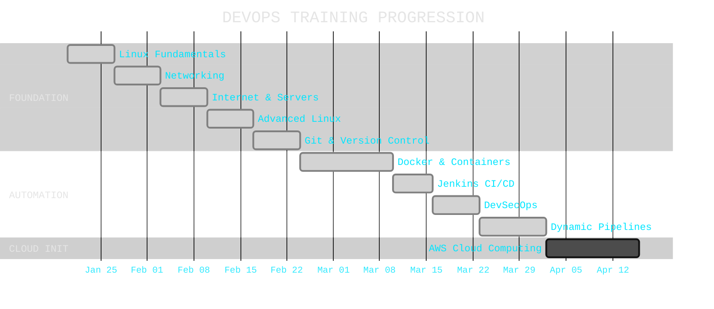
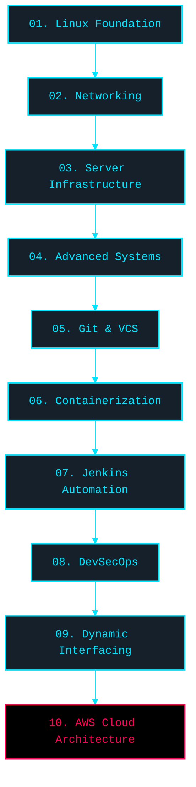

# ❖ DevOps Industrial Training Roadmap

> **Systematic documentation of an industrial DevOps training journey.**
> From foundation to CI/CD, DevSecOps, and Cloud Infrastructure.

---

<div align="center">

[](#)
[](#)
[](#)
[](#)
[](#)

</div>

---

## ⬢ ABOUT THIS REPOSITORY

This repository documents the comprehensive **DevOps Industrial Training** initiated on **January 20, 2026**.

It systematically categorizes weekly progressions, detailing fundamental Linux operations, Jenkins CI/CD pipelines, Docker containerization, AWS cloud architecture, and **DevSecOps** implementations (SonarQube, OWASP, and Trivy).

**Core Functions:**
- ✦ Personal training baseline and documentation
- ✦ Sequential entry roadmap for DevOps fundamentals
- ✦ Resource repository for scripts, configurations, and reference data
- ✦ Professional portfolio reflecting practical deployments

---

## ⬢ SKILLS COVERED

| Core Vertical | Technologies & Methodologies |
|---|---|
| **Linux Foundations** | File Systems, Permissions, Shell Scripting, Bash |
| **Networking** | IPv4, Subnetting, OSI Model, TCP/UDP, DHCP, CIDR |
| **Server Infrastructure** | Web Servers, Reverse Proxy, Hardware Basics |
| **Advanced Systems** | ACL, Cron, SUID/SGID, `nmcli`, `grep`, Users/Groups |
| **Version Control** | Git, GitHub, Branching, Rebase, Webhooks, Actions |
| **Containerization** | Docker, Images, Volumes, Compose, Docker Swarm |
| **Continuous Integration** | Jenkins, Pipelines, Node Agents, Groovy |
| **DevSecOps** | SonarQube, OWASP, Trivy, SAST, Shift-Left Security |
| **Pipeline Automation** | Dynamic Pipelines, Branch Detection, Groovy Logic |
| **Cloud Computing** | AWS Intro, IAM, EC2, VPC, Security Groups, Subnets |

---

## ⬢ TRAINING TIMELINE



| Phase | Duration | Core Subject | Status |
|---|---|---|---|
| Week 01 | Jan 20 – Jan 26 | Linux Fundamentals | ⬢ Complete |
| Week 02 | Jan 27 – Feb 02 | Networking Architecture | ⬢ Complete |
| Week 03 | Feb 03 – Feb 09 | Internet & Server Setup | ⬢ Complete |
| Week 04 | Feb 10 – Feb 16 | Advanced Linux Control | ⬢ Complete |
| Week 05 | Feb 17 – Feb 23 | Git & Version Control | ⬢ Complete |
| Week 06 | Feb 24 – Mar 09 | Docker & Environments | ⬢ Complete |
| Week 07 | Mar 10 – Mar 15 | Jenkins & CI/CD Pipelines | ⬢ Complete |
| Week 08 | Mar 16 – Mar 22 | DevSecOps & Assessment | ⬢ Complete |
| Week 09 | Mar 23 – Apr 01 | Dynamic CI/CD Automation | ⬢ Complete |
| Week 10 | Apr 02 – Present | AWS Cloud Architecture | ⟐ Active |

---

## ⬢ TOPOLOGICAL ROADMAP



---

## ⬢ REPOSITORY ARCHITECTURE

```text
devops-industrial-training-roadmap/
├── README.md                            [Central Interface]
├── projects/                            [Deployed Capabilities]
├── future-roadmap/                      [Strategic Trajectory]
├── resources/                           [External Data]
│
├── Week-01-Linux-Fundamentals/          [System Base]
├── Week-02-Networking/                  [Network Protocol]
├── Week-03-Internet-and-Server-Setup/   [Infrastructure]
├── Week-04-Advanced-Linux/              [System Control]
├── Week-05-Git-Version-Control/         [Version Protocol]
├── Week-06-Docker-Containerization/     [Environment Isolation]
├── Week-07-Jenkins-CI-CD/               [Continuous Integration]
├── Week-08-DevSecOps/                   [Security Protocol]
├── Week-09-Dynamic-Jenkins-Pipelines/   [Dynamic Automation]
└── Week-10-AWS-Cloud-Computing/         [Cloud Infrastructure]
```

---

## ⬢ ONBOARDING SEQUENCE

For an optimal progression sequence, traverse the modules systematically:

> [!TIP]
> **Sequential Execution Required:**
> 1. **[01. Linux Base](./Week-01-Linux-Fundamentals/notes.md)** - The core OS layer.
> 2. **[02. Networking Layer](./Week-02-Networking/notes.md)** - Communication protocols.
> 3. **[03. Server Protocols](./Week-03-Internet-and-Server-Setup/notes.md)** - Hardware/services bridging.
> 4. **[04. Advanced Control](./Week-04-Advanced-Linux/notes.md)** - Permissions and automation.
> 5. **[05. Version Protocol](./Week-05-Git-Version-Control/notes.md)** - Change tracking.
> 6. **[06. Container Isolation](./Week-06-Docker-Containerization/notes.md)** - Immutable infrastructure.
> 7. **[07. Pipeline Automation](./Week-07-Jenkins-CI-CD/notes.md)** - CI/CD orchestration.
> 8. **[08. DevSecOps Analysis](./Week-08-DevSecOps/notes.md)** - Vulnerability mitigation.
> 9. **[09. Dynamic Logic](./Week-09-Dynamic-Jenkins-Pipelines/notes.md)** - Reactive pipelines.
> 10. **[10. AWS Subsystems](./Week-10-AWS-Cloud-Computing/Cloud-Computing-Introduction/notes.md)** - Remote infrastructure.

---

## ⬢ DEPLOYED PROJECTS

### » Containerized Stack
- Multi-tier web deployments utilizing Docker Compose.
- Docker Swarm consensus with active master/worker nodes.
- Overlay network configurations for inter-container communication.

[Access Container Logs ❯](./projects/docker-projects.md)

### » Pipeline Orchestrations
- Jenkins Pipeline definitions (Declarative & Scripted Groovy).
- Bi-directional agent arrays authenticated via SSH keypairs.
- Automated hook triggers integrated with GitHub repositories.
- Branch-aware logic for segregated testing execution.

[Access Pipeline Configs ❯](./projects/jenkins-projects.md)

---

## ⬢ STRATEGIC FLIGHT PLAN

Future capabilities mapping for extended integration:

```text
CURRENT LOG             T+3 MONTHS              T+6 MONTHS
─────────────           ─────────────────       ──────────────────
⬢ Linux Core            Kubernetes (K8s)        Terraform (IaC)
⬢ Network Layer         Helm Charts             Ansible Config
⬢ Container/VCS         AWS Integration         Telemetry/Metrics
⬢ CI/CD Pipelines       Prometheus & Grafana    Enterprise Pipelines
⬢ SecOps Scan           ArgoCD (GitOps)         Cloud Certifications
⟐ AWS Introduction      Advanced Vulnerability  Security Assessment
```

[Review Extended Trajectory ❯](./future-roadmap/3-month-plan.md)

---

## ⬢ SYSTEM ANOMALIES & LEARNINGS

> [!WARNING]
> Runtime warnings based on critical failures and isolated events:

- **SSH Keys:** Validate via manual connection prior to credential injection in Jenkins.
- **Kernel Sharing:** Containers lack embedded kernels; host kernel resources are shared identically.
- **Git History:** Executing `git rebase` alters time-state; strictly prohibit on public branches.
- **Port Saturation:** Container endpoint collisions require constant verification via `docker ps`.
- **Chronological Syntax:** Unix cron demands 5 distinct positional arguments. Verify integrity.
- **VPC Subnets:** Misconfigured AWS Security Groups fail implicitly rather than explicitly. 
- **Image Scans:** `trivy image` isolation is required prior to external repository pushes.
- **Quality Gates:** Terminate pipeline execution upon SonarQube negative parity; never deploy degraded code.
- **Socket Mounts:** Running Jenkins encapsulated via Docker requires host `docker.sock` mapped internally to retain execution capability.

---

## ⬢ QUICK-REFERENCE ALIASES

| Functionality | Memory Address |
| --- | --- |
| Root Navigation | [commands.md](./Week-01-Linux-Fundamentals/commands.md) |
| Protocol Specs | [concepts.md](./Week-02-Networking/concepts.md) |
| Advanced Functions | [commands.md](./Week-04-Advanced-Linux/commands.md) |
| VCS Arguments | [git-commands.md](./Week-05-Git-Version-Control/git-commands.md) |
| Docker Directives | [docker-commands.md](./Week-06-Docker-Containerization/docker-commands.md) |
| Jenkins Groovy | [pipeline-examples.md](./Week-07-Jenkins-CI-CD/pipeline-examples.md) |
| SecOps Assessment | [commands.md](./Week-08-DevSecOps/commands.md) |
| Dynamic Branches | [commands.md](./Week-09-Dynamic-Jenkins-Pipelines/commands.md) |
| AWS IAM Policies | [commands.md](./Week-10-AWS-Cloud-Computing/IAM/commands.md) |

---

## ⬢ OPERATOR IDENTITY

- **Designation:** DevOps Industrial Training Candidate
- **Execution Phase:** Initiated Jan 2026
- **Routing Loop:** Linux ❯ Network ❯ Docker ❯ Jenkins ❯ DevSecOps ❯ Cloud
- **Uplink GitHub:** [hridyen](https://github.com/hridyen)
- **Uplink LinkedIn:** [hridyen](https://www.linkedin.com/in/hridyen/)

---

<div align="center">

`[ SYSTEM ID: DEVOPS EDUCATIONAL REPOSITORY ]`

> Restricted redistribution parameter set to true. 
> Source code and structural templates open for read/study processes.
> 
> *INITIALIZED BY HRIDYEN PRASHAR*

</div>
