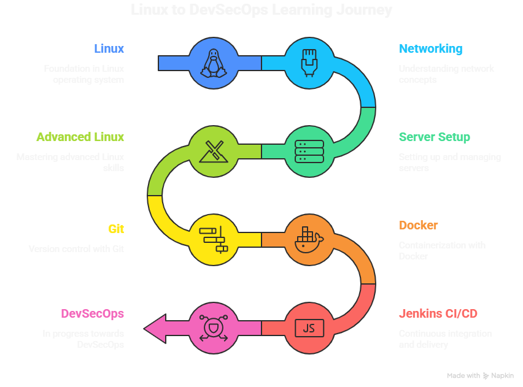

# 🚀 DevOps Industrial Training Roadmap

> **A complete, beginner-friendly documentation of my 7-week DevOps industrial training journey from zero to CI/CD pipelines.**

---

<div align="center">


</div>

---

## 👋 About This Repository

This repo documents my **DevOps Industrial Training** that started on **20th January 2026**.

It covers everything I learned week by week from Linux basics all the way to Jenkins CI/CD pipelines, Docker containerization, and AWS cloud fundamentals.

**This repository serves 4 purposes:**
1. 📝 My personal training documentation
2. 🗺️ A beginner roadmap for anyone entering DevOps
3. 📎 A place to attach resources, scripts, and notes
4. 💼 A portfolio project showing real practical exposure

---

## 🧠 Skills Covered

| Category | Topics |
|---|---|
| 🐧 **Linux** | Commands, File System, Permissions, Shell Scripting, Bash |
| 🌐 **Networking** | IP, Subnetting, OSI Model, TCP/UDP, DHCP, CIDR |
| 🔧 **Server Setup** | WordPress, PHP multi-version, Hardware, Reverse Proxy |
| 🔐 **Advanced Linux** | ACL, GREP, Cron Jobs, SUID, SGID, nmcli, Wheel Group |
| 🗂️ **Git & GitHub** | Version Control, Branching, Rebasing, Pull Requests, PAT |
| 🐳 **Docker** | Containers, Images, Volumes, Networks, Compose, Swarm |
| ☁️ **AWS (Intro)** | EC2, VPC, Subnetting, Security Groups, Snapshots |
| ⚙️ **Jenkins CI/CD** | Pipelines, Agents, Webhooks, Groovy, Jenkinsfile |

---

## 📅 Training Timeline

```
Jan 20 ──────────────────────────────────────────────── Mar 15
  │         │          │          │          │         │    │
Week 1    Week 2     Week 3    Week 4     Week 5    Week 6  Week 7
Linux   Networking  Servers  Adv.Linux   Git      Docker  Jenkins
```

| Week | Dates | Topic |
|---|---|---|
| Week 01 | Jan 20 – Jan 26 | Linux Fundamentals |
| Week 02 | Jan 27 – Feb 02 | Networking |
| Week 03 | Feb 03 – Feb 09 | Internet, Servers & Hardware |
| Week 04 | Feb 10 – Feb 16 | Advanced Linux Tools |
| Week 05 | Feb 17 – Feb 23 | Git & Version Control |
| Week 06 | Feb 24 – Mar 09 | Docker & Containerization |
| Week 07 | Mar 10 – Mar 15 | Jenkins & CI/CD |

---

## 🗺️ Visual Learning Roadmap




**Simple path:**
`Linux` → `Networking` → `Server Setup` → `Advanced Linux` → `Git` → `Docker` → `Jenkins CI/CD`

---

## 📁 Repository Structure

```
devops-industrial-training-roadmap/
│
├── 📄 README.md                         ← You are here
│
├── 📂 Week-01-Linux-Fundamentals/
│   ├── notes.md                         ← Concepts explained simply
│   ├── commands.md                      ← All Linux commands used
│   └── resources.md                     ← Links and references
│
├── 📂 Week-02-Networking/
│   ├── notes.md
│   ├── concepts.md
│   └── resources.md
│
├── 📂 Week-03-Internet-and-Server-Setup/
│   ├── notes.md
│   ├── scripts.md                       ← Shell scripts written
│   └── resources.md
│
├── 📂 Week-04-Advanced-Linux/
│   ├── notes.md
│   ├── commands.md
│   └── resources.md
│
├── 📂 Week-05-Git-Version-Control/
│   ├── notes.md
│   ├── git-commands.md
│   └── resources.md
│
├── 📂 Week-06-Docker-Containerization/
│   ├── notes.md
│   ├── docker-commands.md
│   ├── projects.md
│   └── resources.md
│
├── 📂 Week-07-Jenkins-CI-CD/
│   ├── notes.md
│   ├── pipeline-examples.md
│   └── resources.md
│
├── 📂 projects/
│   ├── docker-projects.md
│   └── jenkins-projects.md
│
├── 📂 future-roadmap/
│   ├── 3-month-plan.md
│   └── 6-month-devops-roadmap.md
│
└── 📂 resources/
    ├── learning-resources.md
    ├── books.md
    └── youtube-channels.md
```

---

## 🧭 How Beginners Should Use This Repo

**If you are new to DevOps, follow this exact order:**

**Step 1 →** Start with [Week 01 - Linux](./Week-01-Linux-Fundamentals/notes.md)
> Linux is the foundation of everything in DevOps. Don't skip it.

**Step 2 →** Move to [Week 02 - Networking](./Week-02-Networking/notes.md)
> Understanding how computers talk to each other is critical for cloud and DevOps work.

**Step 3 →** Read [Week 03 - Internet & Servers](./Week-03-Internet-and-Server-Setup/notes.md)
> Learn how the internet works and how servers are set up with shell scripts.

**Step 4 →** Go through [Week 04 - Advanced Linux](./Week-04-Advanced-Linux/notes.md)
> Cron jobs, permissions, and system tools used in real DevOps work.

**Step 5 →** Study [Week 05 - Git](./Week-05-Git-Version-Control/notes.md)
> Git is used in every single DevOps project. Learn this well.

**Step 6 →** Dive into [Week 06 - Docker](./Week-06-Docker-Containerization/notes.md)
> Containers are the heart of modern DevOps. This is where it gets exciting.

**Step 7 →** Complete [Week 07 - Jenkins](./Week-07-Jenkins-CI-CD/notes.md)
> Build your first CI/CD pipeline. This ties everything together.

---

## 🏗️ Projects Built

### 🐳 Docker Projects
- Dockerized multiple web applications from scratch
- Built multi-container apps using Docker Compose
- Configured Docker Swarm with master and worker nodes
- Set up overlay networks in Swarm
- Pushed custom images to Docker Hub

👉 See [projects/docker-projects.md](./projects/docker-projects.md)

### ⚙️ Jenkins CI/CD Projects
- Created Freestyle and Pipeline projects in Jenkins
- Set up 2 Jenkins agents with SSH key authentication
- Wrote Groovy pipeline scripts
- Created a project using Jenkinsfile (declarative pipeline)
- Configured Webhooks and Poll SCM triggers

👉 See [projects/jenkins-projects.md](./projects/jenkins-projects.md)

---

## 🔮 Future Learning Roadmap

After completing this training, the next steps on the DevOps path are:

```
Current Level              3 Months               6 Months
─────────────         ─────────────────      ──────────────────
✅ Linux               Kubernetes (K8s)       Terraform (IaC)
✅ Networking          Helm Charts            Ansible
✅ Git/Docker          AWS Deep Dive          Monitoring (Prometheus)
✅ Jenkins             Prometheus/Grafana     Full CI/CD Pipelines
🔜 AWS Advanced        ArgoCD (GitOps)        Cloud Certifications
```

👉 Full plan: [future-roadmap/3-month-plan.md](./future-roadmap/3-month-plan.md)

---

## 📚 Resource Library

| Type | Link |
|------|------|
| 📖 Books | [resources/books.md](./resources/books.md) |
| 🎥 YouTube Channels | [resources/youtube-channels.md](./resources/youtube-channels.md) |
| 🔗 Learning Resources | [resources/learning-resources.md](./resources/learning-resources.md) |

---

## 💡 Things I Learned the Hard Way

> ⚠️ These are hard lessons — save yourself the pain!

- Always test your SSH keys **before** adding them to Jenkins credentials
- Docker containers are **not** VMs — they share the host kernel
- `git rebase` rewrites history — never rebase a shared/public branch
- Port conflicts in Docker are easy to miss — always check with `docker ps`
- Cron job timing syntax has **5 fields** — count them every time
- A misconfigured security group in AWS will silently block all traffic
- `EXPOSE` in Dockerfile is documentation only — use `-p` to actually publish

---

## 🧰 Quick Commands Cheat Sheet

> Jump to the right week for full command references:

| Topic | File |
|---|---|
| Linux Commands | [Week-01/commands.md](./Week-01-Linux-Fundamentals/commands.md) |
| Networking Commands | [Week-02/concepts.md](./Week-02-Networking/concepts.md) |
| Advanced Linux | [Week-04/commands.md](./Week-04-Advanced-Linux/commands.md) |
| Git Commands | [Week-05/git-commands.md](./Week-05-Git-Version-Control/git-commands.md) |
| Docker Commands | [Week-06/docker-commands.md](./Week-06-Docker-Containerization/docker-commands.md) |
| Jenkins Pipelines | [Week-07/pipeline-examples.md](./Week-07-Jenkins-CI-CD/pipeline-examples.md) |

---

## 👤 About Me

- 🎓 DevOps Industrial Training — Jan 2026 to present
- 📍 Learning path: Linux → Networking → Docker → Jenkins → Cloud
- 🔗 GitHub: https://github.com/hridyen
- 💼 LinkedIn: https://www.linkedin.com/in/hridyen/

---

<div align="center">

*⚠️ Educational Repository

This project is shared for learning purposes only.
You are welcome to study the code and concepts.
Please do not redistribute, sell, or present this work as your own.
If you use ideas from this repository, kindly give credit.*

`Made with ❤️ during DevOps Industrial Training - HRIDYEN PRASHAR`

</div>
