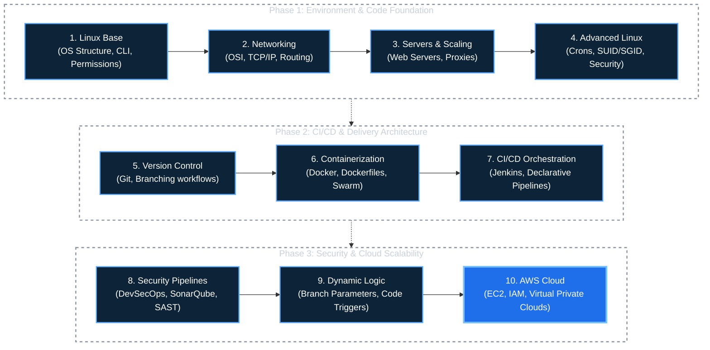

# DevOps Industrial Training Roadmap

> **A comprehensive and structured roadmap documenting my industrial training journey from foundational Linux systems to AWS Cloud deployments.** 
> Designed for technical clarity, detailed tracking, and enterprise-level skill demonstration.

---

<div align="center">

[](#)
[](#)
[](#)
[](#)
[](#)

</div>

---

## About This Repository

This repository serves as the central documentation standard for my comprehensive **DevOps Industrial Training** which commenced on **January 20, 2026**.

The infrastructure is broken down into weekly, discrete learning modules. It scales sequentially from basic Linux commands into complex dynamic Jenkins CI/CD pipelines, Docker Swarm containerization, and ultimately AWS Cloud infrastructure combined with **DevSecOps** practices via SonarQube and Trivy.

**Core Objectives:**
- Provide highly detailed personal documentation and scripts.
- Offer an organized, step-by-step roadmap for new DevOps engineers.
- Centralize all configurations, source files, and command structures into one repository.
- Act as a verifiable portfolio of hands-on deployment scenarios.

---

## Technical Skills Covered

| Competency Area | Technologies & Methodologies Exerted |
|---|---|
| **Linux Operations** | Bash, File Systems, Advanced Permissions, Shell Scripting |
| **Network Architecture** | OSI Model, IPv4/Subnetting, TCP/UDP, DHCP, Routing protocols |
| **Server Administration** | Apache/Nginx, PHP Configurations, Reverse Proxy definitions |
| **Advanced Systems** | ACL restrictions, Cron scheduling, SUID/SGID, `nmcli`, Log management |
| **Version Control Systems** | Git, GitHub Actions, Rebasing, Branch Strategy, Webhook Integrations |
| **Containerization Ecosystems** | Docker Daemon, Dockerfiles, Volumes, Compose definitions, Swarm scaling |
| **Continuous Integration** | Jenkins, Node Agents, Groovy Pipeline scripting, SSH Credentials |
| **DevSecOps Integration** | SonarQube static analysis, OWASP mitigation, Trivy vulnerability scanning |
| **Pipeline Automation Logic** | Dynamic Pipelines, Branch-aware executions, Automated artifact builds |
| **Cloud Infrastructure (Active)** | AWS Core, IAM Policies, EC2 provisioning, VPC allocations, Subnets |

---

## Detailed Training Timeline

**Phase 1: Environment & Code Foundation**
🟢 **Week 01** (Jan 20 – Jan 26) | **Linux Fundamentals**
🟢 **Week 02** (Jan 27 – Feb 02) | **Networking Architecture**
🟢 **Week 03** (Feb 03 – Feb 09) | **Internet & Server Setup**
🟢 **Week 04** (Feb 10 – Feb 16) | **Advanced Linux Control**

**Phase 2: CI/CD & Delivery Architecture**
🟢 **Week 05** (Feb 17 – Feb 23) | **Git & Version Control**
🟢 **Week 06** (Feb 24 – Mar 09) | **Docker Container Ecosystems**

**Phase 3: Security & Cloud Scalability**
🟢 **Week 07** (Mar 10 – Mar 15) | **Jenkins & CI/CD Pipelines**
🟢 **Week 08** (Mar 16 – Mar 22) | **DevSecOps Integrations**
🟢 **Week 09** (Mar 23 – Apr 01) | **Dynamic CI/CD Automation**

**Phase 4: Cloud Ingress**
🟡 **Week 10** (Apr 02 – Present) | **AWS Cloud Architecture** *(In Progress)*

---

## Architectural Roadmap

This diagram illustrates the dependencies and explicit learning components of each phase.



---

## Repository File Architecture

```text
devops-industrial-training-roadmap/
├── README.md                            [Central Entrypoint & Index]
├── projects/                            [Documented Configurations & Code]
├── future-roadmap/                      [Strategic Integration Plans]
├── resources/                           [Book/External References]
│
├── Week-01-Linux-Fundamentals/          [System Base Files]
├── Week-02-Networking/                  [Network Protocol Configurations]
├── Week-03-Internet-and-Server-Setup/   [Hosting Architecture files]
├── Week-04-Advanced-Linux/              [System Control Constraints]
├── Week-05-Git-Version-Control/         [Version Protocol Files]
├── Week-06-Docker-Containerization/     [Environment Infrastructure]
├── Week-07-Jenkins-CI-CD/               [Continuous Integration Scripts]
├── Week-08-DevSecOps/                   [Security Check Protocols]
├── Week-09-Dynamic-Jenkins-Pipelines/   [Dynamic Automations Code]
└── Week-10-AWS-Cloud-Computing/         [Cloud Management & IAM]
```

---

## Deployed Application Stacks

### Containerized Application Portfolios
- End-to-end multi-tier web application deployments constructed via Docker Compose.
- Docker Swarm consensus with active fault-tolerant master/worker nodes.
- Overlay network architecture defined for segmented inter-container database communication.
[View Container Deployments](./projects/docker-projects.md)

### CI/CD Pipeline Orchestrations
- Jenkins Pipeline definitions spanning Declarative to complex Scripted Groovy execution patterns.
- External Linux build-agents authenticated strictly via secure SSH keypair configurations.
- Webhooks actively integrating repository events directly into testing triggers.
- Branch-aware pipelines isolating testing from production deployments automatically.
[View CI/CD Deployments](./projects/jenkins-projects.md)

---

## Long-Term Integration Strategy

```text
Current State              T-Minus 3 Months            T-Minus 6 Months
─────────────              ─────────────────           ──────────────────
Linux / Networking     ->  Kubernetes (K8s) Deploy ->  Terraform (IaC) Structure
Git / Jenkins System   ->  Helm Chart Blueprints   ->  Ansible Infrastructure Automation
Docker Ecosystem       ->  AWS Specialization      ->  Distributed System Monitoring
DevSecOps Scans        ->  Prometheus & Grafana    ->  Enterprise Level CI/CD Validation
AWS Initializer        ->  ArgoCD (GitOps) Logic   ->  Cloud & Security Certifications
```

[Examine Complete Trajectory Planning](./future-roadmap/3-month-plan.md)

---

## Engineering Considerations & Technical Anomalies

> [!WARNING]
> The following system properties have historically caused failure points during execution. Note these for incident response:

- **SSH Authentication Validations:** Require manual connection success in the terminal before allowing Jenkins to assume credential use.
- **Docker Kernel Abstraction:** Standard containers completely share the underlying host kernel. They lack distinct VM isolation bounds.
- **Git Rebase Destruction:** The `git rebase` command permanently alters cryptographic history. It is highly prohibited on any team-shared branches.
- **Port Saturation Constraints:** Application downtime is frequently attributed to overlapping Docker host port binding. Always survey utilization using `docker ps`.
- **Chronological Syntax Strictness:** The Linux cron daemon requires precisely 5 positional identifiers, otherwise syntax failures occur.
- **VPC Subnet Packet Drops:** Misconfigured AWS Security Groups do not warn clients; they silently execute blind drops.
- **Image Scanning Strictness:** Implementing `trivy image` isolation tests is non-negotiable prior to pushing code updates directly to public registries.
- **Quality Gate Enforcements:** CI/CD logic requires manual termination of pipeline sequences if SonarQube metric analysis returns negative parity over code quality.
- **Socket Authority Escalation:** Encapsulating Jenkins inside a Docker process inherently blocks it from spawning sibling containers unless the host `/var/run/docker.sock` is forcibly mounted deep within the image volume.

---

## Command Reference Matrix

| Category Functionality | Implementation Path |
| --- | --- |
| Basic System Core | [commands.md](./Week-01-Linux-Fundamentals/commands.md) |
| Protocol Details | [concepts.md](./Week-02-Networking/concepts.md) |
| Advanced Constraints | [commands.md](./Week-04-Advanced-Linux/commands.md) |
| VCS Operations | [git-commands.md](./Week-05-Git-Version-Control/git-commands.md) |
| Container Subsystems | [docker-commands.md](./Week-06-Docker-Containerization/docker-commands.md) |
| Execution Logic | [pipeline-examples.md](./Week-07-Jenkins-CI-CD/pipeline-examples.md) |
| Security Operations | [commands.md](./Week-08-DevSecOps/commands.md) |
| Parameter Executions | [commands.md](./Week-09-Dynamic-Jenkins-Pipelines/commands.md) |
| Core AWS Policies | [commands.md](./Week-10-AWS-Cloud-Computing/IAM/commands.md) |

---

## Engineer Data

- **Designation:** DevOps Industrial Training Candidate
- **Commencement Date:** January 2026
- **Procedural Model:** Foundation Systems -> CI/CD Execution -> DevSecOps Assurance -> Cloud Management
- **Source Control Profile:** [hridyen](https://github.com/hridyen)
- **Professional Network:** [hridyen](https://www.linkedin.com/in/hridyen/)

---

<div align="center">

*Educational Source Repository. Maintained for continuous review of technical integration protocols.*

</div>
