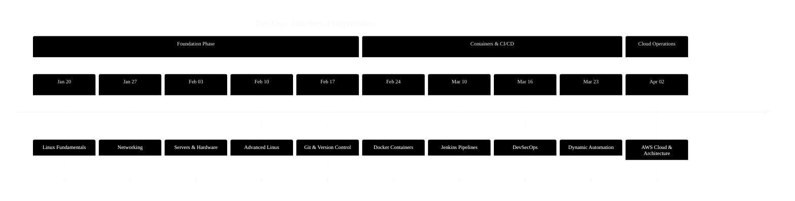
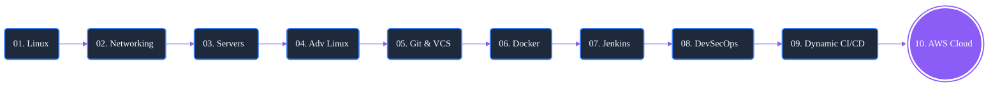

# 🚀 DevOps Industrial Training Roadmap

> **A complete, professional roadmap documenting my journey from foundation to Cloud deployments.** 
> Built for clarity, tracking, and showcasing practical enterprise skills.

---

<div align="center">

[](#)
[](#)
[](#)
[](#)
[](#)

</div>

---

## 🎯 About This Repository

This repository documents the comprehensive **DevOps Industrial Training** initiated on **January 20, 2026**.

It systematically categorizes my weekly progression, detailing fundamental Linux operations, Jenkins CI/CD pipelines, Docker containerization, AWS cloud architecture, and **DevSecOps** implementations.

**Core Purposes:**
- 📌 My personal training documentation
- 🛣️ A structured entry-level roadmap for DevOps engineers
- 📁 A clean resource library for scripts, tools, and notes
- 💼 A professional portfolio reflecting practical deployments

---

## 🛠️ Skills Covered

| Category | Technologies & Topics |
|---|---|
| **Linux Foundations** | Commands, File Systems, Permissions, Shell Scripting |
| **Networking** | IP, Subnetting, OSI Model, TCP/UDP, DHCP, CIDR |
| **Server Infrastructure** | Web Servers, PHP, Reverse Proxy, Hardware Basics |
| **Advanced Systems** | ACL, Cron, SUID/SGID, `nmcli`, `grep`, Users/Groups |
| **Version Control** | Git, GitHub, Branching, Rebase, Pull Requests |
| **Containerization** | Docker, Images, Volumes, Compose, Docker Swarm |
| **Continuous Integration** | Jenkins, Pipelines, Node Agents, Groovy, SSH |
| **DevSecOps** | SonarQube, OWASP, Trivy, SAST, Shift-Left Security |
| **Pipeline Logic** | Dynamic Pipelines, Branch Detection, Webhooks |
| **Cloud Computing** | AWS Intro, IAM, EC2, VPC, Security Groups, Subnets |

---

## 📅 Training Timeline



| Week | Duration | Topic | Status |
|---|---|---|---|
| **Week 01** | Jan 20 – Jan 26 | Linux Fundamentals | ✅ Complete |
| **Week 02** | Jan 27 – Feb 02 | Networking Architecture | ✅ Complete |
| **Week 03** | Feb 03 – Feb 09 | Internet & Server Setup | ✅ Complete |
| **Week 04** | Feb 10 – Feb 16 | Advanced Linux Control | ✅ Complete |
| **Week 05** | Feb 17 – Feb 23 | Git & Version Control | ✅ Complete |
| **Week 06** | Feb 24 – Mar 09 | Docker & Environments | ✅ Complete |
| **Week 07** | Mar 10 – Mar 15 | Jenkins & CI/CD Pipelines | ✅ Complete |
| **Week 08** | Mar 16 – Mar 22 | DevSecOps & Assessment | ✅ Complete |
| **Week 09** | Mar 23 – Apr 01 | Dynamic CI/CD Automation | ✅ Complete |
| **Week 10** | Apr 02 – Present | AWS Cloud Architecture | 🔄 In Progress |

---

## 🗺️ Path Roadmap



---

## 📂 Repository Architecture

```text
devops-industrial-training-roadmap/
├── 📄 README.md                         ← Central Hub
├── 📂 projects/                         ← Practical Implementations
├── 📂 future-roadmap/                   ← Next Steps (3/6 Months)
├── 📂 resources/                        ← Books & Channels
│
├── 📂 Week-01-Linux-Fundamentals/       ← Linux Commands & Notes
├── 📂 Week-02-Networking/               ← IP & Routing Concepts
├── 📂 Week-03-Internet-and-Server-Setup/← Server Configurations
├── 📂 Week-04-Advanced-Linux/           ← Security & Permissions
├── 📂 Week-05-Git-Version-Control/      ← Branching & Merges
├── 📂 Week-06-Docker-Containerization/  ← Containers & Swarm
├── 📂 Week-07-Jenkins-CI-CD/            ← Pipelines & Groovy
├── 📂 Week-08-DevSecOps/                ← SonarQube & Trivy
├── 📂 Week-09-Dynamic-Jenkins-Pipelines/← Auto CI/CD Flow
└── 📂 Week-10-AWS-Cloud-Computing/      ← IAM, EC2, VPC
```

---

## 🏗️ Deployed Projects

### 🐳 Docker Configurations
- Multi-tier web deployments utilizing Docker Compose.
- Docker Swarm consensus with active master/worker nodes.
- Overlay network architecture for inter-container communication.
👉 **[View Docker Projects](./projects/docker-projects.md)**

### ⚙️ Jenkins CI/CD Orchestrations
- Jenkins Pipeline definitions (Declarative & Scripted Groovy).
- Jenkins agents authenticated via SSH keypairs.
- Automated webhooks integrated with GitHub endpoints.
- Branch-aware pipelines for decoupled environment testing.
👉 **[View Jenkins Projects](./projects/jenkins-projects.md)**

---

## 🔭 Future Learning Trajectory

```text
Current State          3 Months               6 Months
─────────────          ─────────────────      ──────────────────
✅ Linux/Net           Kubernetes (K8s)       Terraform (IaC)
✅ Version Control     Helm Charts            Ansible Config
✅ Docker/Jenkins      AWS Deep Dive          Monitoring Metrics
✅ SecOps Scan         Prometheus & Grafana   Enterprise CI/CD
🔄 AWS Introduction    ArgoCD (GitOps)        Cloud Certifications
```

👉 **[Review Full 3-Month Plan](./future-roadmap/3-month-plan.md)**

---

## ⚠️ Important Lessons Learned

> [!WARNING]
> Save yourself the troubleshooting time by reviewing these key gotchas:

- **SSH Configurations:** Always manually test SSH connectivities on the agent before letting Jenkins attempt it.
- **Docker Kernels:** Containers share the host kernel. They are **not** virtual machines.
- **Git Rebase:** Never rebase a public shared branch; it alters the foundational history.
- **Port Collisions:** Silent application failures are often just container port conflicts. Check `docker ps`.
- **Cron Jobs:** Remember the sequence: `Minute Hour Day Month DayOfWeek` (5 fields).
- **Security Groups:** AWS groups act as silent firewalls; if a port isn't explicitly permitted, it drops gracefully.
- **Vulnerability Isolation:** Scan with `trivy image` before pushing code directly to Docker Hub.
- **Quality Gates:** Your CI pipeline MUST fail if SonarQube detects vulnerabilities. Do not pass bad builds.
- **Socket Permissions:** Running Jenkins nested inside Docker needs explicit socket mounting to utilize the host daemon.

---

## 📖 Quick-Reference Aliases

| Section | Link |
| --- | --- |
| Linux Core | [commands.md](./Week-01-Linux-Fundamentals/commands.md) |
| Networking | [concepts.md](./Week-02-Networking/concepts.md) |
| System Control | [commands.md](./Week-04-Advanced-Linux/commands.md) |
| Git Protocols | [git-commands.md](./Week-05-Git-Version-Control/git-commands.md) |
| Docker Hub | [docker-commands.md](./Week-06-Docker-Containerization/docker-commands.md) |
| Groovy Logic | [pipeline-examples.md](./Week-07-Jenkins-CI-CD/pipeline-examples.md) |
| SecOps Tools | [commands.md](./Week-08-DevSecOps/commands.md) |
| AWS Policies | [commands.md](./Week-10-AWS-Cloud-Computing/IAM/commands.md) |

---

## 🧑‍💻 Operator Identity

- **Status:** DevOps Industrial Training Candidate
- **Path:** Linux ➡️ Network ➡️ Docker ➡️ Jenkins ➡️ DevSecOps ➡️ Cloud
- **GitHub:** [hridyen](https://github.com/hridyen)
- **LinkedIn:** [hridyen](https://www.linkedin.com/in/hridyen/)

---

<div align="center">

*Educational Repository. Shared for study and process reference.*  
`Made with passion during continuous learning - HRIDYEN PRASHAR`

</div>
