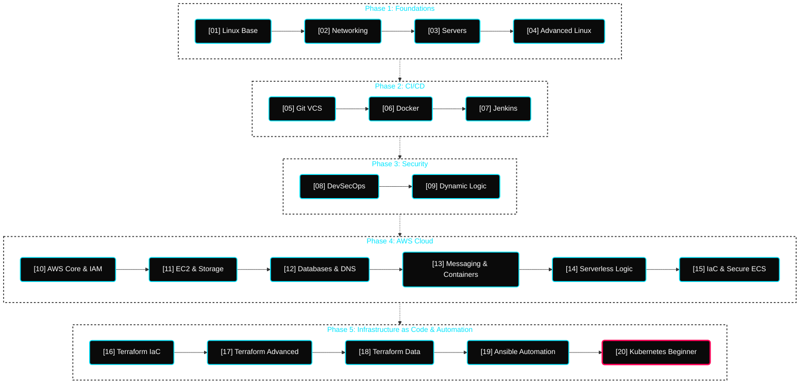

# ⚡ DevOps Industrial Training Roadmap

> **A comprehensive and structured roadmap documenting my industrial training journey.** 
> Built for technical clarity, detailed tracking, and enterprise-level skill demonstration.

---

---

## ✦ About This Repository

This repository serves as the central documentation standard for my comprehensive **DevOps Industrial Training** which commenced on **January 20, 2026**.

The infrastructure is broken down into weekly, discrete learning modules. It scales sequentially from basic Linux commands into complex dynamic Jenkins CI/CD pipelines, Docker Swarm containerization, and ultimately AWS Cloud infrastructure combined with **DevSecOps** practices via SonarQube and Trivy.

**Core Objectives:**
- Provide highly detailed personal documentation and scripts.
- Offer an organized, step-by-step roadmap for new DevOps engineers.
- Centralize all configurations, source files, and command structures into one repository.
- Act as a verifiable portfolio of hands-on deployment scenarios.

---

## ✦ Technical Skills Covered

| Competency Area | Technologies & Methodologies Exerted |
|---|---|
| **Linux Operations** | Bash, File Systems, Advanced Permissions, Shell Scripting |
| **Network Architecture** | OSI Model, IPv4/Subnetting, TCP/UDP, DHCP, Routing protocols |
| **Server Administration** | Apache/Nginx, PHP Configurations, Reverse Proxy definitions |
| **Advanced Systems** | ACL restrictions, Cron scheduling, SUID/SGID, `nmcli`, Log management |
| **Version Control Systems** | Git, GitHub Actions, Rebasing, Branch Strategy, Webhook Integrations |
| **Containerization Ecosystems** | Docker Daemon, Dockerfiles, Volumes, Compose definitions, Swarm scaling |
| **Continuous Integration** | Jenkins, Node Agents, Groovy Pipeline scripting, SSH Credentials |
| **DevSecOps Integration** | SonarQube static analysis, OWASP mitigation, Trivy vulnerability scanning |
| **Pipeline Automation Logic** | Dynamic Pipelines, Branch-aware executions, Automated artifact builds |
| **Cloud Computing** | IAM, VPC, EC2, EBS, ELB, ASG, RDS, Aurora, S3, Route 53 |
| **Messaging & Global** | SQS, SNS, Kinesis, CloudFront, Global Accelerator |
| **Container Orchestration** | ECS (Fargate/EC2), ECR, Task Definitions, Services |
| **Migration & Storage** | Snowball, FSx, Storage Gateway, Hybrid Storage |
| **Infrastructure Scaling** | ASG, Multi-AZ High Availability, Read Replicas |
| **Serverless Architecture** | Lambda, API Gateway, DynamoDB, Cognito, Serverless Framework |
| **Web Performance** | CloudFront Functions, Lambda@Edge, RDS Proxy |
| **Infrastructure as Code** | CloudFormation, Nested Stacks, StackSets, cfn-guard |

---

## ✦ Detailed Training Timeline

### Phase 1: Environment & Code Foundation
-  **Week 01** (Jan 20 – Jan 26) | **Linux Fundamentals**
-  **Week 02** (Jan 27 – Feb 02) | **Networking Architecture**
-  **Week 03** (Feb 03 – Feb 09) | **Internet & Server Setup**
-  **Week 04** (Feb 10 – Feb 16) | **Advanced Linux Control**

### Phase 2: CI/CD & Delivery Architecture
-  **Week 05** (Feb 17 – Feb 23) | **Git & Version Control**
-  **Week 06** (Feb 24 – Mar 09) | **Docker Container Ecosystems**
-  **Week 07** (Mar 10 – Mar 15) | **Jenkins & CI/CD Pipelines**

### Phase 3: Security & Advanced Automations
-  **Week 08** (Mar 16 – Mar 22) | **DevSecOps Integrations**
-  **Week 09** (Mar 23 – Apr 01) | **Dynamic CI/CD Automation**

### Phase 4: Cloud Ingress
-  **Week 10** (Apr 02 – Apr 08) | **AWS Fundamentals & IAM**
-  **Week 11** (Apr 09 – Apr 15) | **AWS Compute & Storage**
-  **Week 12** (Apr 16 – Apr 22) | **AWS Databases & Services**
-  **Week 13** (Apr 23 – Apr 29) | **Messaging & Containers**
-  **Week 14** (Apr 30 – May 06) | **Serverless Architecture**
-  **Week 15** (May 07 – May 13) | **Infrastructure as Code & Secure Architecture**

### Phase 5: Infrastructure as Code & Automation
-  **Week 16** (May 14 – May 20) | **Terraform Infrastructure as Code**
-  **Week 17** (May 21 – May 27) | **Terraform Advanced Concepts**
-  **Week 18** (May 28 – June 03) | **Terraform Data & Modules**
-  **Week 19** (June 04 – June 10) | **Ansible Automation & Use Cases**
-  **Week 20** (June 11 – Present) | **Kubernetes Fundamentals & Beginner Concepts**

 

| Execution Week | Duration | Primary Module | Status |
|---|---|---|---|
| **Week 10** | Apr 02 – Apr 08 | AWS Fundamentals & IAM | Complete |
| **Week 11** | Apr 09 – Apr 15 | AWS Compute & Storage | Complete |
| **Week 12** | Apr 16 – Apr 22 | AWS Databases & Services | Complete |
| **Week 13** | Apr 23 – Apr 29 | Messaging & Containers | Complete |
| **Week 14** | Apr 30 – May 06 | Serverless Architecture | Complete |
| **Week 15** | May 07 – May 13 | IaC & Secure Architecture | Complete |
| **Week 16** | May 14 – May 20 | Terraform IaC | Complete |
| **Week 17** | May 21 – May 27 | Terraform Advanced Concepts | Complete |
| **Week 18** | May 28 – June 03 | Terraform Data & Modules | Complete |
| **Week 19** | June 04 – June 10 | Ansible Automation & Use Cases | Complete |
| **Week 20** | June 11 – Present | Kubernetes Fundamentals & Beginner Concepts | In Progress |

---

## ✦ Architectural Roadmap

```mermaid
flowchart TD
    classDef default fill:#0A0A0A,stroke:#00E5FF,stroke-width:2px,color:#FFFFFF,rx:5px,ry:5px;
    classDef active fill:#0A0A0A,stroke:#FF0055,stroke-width:3px,color:#FFFFFF,rx:5px,ry:5px;
    classDef phase fill:transparent,stroke:#333333,stroke-width:2px,stroke-dasharray: 4 4,color:#00E5FF;

    subgraph P1 [Phase 1: Foundations]
        A["[01] Linux Base"] --> B["[02] Networking"] --> C["[03] Servers"] --> D["[04] Advanced Linux"]
    end

    subgraph P2 [Phase 2: CI/CD]
        E["[05] Git VCS"] --> F["[06] Docker"] --> G["[07] Jenkins"]
    end

    subgraph P3 [Phase 3: Security]
        H["[08] DevSecOps"] --> I["[09] Dynamic Logic"]
    end

    subgraph P4 [Phase 4: AWS Cloud]
        J["[10] AWS Core & IAM"] --> K["[11] EC2 & Storage"] --> L["[12] Databases & DNS"] --> M["[13] Messaging & Containers"] --> N["[14] Serverless Logic"] --> O["[15] IaC & Secure ECS"]
    end

    subgraph P5 [Phase 5: Infrastructure as Code & Automation]
        P["[16] Terraform IaC"] --> Q["[17] Terraform Advanced"] --> R["[18] Terraform Data"] --> S["[19] Ansible Automation"] --> T["[20] Kubernetes Beginner"]:::active
    end

    P1 -.-> P2
    P2 -.-> P3
    P3 -.-> P4
    P4 -.-> P5
    
    class P1,P2,P3,P4,P5 phase;
```

---

## ✦ Repository File Architecture

### ✦ Phase 1-3: Foundations, CI/CD & Security
-  — ***Linux Fundamentals*** (File systems, Permissions, Shell Scripting)
-  — ***Networking Architecture*** (OSI Model, IPv4/Subnetting, TCP/UDP)
-  — ***Internet & Server Setup*** (Apache/Nginx, HTTP, PHP Configuration)
-  — ***Advanced Linux Control*** (ACLs, Cron, SUID/SGID, Log Management)
-  — ***Git & Version Control*** (Rebasing, Branch Strategies, Hooks)
-  — ***Docker Container Ecosystems*** (Dockerfiles, Volumes, Compose, Swarm)
-  — ***Jenkins CI/CD Pipelines*** (Declarative/Scripted Groovy Pipelines, Distributed Agents)
-  — ***DevSecOps Integrations*** (SonarQube, Trivy, OWASP Security Mitigations)
-  — ***Dynamic CI/CD Automation*** (Branch-aware Groovy Executions, Shared Libraries)
  - ⚡ [Weekly Scenario-Based Q&A Prep](./Interview-Questions-and-Answers/04-Jenkins-and-CICD/README.md#week-09-dynamic-jenkins-pipelines)

### ✦ Phase 4: Cloud Ingress
-  — ***Cloud Fundamentals*** (IAM, Global Infrastructure)
  - ⚡ [Weekly Scenario-Based Q&A Prep](./Interview-Questions-and-Answers/05-AWS-Cloud-Infrastructure/README.md#week-10-aws-fundamentals-and-iam)
-  — ***Compute & Distribution*** (EC2, EBS, Load Balancers)
  - ⚡ [Weekly Scenario-Based Q&A Prep](./Interview-Questions-and-Answers/05-AWS-Cloud-Infrastructure/README.md#week-11-aws-compute-and-storage)
-  — ***Databases & Advanced Services*** (RDS, Route 53, S3, ASG)
  - ⚡ [Weekly Scenario-Based Q&A Prep](./Interview-Questions-and-Answers/05-AWS-Cloud-Infrastructure/README.md#week-12-aws-databases-and-services)
-  — ***Messaging & Containers*** (SQS, SNS, ECS, ECR, CloudFront)
  - ⚡ [Weekly Scenario-Based Q&A Prep](./Interview-Questions-and-Answers/05-AWS-Cloud-Infrastructure/README.md#week-13-aws-messaging-and-containers)
-  — ***Serverless & NoSQL*** (Lambda, API Gateway, DynamoDB, Cognito)
  - ⚡ [Weekly Scenario-Based Q&A Prep](./Interview-Questions-and-Answers/05-AWS-Cloud-Infrastructure/README.md#week-14-serverless-architecture)
-  — ***Infrastructure as Code*** (CloudFormation, StackSets, cfn-guard)
  - ⚡ [Weekly Scenario-Based Q&A Prep](./Interview-Questions-and-Answers/05-AWS-Cloud-Infrastructure/README.md#week-15-infrastructure-as-code)

### ✦ Phase 5: Infrastructure as Code & Automation (Active)
-  — ***Terraform IaC*** (HCL, Providers, State Management)
  - ⚡ [Weekly Scenario-Based Q&A Prep](./Interview-Questions-and-Answers/06-Terraform-IaC/README.md#week-16-terraform-iac-basics)
-  — ***Terraform Advanced*** (Meta-Arguments, Lifecycle, Functions)
  - ⚡ [Weekly Scenario-Based Q&A Prep](./Interview-Questions-and-Answers/06-Terraform-IaC/README.md#week-17-terraform-advanced-concepts)
-  — ***Terraform Data & Modules*** (Data Sources)
  - ⚡ [Weekly Scenario-Based Q&A Prep](./Interview-Questions-and-Answers/06-Terraform-IaC/README.md#week-18-terraform-data-and-modules)
-  — ***Ansible Automation*** (Introduction, Container/CI-CD Integration, System Provisioning)
  - ⚡ [Weekly Scenario-Based Q&A Prep](./Interview-Questions-and-Answers/07-Ansible-Automation/README.md#week-19-ansible-automation)
-  — ***Kubernetes Beginner*** (Architecture, Pods & Deployments, Services & Networking, Storage & Configuration)
  - ⚡ [Weekly Scenario-Based Q&A Prep](./Interview-Questions-and-Answers/09-Kubernetes-Orchestration/README.md)

### ✦ DevOps Interview Q&A Hub
-  — ***Scenario-Based Q&A Bank*** (100 questions per tool, collapsible details format)
  - [01-Linux-and-Networking](./Interview-Questions-and-Answers/01-Linux-and-Networking/) — Linux System Administration & Performance Tuning
  - [02-Git-and-GitHub](./Interview-Questions-and-Answers/02-Git-and-GitHub/) — Version Control, Branching & Workflows
  - [03-Docker-and-Containers](./Interview-Questions-and-Answers/03-Docker-and-Containers/) — Containerization, Build Optimization & Scaling
  - [04-Jenkins-and-CICD](./Interview-Questions-and-Answers/04-Jenkins-and-CICD/) — Jenkins Agents, Pipelines & Automation
  - [05-AWS-Cloud-Infrastructure](./Interview-Questions-and-Answers/05-AWS-Cloud-Infrastructure/) — Cloud Ingress, Databases, Messaging & Serverless
  - [06-Terraform-IaC](./Interview-Questions-and-Answers/06-Terraform-IaC/) — Infrastructure as Code, State Management & Refactoring
  - [07-Ansible-Automation](./Interview-Questions-and-Answers/07-Ansible-Automation/) — Playbooks, Inventory & Vault-based Configs
  - [08-DevSecOps-and-Web-Servers](./Interview-Questions-and-Answers/08-DevSecOps-and-Web-Servers/) — Nginx/Apache config, Certificates & Security Scans

---

## ✦ Engineering Considerations

> [!IMPORTANT]
> **Database Resilience:** In AWS, high availability is achieved through **Multi-AZ** (Synchronous) for disaster recovery, while vertical scaling is handled via **Read Replicas** (Asynchronous).
> **DNS Propagation:** Always set a lower TTL (e.g., 60s) before major DNS migrations in **Route 53** to minimize downtime.

---

## ✦ Command Reference Matrix

| Category Functionality | Implementation Path |
| --- | --- |
| ASG Management | [commands.md](./Week-12-AWS-Databases/Auto-Scaling-Groups/commands.md) |
| RDS & Aurora Ops | [commands.md](./Week-12-AWS-Databases/RDS-Aurora-ElastiCache/commands.md) |
| S3 & Route 53 Ops | [commands.md](./Week-12-AWS-Databases/S3/commands.md) |
| EC2 Compute Access | [commands.md](./Week-11-AWS-Compute-and-Storage/EC2/commands.md) |
| Serverless Ops | [commands.md](./Week-14-Serverless-Architecture/Lambda-Fundamentals/commands.md) |
| NoSQL Operations | [commands.md](./Week-14-Serverless-Architecture/DynamoDB-Serverless-NoSQL/commands.md) |
| API Gateway | [commands.md](./Week-14-Serverless-Architecture/API-Gateway-and-Cognito/commands.md) |
| Cloud Architecture | [concepts.md](./Week-10-AWS-Cloud-Computing/Cloud-Computing-Introduction/concepts.md) |
| CloudFormation IaC | [commands.md](./Week-15-Infrastructure-as-Code/CloudFormation-Basics/commands.md) |
| Terraform IaC | [commands.md](./Week-16-Terraform/Terraform-Basics/commands.md) |
| Terraform Advanced | [commands.md](./Week-17-Terraform-Advanced/Functions/commands.md) |
| Terraform Data Sources | [commands.md](./Week-18-Terraform-Data/Data-Sources/commands.md) |
| Ansible Ad-hoc & Setup | [commands.md](./Week-19-Ansible-Automation/Ansible-Introduction/commands.md) |
| Ansible Container Automation | [commands.md](./Week-19-Ansible-Automation/Container-Automation/commands.md) |
| Ansible CI/CD & SSL | [commands.md](./Week-19-Ansible-Automation/CI-CD-SSL-Automation/commands.md) |
| Ansible System Provisioning | [commands.md](./Week-19-Ansible-Automation/System-Provisioning/commands.md) |

---

## ✦ Engineer Data

- **Designation:** DevOps Industrial Training Candidate
- **Commencement Date:** January 2026
- **Procedural Model:** Foundation Systems -> CI/CD Execution -> DevSecOps Assurance -> Cloud Management
- **Source Control Profile:** [hridyen](https://github.com/hridyen)
- **Professional Network:** [hridyen](https://www.linkedin.com/in/hridyen/)

---

*Educational Source Repository. Maintained for continuous review of technical integration protocols.*

