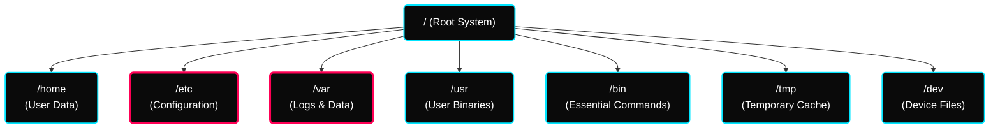

[](#) [](#)

---

# ⚡ CLI Basics & Architecture

> **Focus:** Linux File System, Process Management, Package Management, and Basic Shell Scripting.

---

## ✦ 1. The Linux File System Hierarchy

Linux organizes files in a strict hierarchical tree structure originating from `/` (root). Understanding this is critical for navigating logs and binaries.



> [!TIP]
> **Remember:** Everything in Linux is fundamentally treated as a file — including hardware devices mapping to `/dev`.

---

## ✦ 2. Processes, Daemons & Services

A crucial component of DevOps is interacting with live system processes.

| Concept | Definition | Example |
|---|---|---|
| **Process** | A raw instance of a program in active execution. | Running a `.sh` file script. |
| **Daemon** | A background process running continuously awaiting events. | `sshd`, `httpd` |
| **Service** | An application that responds to requests via Daemons. | Web services, NetworkManager |

### ✦ Service States (`systemctl`)

```bash
systemctl status sshd     # Verify active state
systemctl restart sshd    # Force a daemon reboot after config changes
systemctl enable sshd     # Initialize daemon automatically at system boot
```

---

## ✦ 3. Package Management (RPM vs YUM)

| Tool | Capability | Limitation |
|---|---|---|
| **RPM** | Installs raw `.rpm` files offline directly to the machine. | Cannot automatically resolve missing dependencies. |
| **YUM** | Advanced repository-based management (RHEL/CentOS). | Requires configured internet or local network `.repo` list. |

> [!WARNING]
> Building enterprise environments often requires pointing `YUM` locally using a completely air-gapped Custom Server Repository rather than standard internet mirrors to prevent vulnerability contamination.

---

## ✦ Practice Exercises
- [ ] List all active daemons across your system using `systemctl list-units --type=service`.
- [ ] Create a hierarchical folder structure using `mkdir -p` imitating the root layout `/var/log/custom`.
- [ ] Monitor your own system RAM consumption using `top` and `free -h`.

---

## ✦ Personal Notes

- **The Power of `/etc`:** As a DevOps engineer, you'll spend a lot of time here. Always take a backup (e.g., `cp config.conf config.conf.bak`) before editing any system configuration file.
- **Log Rotation:** Keep an eye on `/var/log`. In professional environments, `logrotate` is your best friend to prevent the root partition from filling up and crashing the server.
- **Binaries:** Understanding the difference between `/bin` (essential) and `/usr/bin` (non-essential) helps when debugging "Command not found" issues in restricted environments.

---

## ✦ 🔗 Resources

See [resources.md](./resources.md)
