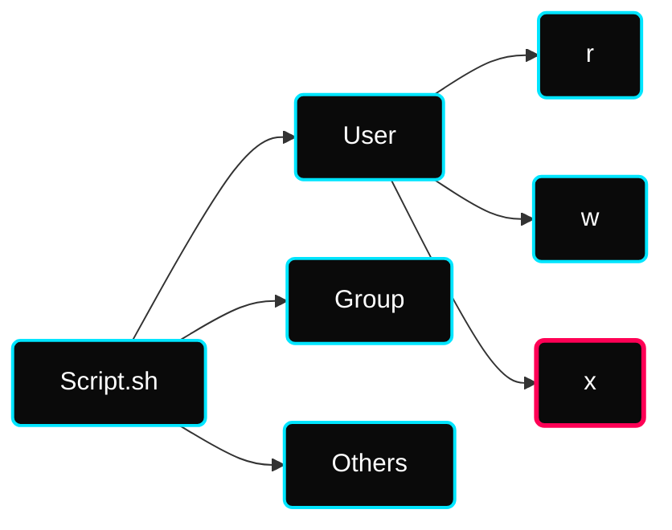

[](#) [](#)

---

# ⚡ Permissions & User Architecture

> **Focus:** Security Administration, Privilege Subsystem, and Connectivity Architectures.

---

## ✦ 1. Linux Privileges Breakdown

Every directory or script generated in Linux falls under a strict 3-tier ownership model.



**Numeric (Octal) Assignment Mapping:**
- `4` = Read (`r`)
- `2` = Write (`w`)
- `1` = Execute (`x`)

> [!TIP]
> Example: Assigning `chmod 755` provides `4+2+1=7` Full Access to the Owner, while limiting Groups and Others to `4+1=5` Read & Execute configurations.

---

## ✦ 2. User & Group Administration
> **Contributor Insights:** In DevOps environments, managing access via groups (e.g., `sudo`, `docker`) is standard practice for secure CI/CD orchestration.

### ✦ User Operations
| Action | Command | Description |
|---|---|---|
| **Create** | `useradd <name>` | Adds a new user profile to the system. |
| **Password** | `passwd <name>` | Sets or changes the user's password. |
| **Switch** | `su <name>` | Switches the current shell session to another user. |
| **Modify** | `usermod -l <new> <old>` | Changes the login name of an existing user. |
| **Delete** | `userdel <name>` | Removes a user profile from the system. |

### ✦ Group Operations
| Action | Command | Description |
|---|---|---|
| **Create** | `groupadd <group>` | Adds a new security group. |
| **Add Member** | `gpasswd -a <user> <grp>` | Appends a user to a specific group. |
| **Remove Member** | `gpasswd -d <user> <grp>` | Removes a user from a specific group. |

### ✦ Core Configuration Files
* `/etc/passwd` — Human-readable registry of users and home paths.
* `/etc/shadow` — Secure storage for encrypted password hashes.
* `/etc/group` — Registry of all system groups and their members.
* `sudo` — Temporary privilege elevation for authorized users.

---
 Linda

## ✦ 3. SSH Configurations (Secure Shell)

SSH dictates the pipeline through which standard remote orchestration takes place.

**Location:** `/etc/ssh/sshd_config`

### ✦ Hardening Protocol
A critical first layer of security on any web-facing cloud machine is forcefully rejecting `root` credential logins via SSH.

```bash
# Locate this field inside sshd_config
PermitRootLogin no

systemctl restart sshd
```

> [!WARNING]
> By disabling root access directly, malicious entities are forced to compromise standard users first and elevate themselves, drastically shutting down brute-force scripts targeting `root`.

---

## ✦ 4. Advanced Networking & Synchronization

### ✦ RSYNC
Unlike native `scp` operations, `rsync` computes algorithmic delta transfers, allowing it to rapidly calculate and only transmit files modified since the last backup.

```bash
# Efficient block syncing
rsync -avh database/ root@10.0.0.1:/var/backups/
```

### ✦ NIC Teaming (Bonding) 
Critical production infrastructures mandate Network Interface Card redundancy.

| State | Purpose |
|---|---|
| `active-backup` | Cold failover. If Card A dies, Card B instantly restores connectivity. |
| `round-robin` | Rotates packets. Load balancing across all hardware paths. |
| `broadcast` | Mass duplicates signals across every interface constantly. |

---

## ✦ Practice Exercises
- [ ] Initialize a new user `dev_test` using `useradd` and view their specific footprint in `/etc/passwd`.
- [ ] Implement `chmod 600` on an arbitrary `.pem` key file and verify execution blockage.
- [ ] Access your standard `/etc/ssh/sshd_config` and audit the status of Root Logins.

---

## ✦ Personal Notes

- **The `chmod 600` Rule:** This is the industry standard for private keys (`.pem`, `.id_rsa`). If permissions are too open, SSH will refuse to use the key for security reasons.
- **Sudo Hygiene:** Avoid staying in a `sudo su -` shell. Use `sudo <command>` to maintain a clear audit trail in `/var/log/secure` or `/var/log/auth.log`.
- **User Groups:** In CI/CD, you often add the `jenkins` or `docker` user to specific groups (like the `docker` group) to allow them to interact with the daemon without needing full root privileges.

---

## ✦ 🔗 Resources

See [resources.md](./resources.md)
