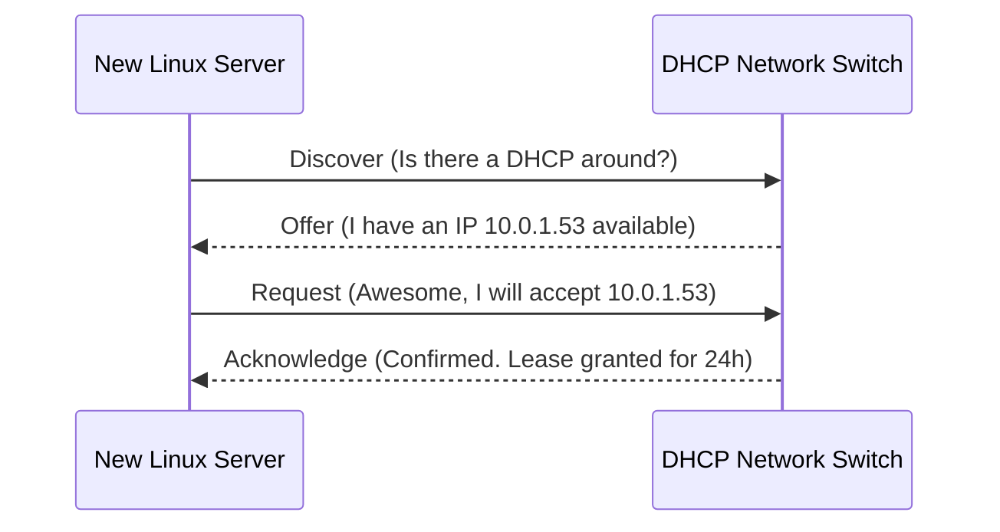

[](#) [](#)

---

# ⚡ IP Addressing & Subnets

> **Focus:** CIDR Subnetting Rules, IP Address Allocation, and DHCP Routing.

---

## ✦ 1. IPv4 vs IPv6 Standards

Every single machine linked in an infrastructure must possess a uniquely identifiable network marker.

| Generation | Architecture | Total Addresses | Example |
|---|---|---|---|
| **IPv4** | 32-bit Numeric | ~4.3 Billion | `192.168.1.10` |
| **IPv6** | 128-bit Alphanumeric | 340 Undecillion | `2001:0db8:85a3::8a2e` |

> [!TIP]
> While IPv6 prevents address exhaustion globally, AWS internal VPCs overwhelmingly still rely on standard IPv4 `10.x.x.x` implementations.

---

## ✦ 2. The Mechanics of CIDR (Classless Inter-Domain Routing)

CIDR allows engineers to artificially divide massive networks into smaller grouped **Subnets**. It uses slash notation.

```
IP Address: 192.168.1.0/24
                       │
                       └── Network Block Mask
```

### ✦ Common Cloud Subnet Sizes:

| CIDR Prefix | Total IPs Allowed | Usable Host IPs | Cloud DevOps Use Case |
|---|---|---|---|
| `/16` | 65,536 | 65,534 | AWS Cloud Virtual Private Cloud (VPC) Boundary |
| `/24` | 256 | 254 | Standard Application Subnets / Single Router LANs |
| `/32` | 1 | 1 | Defining a rigorous Security Group rule for a Single Machine |

> [!WARNING]
> In AWS Subnets, you actually lose **5 IPs natively**, not just 2 (Network + Broadcast). The cloud provider reserves extra hardware routing IPs silently. A `/24` gives you `251` IPs in the cloud!

---

## ✦ 3. DHCP (Dynamic Host Configuration Protocol)

Instead of statically mapping every server IP manually, DHCP servers handle lease allocations cleanly on startup.



---

## ✦ Practice Exercises
- [ ] Utilize an external IP checker to identify your outbound IPv4 address.
- [ ] Determine how many total computers could be spun up inside a `/26` configuration.
