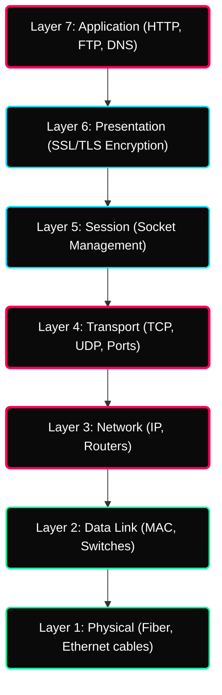

 

---

# ⚡ OSI & Port Protocols

> **Focus:** Theoretical Networking Architecture, The TCP/IP Suite, and Topology Layouts.

---

## ✦ 1. The OSI Model (7 Layers)

The Open Systems Interconnection model is a conceptual framework determining how data travels from one machine's application to another over physical hardware.

> [!NOTE]
> As a DevOps/Cloud Engineer, you will spend 90% of your time troubleshooting network drops at **Layer 3 (IP/Routing)**, **Layer 4 (Ports/TCP)**, and **Layer 7 (Application/HTTP)**!

---

## ✦ 2. TCP vs UDP Protocol

At Layer 4 (Transport), data utilizes two primary transmission methods.

| Feature | TCP (Transmission Control Protocol) | UDP (User Datagram Protocol) |
|---|---|---|
| **Connection** | Requires secure `SYN/ACK` 3-way handshake. | Connectionless fire-and-forget. |
| **Reliability** | Guaranteed packet delivery and ordering. | Zero guarantees. Packets drop silently. |
| **Speed** | Highly accurate but slower. | Microsecond fast. |
| **Use Cases** | Web Traffic (HTTP), SSH, Database Queries | DNS lookups, Video Streaming, Gaming |

---

## ✦ 3. Network Topologies

In modern cloud architecture, you emulate these topologies using Virtual Private Clouds (VPCs).

- **Star Topology** — Every server connects to a localized switch. Failure of one node doesn't drop the rest.
- **Mesh Topology** — Complete interconnection. Critical for zero-downtime microservices communicating internally.

---

## ✦ Practice Exercises
- [ ] Diagram out how your browser fetching `google.com` passes through Layers 7 down to Layer 1.
- [ ] Determine exactly what a `SYN-ACK` packet does during a TCP connection phase.
