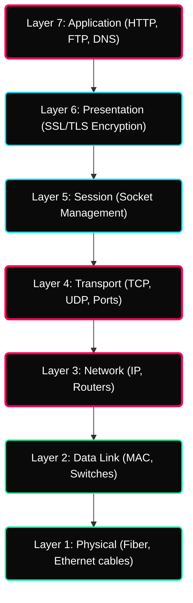
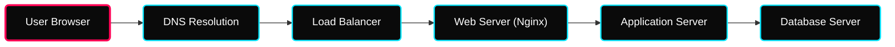

 

---

# ⚡ OSI & Port Protocols

> **Focus:** Theoretical Networking Architecture, The TCP/IP Suite, and Topology Layouts.

---

## ✦ 1. The OSI Model (7 Layers)

The Open Systems Interconnection model is a conceptual framework determining how data travels from one machine's application to another over physical hardware.

---

## ✦ 2. End-to-End Request Flow
> **Contributor Insights:** Tracing the request flow step-by-step is the fastest way to debug connectivity issues in production.

---

## ✦ 3. Ports & Services Reference
Common ports defined in industrial networking:

| Service | Port | Protocol |
|---|---|---|
| **SSH** | 22 | TCP |
| **HTTP** | 80 | TCP |
| **HTTPS** | 443 | TCP |
| **Node.js/Spring** | 3000 / 8080 | TCP |
| **MySQL / Postgres** | 3306 / 5432 | TCP |

> [!NOTE]
> As a DevOps/Cloud Engineer, you will spend 90% of your time troubleshooting network drops at **Layer 3 (IP/Routing)**, **Layer 4 (Ports/TCP)**, and **Layer 7 (Application/HTTP)**!

---

## ✦ 2. TCP vs UDP Protocol

At Layer 4 (Transport), data utilizes two primary transmission methods.

| Feature | TCP (Transmission Control Protocol) | UDP (User Datagram Protocol) |
|---|---|---|
| **Connection** | Requires secure `SYN/ACK` 3-way handshake. | Connectionless fire-and-forget. |
| **Reliability** | Guaranteed packet delivery and ordering. | Zero guarantees. Packets drop silently. |
| **Speed** | Highly accurate but slower. | Microsecond fast. |
| **Use Cases** | Web Traffic (HTTP), SSH, Database Queries | DNS lookups, Video Streaming, Gaming |

---

## ✦ 3. Network Topologies

In modern cloud architecture, you emulate these topologies using Virtual Private Clouds (VPCs).

- **Star Topology** — Every server connects to a localized switch. Failure of one node doesn't drop the rest.
- **Mesh Topology** — Complete interconnection. Critical for zero-downtime microservices communicating internally.

---

## ✦ 5. Cloud Networking Basics
In cloud platforms like AWS, traditional networking is abstracted into **Software Defined Networking (SDN)**.

- **VPC (Virtual Private Cloud)**: Isolated virtual network for your resources.
- **Public Subnet**: Reachable from the internet (via Internet Gateway). Usually hosts Load Balancers.
- **Private Subnet**: No direct internet route. Hosts sensitive App servers and Databases.
- **CIDR**: Defines the IP range size (e.g., `/16` = 65,536 IPs, `/24` = 256 IPs).

---

## ✦ Practice Exercises
- [ ] Determine exactly what a `SYN-ACK` packet does during a TCP connection phase.

---

## ✦ Personal Notes

- **The Layer 4 Bouncer:** In AWS Security Groups, you operate primarily at **Layer 4**. When a developer says "My app can't connect!", the first thing you check is if the security group allows that specific **Port** and **Protocol (TCP/UDP)**.
- **TCP Handshake Failures:** If a connection times out, it's often a "Silent Drop" at Layer 3/4. If it returns "Connection Refused", the packet made it to the server, but no daemon is listening on that port (Layer 7 issue).
- **UDP for Speed:** In high-scale monitoring (Prometheus/Grafana), you often use UDP for metrics (statsd). It's better to lose a single metric packet than to slow down the entire application by waiting for TCP acknowledgments.

---

## ✦ 🔗 Resources

See [resources.md](./resources.md)
