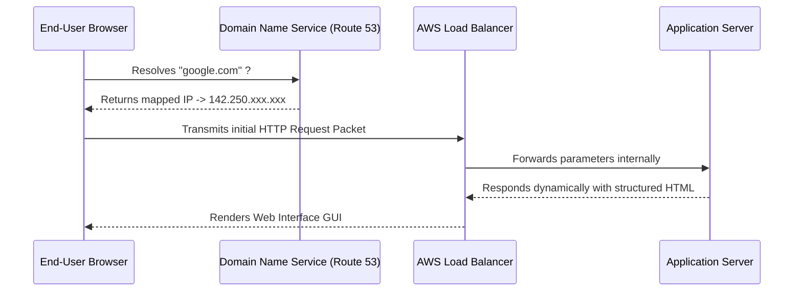

 

---

# ⚡ DNS & Proxy Routings

> **Focus:** Internet execution mapping, TLS encryption frameworks, and layer 7 load-balancing principles.

---

## ✦ 1. The Internet Execution Loop

Every digital interaction originates from parsing alphanumeric text into raw routable IP data blocks.

---

## ✦ 2. HTTP vs HTTPS (Cryptography)

The execution layer fundamentally changes depending on the transport port assigned to the system.

- **HTTP (Port 80)**: Unencrypted raw-text transfer. Highly vulnerable to MITM (Man in the Middle) sniffing attacks.
- **HTTPS (Port 443)**: Relies on `SSL/TLS` symmetric handshakes to encrypt payloads before they leave the wire.

> [!WARNING]
> Certbot (Let's Encrypt) relies dynamically on checking Port 80 to verify your web server ownership before returning the TLS Port 443 certificate. Never firewall Port 80 outright on a proxy server configuration.

---

## ✦ 3. The Reverse Proxy Architecture

A reverse proxy actively shields destination servers, sitting aggressively in front of an environment layer to intercept commands.

| Feature Benefits | What it Does Practically |
|---|---|
| **SSL Termination** | All SSL CPU overhead is decoded instantly at the Proxy, alleviating the backend app servers. |
| **Load Balancing** | Intersects `10k+` requests and evenly divides them randomly across multiple backend hosts natively. |
| **IP Anonymity** | The actual web server completely hides behind the proxy environment, preventing DDoS direct attacks to the server directly. |

---

## ✦ Practice Exercises
- [ ] Run `nslookup` on 3 major domains to identify their global resolution IPs.
- [ ] Attempt forcing a TCP socket into `google.com:80` using `telnet` and track the exact HTTP Header responses.
