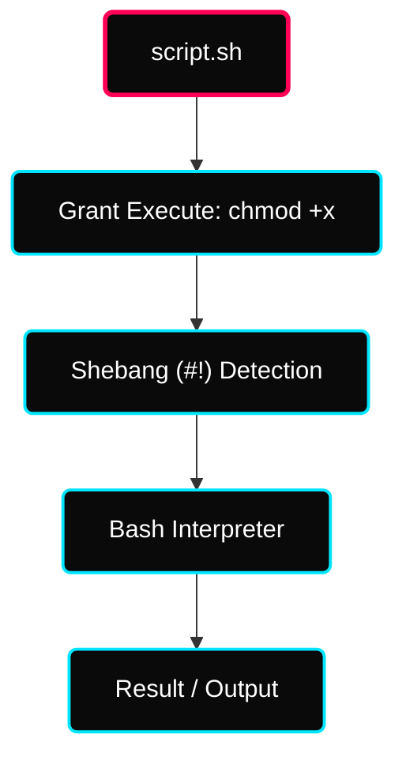

 

---

# ⚡ Shell Scripting Mastery

> **Focus:** Automation Logic, Script Architecture, Shell Variables, and Execution Prototypes.

---

## ✦ 1. What is a Shell?
A Shell acts as the primary interface between the user and the Linux kernel. It interprets text-based commands and converts them into kernel-level operations.

| Logic | Description |
|---|---|
| **Input** | Takes commands from stdin (terminal). |
| **Relay** | Passes instructions to the OS Kernel. |
| **Execution** | Returns the status/output of the operation. |

### ✦ Common Shells
- **Bash (Bourne Again Shell)** — The industry standard for Linux scripting.
- **Zsh / Fish** — Modern shells with enhanced UI/UX.
- **sh / ksh** — Legacy or specialized shells.

---

## ✦ 2. Script Anatomy & Execution
A Shell Script is a text file containing a sequence of commands executed line-by-line.

### ✦ Execution Flow

### ✦ Prototype Methods
1. `sh script.sh` — Runs using Bourne shell.
2. `bash script.sh` — Specifically uses Bash.
3. `./script.sh` — Direct execution (Requires `chmod +x` and shebang).
4. `. script.sh` — Dot command (Executes in current shell environment).

---

## ✦ 3. Variable Architectures
Variables allow data to be stored and reused dynamically.

### ✦ System Variables (Built-in)
| Variable | Represents |
|---|---|
| `$HOME` | User's Home Directory |
| `$USER` | Current Logged-in Profile |
| `$SHELL` | Primary Shell path |
| `$PWD` | Present Working Directory |
| `$BASH_VERSION` | Versioning of current bash engine |

### ✦ Positional Parameters (Arguments)
- `$0` — Script Name.
- `$1 - $9` — Indexed Input Arguments.
- `$#` — Count of total arguments.
- `$*` — All arguments as a **single string**.
- `$@` — All arguments as **separate elements**.
- `$$` — Current Process ID (PID).
- `$?` — Exit status of the last command (`0` = Success).

---

## ✦ 4. String Formatting & Escapes
When echo-ing data, use the `-e` flag to enable interpretation of backslash escapes.

| Escape | Meaning |
|---|---|
| `\n` | New line |
| `\t` | Tab |
| `\\` | Literal Backslash |
| `\a` | System Alert Beep |

---

## ✦ Contributor Notes
> **Best Practice:** Always use the `.sh` extension for clarity, even if Linux doesn't strictly require it. It helps IDEs like VS Code provide syntax highlighting immediately.

---

## ✦ 🔗 Resources
See [resources.md](./resources.md)
