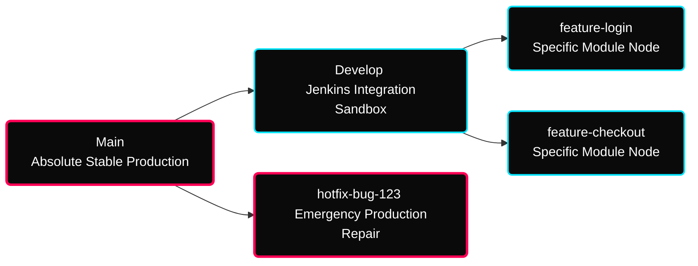

[](#) [](#)

---

# ⚡ Advanced Branching & CI Pipelines

> **Focus:** Topological Git Flow environments, Rewriting commit histories, and code collision resolutions.

---

## ✦ 1. The Standard "Git Flow" Topology

Enterprise environments rigorously separate un-tested developer code deployments from stable production branches utilizing a strict staging hierarchy.



---

## ✦ 2. Rebasing vs Merging

Merging code back into main streams can be handled distinctly.

| Concept | Action Mechanism | Risk Level |
|---|---|---|
| **Merge** | Interlocks history chronologically creating a messy but completely accurate `merge commit` junction. | Extremely Safe |
| **Rebase** | Physically detaches your branch from the past and physically re-attaches it onto the immediate head of the target branch, rewriting history sequentially! | Highly Destructive |

> [!WARNING]
> Never, ever Rebase a branch that is physically shared by multiple developers in a public external repository. Because rebasing rewrites the exact commit hashes, you will permanently desynchronize your team's local clones from the master registry!

---

## ✦ 3. Cherry-Picking

If an emergency Hotfix was deployed into `main` urgently, but the `Develop` environment still desperately needs that exact specific bug fix without merging the entire history of `main` down into it natively: `Git Cherry-Pick` flawlessly duplicates a single isolated commit hash!

```bash
# Pulls the specified commit perfectly into your active checkout branch safely!
git cherry-pick a1b2c3d4 
```

---

## ✦ Practice Exercises
- [ ] Diagram a sandbox scenario resolving a merge conflict triggered by editing the same `.md` line on two branches.
- [ ] Initialize a dummy repository, create a branch, run arbitrary changes natively, and merge them back onto Main sequentially.
