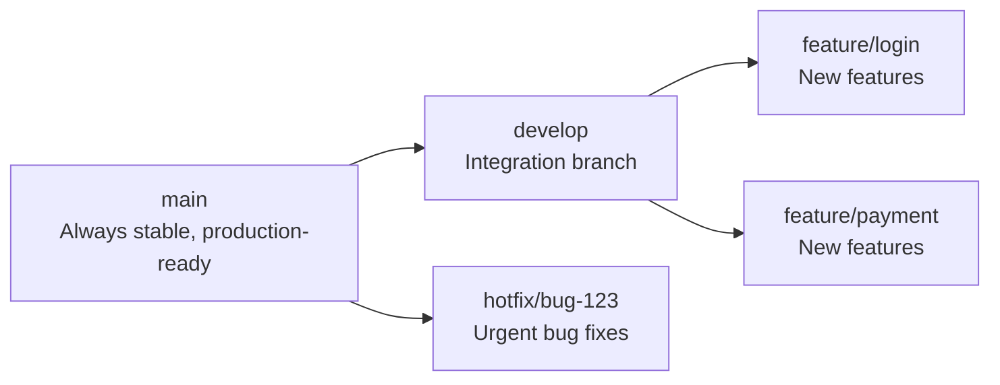

# Week 05 — Git & Version Control

> **Duration:** Feb 17 – Feb 23, 2026
> **Goal:** Understand version control and master Git — the backbone of all modern software development.

---

## Why Git in DevOps?

Every DevOps workflow starts with code in a Git repository. Whether you are writing a Dockerfile, a Jenkins pipeline, or a Terraform script — it all lives in Git.

---

## Concepts Learned

### 1. What is Version Control?

Version control is a system that records changes to files over time. It lets you:
- Go back to any previous version of your code
- Work in parallel with a team without overwriting each other's work
- Track who changed what and when

### 2. CVCS vs DVCS

| CVCS (Centralized) | DVCS (Distributed) |
|---|---|
| One central server holds all history | Every developer has the full history |
| Examples: SVN, CVS | Examples: **Git**, Mercurial |
| If server goes down, you can't work | Works offline |
| Slower | Faster |

Git is **DVCS** — the entire repository (with all history) exists on your local machine.

### 3. Key Git Concepts

| Concept | Meaning |
|---|---|
| **Repository (Repo)** | A folder tracked by Git |
| **Commit** | A saved snapshot of your files |
| **Branch** | An independent line of development |
| **Merge** | Combining two branches together |
| **Remote** | A version of the repo on another server (GitHub, GitLab) |
| **Clone** | Copy a remote repo to your local machine |
| **Fork** | Copy someone else's repo to your GitHub account |
| **Pull Request (PR)** | Ask the repo owner to merge your changes |
| **Stash** | Temporarily save uncommitted changes |
| **Rebase** | Rewrite commit history by moving commits to a new base |
| **Cherry-pick** | Copy a specific commit from one branch to another |
| **PAT** | Personal Access Token — used instead of password for GitHub |

### 4. Branching Strategy

A branching strategy is a plan for how your team uses branches. Common strategies:

**Git Flow:**


### 5. Rebase vs Merge

| Merge | Rebase |
|---|---|
| Creates a merge commit | Rewrites history, no merge commit |
| History shows all branches | History looks clean and linear |
| Safe for shared branches | ⚠️ Never rebase public/shared branches |
| Good for collaborative work | Good for local cleanup before PR |

### 6. Cherry-Pick

Copy a specific commit to another branch without merging the whole branch.

```bash
git cherry-pick <commit-hash>
```

Use case: A bug fix was made on `feature` branch but you need it on `main` right now.

---

## Git Commands Reference

```bash
# Setup
git config --global user.name "Your Name"
git config --global user.email "you@example.com"

# Initialize / Clone
git init                              # Start tracking a folder
git clone <url>                       # Clone a remote repo
git clone <url> --depth 1            # Shallow clone (no full history)

# Staging & Committing
git status                            # See what has changed
git add filename.txt                  # Stage a specific file
git add .                             # Stage all changes
git commit -m "Your commit message"   # Save staged changes

# Remote
git remote -v                         # List remote connections
git remote add origin <url>           # Add a remote
git push origin main                  # Push to remote
git pull origin main                  # Pull latest changes
git fetch origin                      # Download remote changes (don't merge)

# Branches
git branch                            # List branches
git branch feature-login              # Create a new branch
git checkout feature-login            # Switch to a branch
git checkout -b feature-login         # Create AND switch in one step
git merge feature-login               # Merge a branch into current branch
git branch -d feature-login           # Delete a branch (safe)
git branch -D feature-login           # Force delete a branch

# Rebase & Cherry-pick
git rebase main                       # Rebase current branch onto main
git cherry-pick <hash>                # Copy a specific commit here

# Stash
git stash                             # Temporarily save uncommitted changes
git stash list                        # List saved stashes
git stash pop                         # Restore the most recent stash
git stash drop                        # Delete the most recent stash

# History & Inspection
git log                               # View commit history
git log --oneline                     # Compact view
git log --oneline --graph             # Visual branch graph
git diff                              # See unstaged changes
git show <commit-hash>               # Details of a specific commit

# SSH for GitHub
ssh-keygen -t ed25519 -C "you@example.com"    # Generate SSH key pair
cat ~/.ssh/id_ed25519.pub                      # Copy public key to GitHub
ssh -T git@github.com                          # Test SSH connection
```

---

## Personal Notes

<!-- Add your Git notes and discoveries here -->

---

## Resources

See [resources.md](./resources.md) for Git documentation and tutorials.
