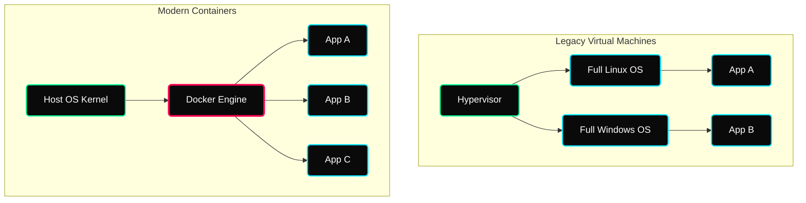

 

---

# ⚡ Container Visualization & Lifecycles

> **Focus:** Virtualization divergence, Dockerfile assembly, and daemon networking primitives.

---

## ✦ 1. Virtual Machines vs Containers

Containers solve the "it works on my machine" crisis by freezing external dependencies into standard, movable artifacts.

> [!TIP]
> Notice how Containers skip the OS layer entirely! A container doesn't boot; it just spins into Memory instantaneously utilizing native kernel functions!

---

## ✦ 2. Image vs Container Terminology

| Concept | Explanation | Real World |
|---|---|---|
| **Image**| Static read-only artifact template downloaded from a Registry. | The physical blueprint of a house. |
| **Container** | Running application executing the Image natively. | The physical house you walk into. |
| **Volume** | Extracted disk mounting separating logic from app data. | The storage garage attached to the house. |

---

## ✦ 3. Networking Boundaries

By default, Docker isolates completely. You must intentionally bridge it natively.

| Network Flag | Effect |
|---|---|
| `--network bridge` | Standard isolation. Good for single-node systems. |
| `--network host` | Obliterates isolation. The container physically takes over the host's direct network card. Dangerous, but extremely low latency. |

---

## ✦ Practice Exercises
- [ ] Spin up `nginx` isolated internally on Port 80 and deliberately fail to connect via browser without mapped `8080:80` parameters!
- [ ] Mount a distinct named volume natively into `/usr/share/nginx/html` and watch how destroying the container doesn't delete your web files.
