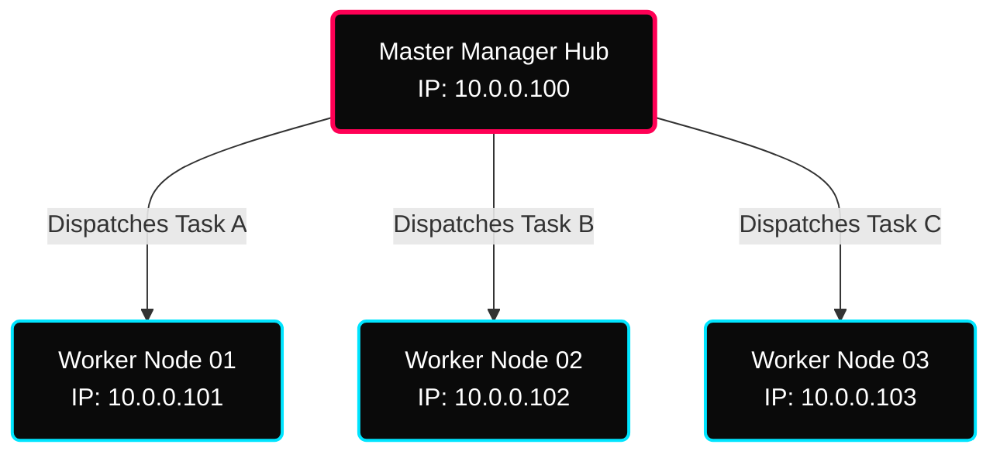

 

---

# ⚡ Docker Swarm Configurations

> **Focus:** Multi-Host container architecture natively natively, Manager-Worker hierarchies natively, and Overlay mesh networking natively.

---

## ✦ 1. The Swarm Control Topology

Docker fundamentally operates gracefully natively on a singular machine locally. A **Swarm** physically interconnects multiple disparate cloud servers intelligently natively acting as one unified computing pool natively.

---

## ✦ 2. Abstract Networking (The Overlay Mesh)

Standard bridge networks isolate completely containers onto a single host securely.
When deploying scaling Web Servers blindly gracefully across 3 different physical Worker Nodes gracefully securely, Docker relies fundamentally exclusively natively on an **Overlay Network** to automatically route tracking packets dynamically natively between machines transparently!

> [!WARNING]
> Overlay networking structurally relies gracefully completely natively forcefully on Firewall Port `2377` for swarm management bindings, and `4789` for physical data-plane overlays natively!

---

- [ ] Deploy an arbitrary global service intelligently natively using `docker service create` specifically defining `--replicas 3`.

---

## ✦ Personal Notes

- **The Manager Quorum:** In a production Swarm, always use an odd number of Managers (3 or 5). This prevents "Split-Brain" scenarios where the cluster doesn't know who the leader is if a network partition occurs.
- **Service vs. Container:** In Swarm, you don't manage containers directly; you manage **Services**. If a container dies, the Swarm Manager detects the delta from the desired state and automatically recreates it on a healthy node.
- **Routing Mesh Convenience:** One of the coolest features of Swarm is the **Routing Mesh**. You can hit the IP of *any* node in the cluster on the service port, and Docker will internally route your request to a node that is actually running the container.

---

## ✦ 🔗 Resources

See [resources.md](./resources.md)
