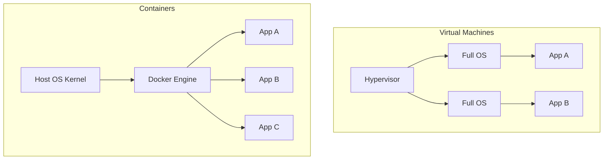
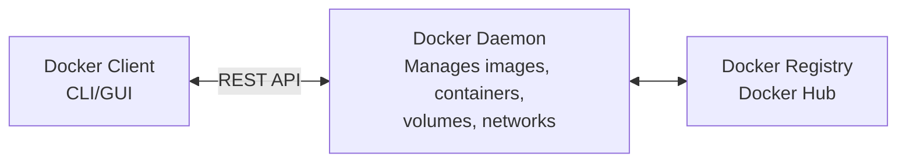

# Week 06 — Docker & Containerization

> **Duration:** Feb 24 – Mar 09, 2026 (2 weeks)
> **Goal:** Understand containers, run applications inside Docker, and manage multi-container systems.

---

## Why Docker in DevOps?

Before Docker, deploying an application was a nightmare. It would work on one machine but not another — the classic *"it works on my machine"* problem.

Docker solves this by packaging your application and **everything it needs** into a single portable unit called a **container**.

---

## Concepts Learned

### 1. What is Virtualisation?

**Virtualisation** means running multiple operating systems on a single physical machine using software called a **hypervisor** (like VirtualBox or VMware).

Each virtual machine (VM) has its **own full OS**, which makes VMs heavy and slow to start.

**Containers are different** — they share the host OS kernel. This makes them:
- Much lighter than VMs
- Start in seconds (VMs take minutes)
- Use less RAM and disk space



---

### 2. Docker Architecture

Docker uses a **client-server** architecture.



Key components:
- **Docker Client** — the CLI tool you type commands into (`docker run`, `docker build`)
- **Docker Daemon** — the background service that does the actual work
- **Docker Hub** — a public registry where Docker images are stored and shared
- **Docker Engine** — the combination of the client + daemon

---

### 3. Images vs Containers

| Image | Container |
|-------|-----------|
| A **template/blueprint** | A **running instance** of an image |
| Read-only | Has a writable layer on top |
| Stored on disk | Lives in memory when running |
| Like a recipe | Like the actual dish being cooked |

---

### 4. Volumes

By default, when a container is deleted, its data is deleted too.

**Volumes** are the solution — they store data outside the container so it persists.

```bash
# Create a named volume
docker volume create mydata

# Run container with volume mounted
docker run -v mydata:/app/data myimage
```

Types:
- **Named volumes** — managed by Docker, easiest to use
- **Bind mounts** — you specify an exact folder on the host machine
- **tmpfs** — stored in memory only (disappears on restart)

---

### 5. Docker Networks

Docker containers can communicate with each other through networks.

| Network Type | Description | When to Use |
|---|---|---|
| **bridge** | Default. Containers on same bridge can talk to each other | Most common, single host |
| **host** | Container uses host's network directly (no isolation) | When you need max performance |
| **none** | No networking at all | Completely isolated containers |
| **custom bridge** | User-defined bridge with DNS resolution by name | Better than default bridge |
| **overlay** | Connects containers across multiple hosts | Docker Swarm, multi-host apps |
| **ipvlan** | Full control over IP addressing | Advanced networking |
| **macvlan** | Assigns a real MAC address to containers | Containers need to appear as physical devices |

---

### 6. EXPOSE vs -p (Publish)

This is a common source of confusion:

| `EXPOSE` in Dockerfile | `-p` flag in `docker run` |
|---|---|
| Documentation only | Actually opens the port |
| Does NOT make port accessible from outside | Maps container port to host port |
| Tells other developers which port the app uses | Required to access the app from your browser |

```bash
# This publishes port 80 inside container to port 8080 on host
docker run -p 8080:80 nginx

# You can now access it at localhost:8080
```

---

### 7. docker exec vs docker attach

| `docker exec` | `docker attach` |
|---|---|
| Runs a new command inside a running container | Connects to the main process of a container |
| Safe — won't stop the container | Dangerous — exiting with Ctrl+C can stop the container |
| Use for: exploring, running scripts | Use for: debugging the main process |

```bash
docker exec -it mycontainer bash    # Open a bash shell inside container
docker attach mycontainer           # Attach to the running main process
```

---

### 8. Dockerfile

A **Dockerfile** is a script that tells Docker how to build your image.

```dockerfile
# Base image
FROM ubuntu:22.04

# Who maintains this
LABEL maintainer="yourname@email.com"

# Set working directory inside container
WORKDIR /app

# Copy files from host to container
COPY . /app

# Install dependencies
RUN apt-get update && apt-get install -y python3

# Port the app will use (documentation only)
EXPOSE 5000

# Command to run when container starts
CMD ["python3", "app.py"]
```

---

### 9. Docker Compose

**Docker Compose** lets you define and run multi-container applications using a single YAML file.

Example — a web app with a database:

```yaml
version: "3.8"

services:
  web:
    image: nginx
    ports:
      - "8080:80"
    volumes:
      - ./html:/usr/share/nginx/html
    networks:
      - mynet
    depends_on:
      - db

  db:
    image: mysql:8.0
    environment:
      MYSQL_ROOT_PASSWORD: secret
      MYSQL_DATABASE: myapp
    volumes:
      - dbdata:/var/lib/mysql
    networks:
      - mynet

volumes:
  dbdata:

networks:
  mynet:
```

Run everything with: `docker compose up -d`

---

### 10. Docker Swarm

**Docker Swarm** is Docker's built-in tool for running containers across **multiple machines** (nodes).

Key concepts:
- **Manager node** — controls the swarm, assigns work
- **Worker node** — runs the containers assigned by manager
- **Service** — a task defined to run on the swarm
- **Overlay network** — lets containers on different hosts communicate

```bash
# Initialize a swarm on the manager
docker swarm init

# Join as worker (run on worker machine, use token from init)
docker swarm join --token <TOKEN> <MANAGER_IP>:2377

# Deploy a service across the swarm
docker service create --name webservice --replicas 3 -p 80:80 nginx

# See all nodes
docker node ls

# See all services
docker service ls
```

---

### 11. Reverse Proxy with Nginx

A **reverse proxy** sits in front of your app and forwards requests to it. This lets you:
- Use a domain name instead of an IP:port
- Run multiple apps on port 80
- Add SSL certificates

Basic Nginx reverse proxy config:

```nginx
server {
    listen 80;
    server_name myapp.com;

    location / {
        proxy_pass http://localhost:3000;
        proxy_set_header Host $host;
        proxy_set_header X-Real-IP $remote_addr;
    }
}
```

---

## Practice Exercises

- [ ] Pull the `nginx` image from Docker Hub and run it
- [ ] Write a Dockerfile for a simple Python or Node.js app
- [ ] Build the image and run it with a port mapping
- [ ] Create a Docker Compose file with 2 services
- [ ] Create a named volume and verify data persists after container removal
- [ ] Set up a custom bridge network and make two containers talk to each other
- [ ] Initialize a Docker Swarm and deploy a service with 3 replicas

---

## Personal Notes

<!-- Add your own observations, errors you hit, and how you fixed them -->

> 💬 *Note what confused you, what clicked, and what you want to revisit.*

---

## Resources

See [resources.md](./resources.md) for Docker documentation, tutorials, and reference links.
