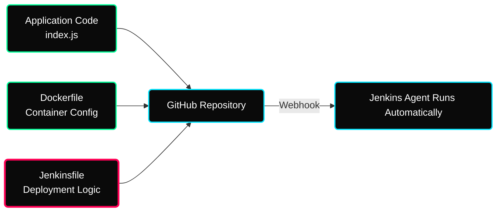

 

---

# ⚡ Groovy Declarative Pipelines

> **Focus:** Infrastructure as Code pipelines, Jenkinsfile tracking structurally, and Groovy DSL Syntax.

---

## ✦ 1. The Power of "Jenkinsfile"

Instead of configuring a clunky disjointed Jenkins UI manually every single time an environment changes, the entire pipeline is codified precisely dynamically into a singular tracked `Jenkinsfile` stored alongside your application structurally in GitHub.

---

## ✦ 2. Groovy DSL Core Structure

Pipelines enforce strict bracket groupings ensuring logic dictates identically.

| Component | Function within standard execution |
|---|---|
| `pipeline { }` | Absolute root node. Encapsulates the entire script. |
| `agent any` | Tells the Master controller to dump this job onto literally any connected worker. |
| `stages { }` | Structurally separates distinct phases logically sequentially (Build, then Test, then Deploy). |
| `steps { }` | The exact literal bash `sh` or PowerShell commands physically executed inside each phase. |
| `post { }` | Final conditional triggers executing strictly depending on if the build Passed or Failed. |

---

- [ ] Initialize a standard Freestyle project structurally via the Jenkins GUI completely, then convert the exact same logic into a Jenkinsfile Pipeline dynamically!

---

## ✦ Personal Notes

- **The "Agent any" Trap:** In production, avoid `agent any`. Use labels like `agent { label 'docker-node' }` to ensure your build only runs on agents that have the necessary tools installed. This prevents builds failing because "docker command not found".
- **Post-Build Awareness:** Always use the `post { always { cleanWs() } }` block. Without it, Jenkins agents will keep old build artifacts on disk indefinitely, eventually running out of space and crashing future builds.
- **Fail Fast:** Use the `timeout` option on your stages. If a build hangs (e.g., waiting for an input), you don't want it to hog an executive slot for hours. `timeout(time: 10, unit: 'MINUTES') { ... }` is a lifesaver.

---

## ✦ 🔗 Resources

See [resources.md](./resources.md)
