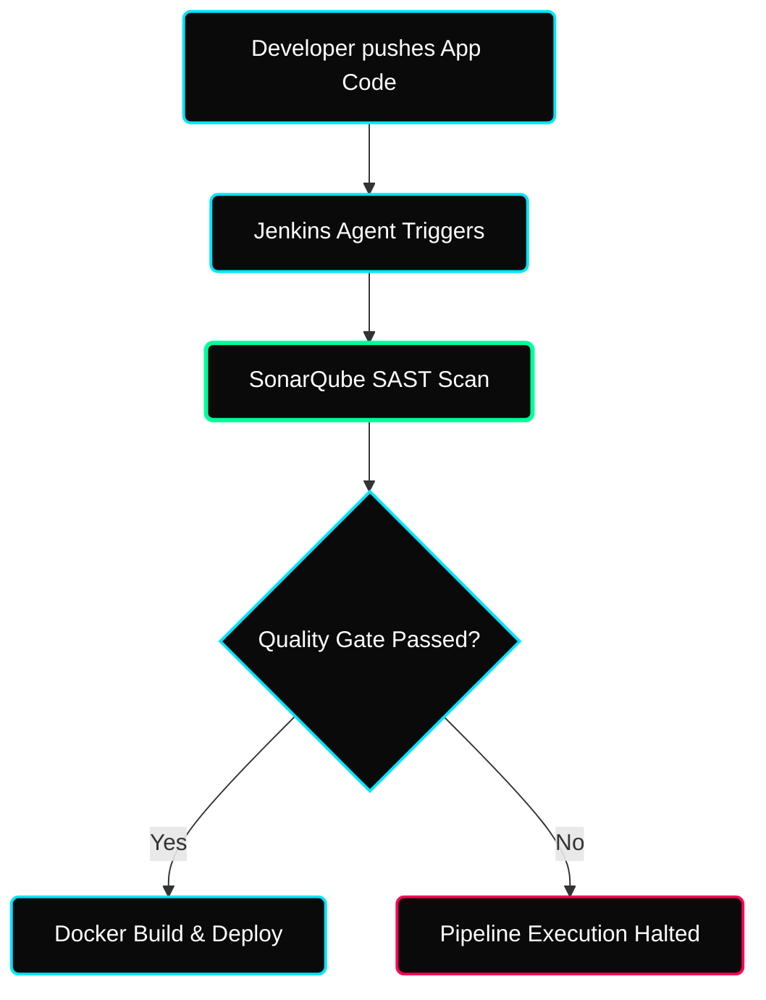

 

---

# ⚡ SonarQube & SAST Architectures

> **Focus:** Static Application Security Testing, Quality Gates, and CI Code Integration.

---

## ✦ 1. Shift-Left Security Pipeline

Traditional DevOps drops security checking gracefully at the very end of the deployment cycle natively. DevSecOps forces **Shift-Left** evaluation cleanly intercepting pushes identically at build time structurally!

---

## ✦ 2. SonarQube Metric Priorities

SonarQube analyzes un-compiled raw source code strictly tracking four distinct violation thresholds organically.

| Threshold | Description | DevOps Impact Context |
|---|---|---|
| **Vulnerabilities** | Critical exploit vectors natively found in syntax. | High Priority. Must fail the Quality Gate instantly. |
| **Bugs** | Broken logic chains gracefully tracking undefined paths. | Medium Priority. Fail on production branch integrations. |
| **Code Smells** | Bad formatting strictly working gracefully effectively but causing messy readabilities logically. | Tracked as "Technical Debt". Handled eventually cleanly seamlessly. |
| **Coverage** | The explicit percentage of code actually securely validated by Unit Tests natively. | High Priority cleanly forcing Developers to write Unit Tests structurally naturally! |

---

## ✦ Practice Exercises
- [ ] Initialize a completely blank SonarQube instance intuitively seamlessly using a standard Docker Container directly bound to Port `9000`.
- [ ] Evaluate explicitly natively a completely dummy Python script visually validating structural code smells logically cleanly seamlessly cleanly dynamically!
