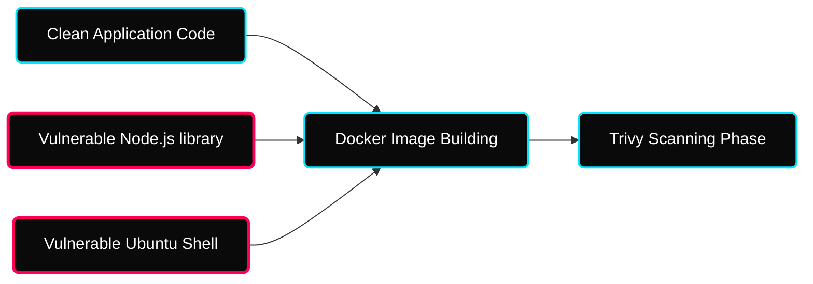

 

---

# ⚡ Container Images & External Dependencies (SCA)

> **Focus:** Software Composition Analysis (SCA), Common Vulnerability Exposures (CVE), and Docker Layer Integrations.

---

## ✦ 1. The Threat of Baseline Dependencies

You can write completely flawless, secure native logic, but if you run it utilizing an arbitrarily vulnerable `FROM ubuntu:20.04` container base, your application is structurally compromised.

---

## ✦ 2. OWASP Top 10 Core Threats

The Open Web Application Security Project rigorously defines exactly what vectors currently plague web architecture.

| Threat Profile | Exploitation Dynamic |
|---|---|
| **Broken Access Control** | URL manipulation allowing users to bypass administrative checks. |
| **Injection (SQL)** | Executing malicious arbitrary queries intentionally inside Database prompts. |
| **Vulnerable Components** | Not updating external Open-Source libraries optimally to resolve CVEs. |

---

## ✦ 3. Trivy vs OWASP Dependency-Check

Two distinct tools solve two distinct scanning vectors seamlessly.

| Tool | Focus Zone | Pipeline Utilization |
|---|---|---|
| **OWASP DC** | Deeply inspects explicit `.pom`, `package.json`, and `.whl` binaries internally. | Executed securely continuously prior to building Docker layers implicitly. |
| **Trivy** | Scans fully built Container image Operating System binaries thoroughly. | Executed identically effectively strictly after Container generation. |

---

## ✦ Practice Exercises
- [ ] Pull an outdated `nginx:1.10` container dynamically and execute Trivy naturally against it to view the critical vulnerabilities list.
