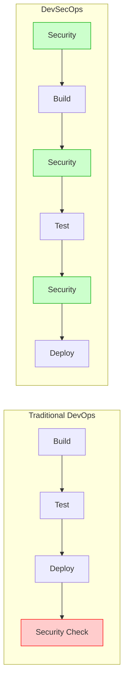
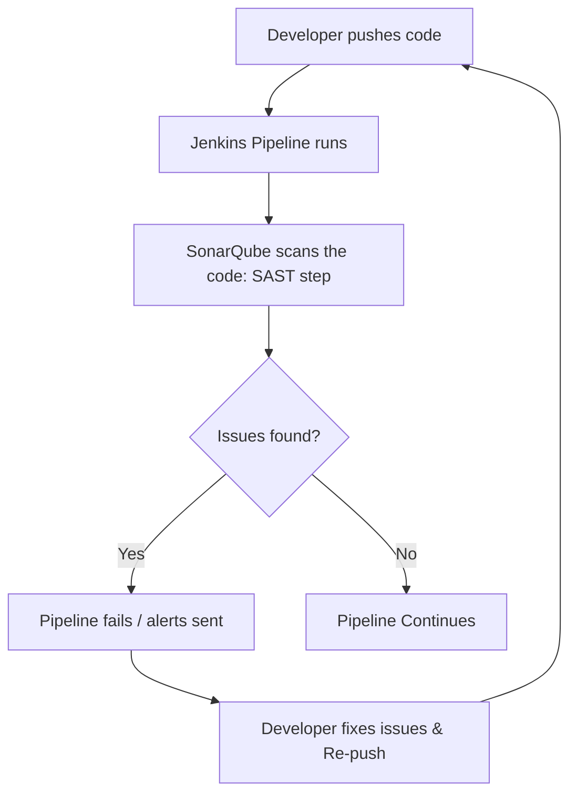
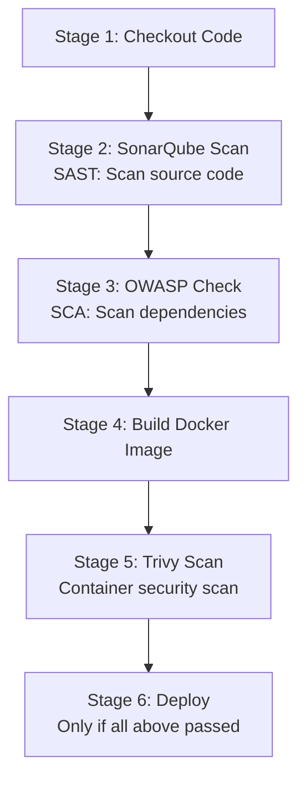

# ⚡ Week 08 — DevSecOps

> **Duration:** Mar 16, 2026 – Ongoing
> **Status:** In Progress
> **Goal:** Understand how security is integrated into the DevOps pipeline — "Shift Left" security.

---

## ✦ What is DevSecOps?

Traditional DevOps focuses on **speed** — build fast, deploy fast.
But speed without security creates vulnerabilities.

**DevSecOps** = DevOps + Security **at every stage**

Instead of checking security at the end, you check it **continuously** throughout the pipeline.



This is called **"Shift Left"** — moving security checks earlier in the process.

---

## ✦ Concepts Being Learned

### ✦ 1. DevSecOps Overview
- What is the difference between DevOps and DevSecOps
- Why security needs to be part of the CI/CD pipeline
- What "Shift Left" means
- Types of security checks:
  - **SAST** — Static Application Security Testing (scan code)
  - **DAST** — Dynamic Application Security Testing (scan running app)
  - **SCA** — Software Composition Analysis (scan dependencies)
  - **Container Security** — scan Docker images for vulnerabilities

---

### ✦ 2. SonarQube
> **Status:** Introduced — not yet hands-on

**What it is:**
SonarQube is a **code quality and security analysis tool**. It scans your source code and finds:
- Security vulnerabilities
- Bugs
- Code smells (bad practices)
- Duplicate code
- Test coverage gaps

**How it fits in DevSecOps:**


**Key terms to know:**
| Term | Meaning |
|---|---|
| Quality Gate | A pass/fail threshold — pipeline fails if code doesn't meet standards |
| Code Smell | Code that works but is written poorly |
| Technical Debt | Time needed to fix all the bad code |
| Coverage | % of code covered by automated tests |

> 📝 *Notes to add once hands-on begins:*
> - [ ] SonarQube installation steps
> - [ ] How to integrate with Jenkins
> - [ ] How to read the SonarQube dashboard
> - [ ] Quality Gate configuration

---

### ✦ 3. OWASP
> **Status:** Introduced — not yet hands-on

**What it is:**
OWASP (Open Web Application Security Project) is an open-source organization that publishes security standards and tools.

**Most important thing to know — OWASP Top 10:**
A list of the 10 most critical web application security risks:

| # | Risk |
|---|---|
| A01 | Broken Access Control |
| A02 | Cryptographic Failures |
| A03 | Injection (SQL, NoSQL, etc.) |
| A04 | Insecure Design |
| A05 | Security Misconfiguration |
| A06 | Vulnerable & Outdated Components |
| A07 | Identification & Authentication Failures |
| A08 | Software & Data Integrity Failures |
| A09 | Security Logging & Monitoring Failures |
| A10 | Server-Side Request Forgery (SSRF) |

**OWASP Dependency Check:**
A tool that scans your project's dependencies (libraries) and checks if any have known vulnerabilities (CVEs).

```
Your app uses library X version 1.0
OWASP Dependency Check finds → library X 1.0 has a known vulnerability!
It tells you → Upgrade to version 1.2
```

> 📝 *Notes to add once hands-on begins:*
> - [ ] How to run OWASP Dependency Check
> - [ ] How to integrate into Jenkins pipeline
> - [ ] How to read the vulnerability report
> - [ ] What is a CVE number

---

### ✦ 4. Trivy
> **Status:** Introduced — not yet hands-on

**What it is:**
Trivy is an open-source **container image vulnerability scanner** made by Aqua Security. It scans Docker images for known vulnerabilities.

**Why it matters:**
Even if your code is secure, the **base image** you use in your Dockerfile might have vulnerabilities.

```dockerfile
FROM ubuntu:20.04   ← This base image might have 50+ known vulnerabilities!
```

Trivy scans and tells you exactly which ones.

**What Trivy can scan:**
- Docker images
- Filesystems
- Git repositories
- Kubernetes clusters
- Infrastructure as Code files (Terraform, etc.)

**Basic usage (once learned):**
```bash
# Scan a Docker image
trivy image nginx:latest

# Scan a local Docker image
trivy image myapp:v1

# Scan and output as table
trivy image --format table nginx:latest

# Only show HIGH and CRITICAL vulnerabilities
trivy image --severity HIGH,CRITICAL nginx:latest
```

**Example output:**
```
nginx:latest (debian 11.6)
==========================
Total: 136 (HIGH: 9, CRITICAL: 2)

┌─────────────────┬──────────────┬──────────┬──────────────┐
│    Library      │    CVE ID    │ Severity │   Fix Version│
├─────────────────┼──────────────┼──────────┼──────────────┤
│ libssl1.1       │ CVE-2023-xxxx│ CRITICAL │ 1.1.1t       │
└─────────────────┴──────────────┴──────────┴──────────────┘
```

> 📝 *Notes to add once hands-on begins:*
> - [ ] Trivy installation steps
> - [ ] How to integrate Trivy into Jenkins pipeline
> - [ ] How to fail pipeline if CRITICAL vulnerability found
> - [ ] Difference between Trivy and Snyk

---

## ✦ How These Tools Fit Together in a Pipeline



---

## ✦ Practice Exercises (Pending)

- [ ] Install SonarQube using Docker
- [ ] Connect SonarQube to Jenkins
- [ ] Run a code scan and read the report
- [ ] Install Trivy on a Linux machine
- [ ] Scan the `nginx:latest` image with Trivy
- [ ] Run OWASP Dependency Check on a sample project
- [ ] Build a full DevSecOps pipeline in Jenkins with all 3 tools

---

## ✦ Errors & Fixes

<!-- Fill this as you practice and hit errors -->

| Error | Cause | Fix |
|---|---|---|
| | | |

---

## ✦ Personal Notes

<!-- Add your own notes as you go deeper into Week 8 -->

> *This section will grow as you practice. Add your observations, commands, and aha moments here.*

---

## ✦ Resources

See [resources.md](./resources.md)
