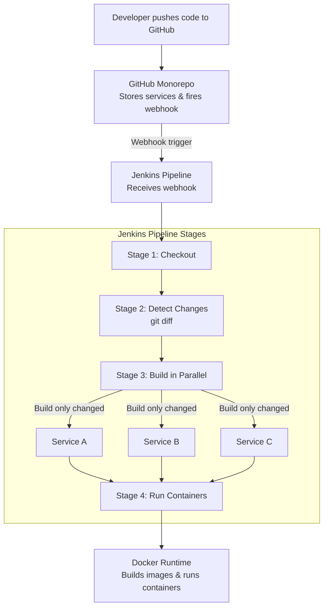
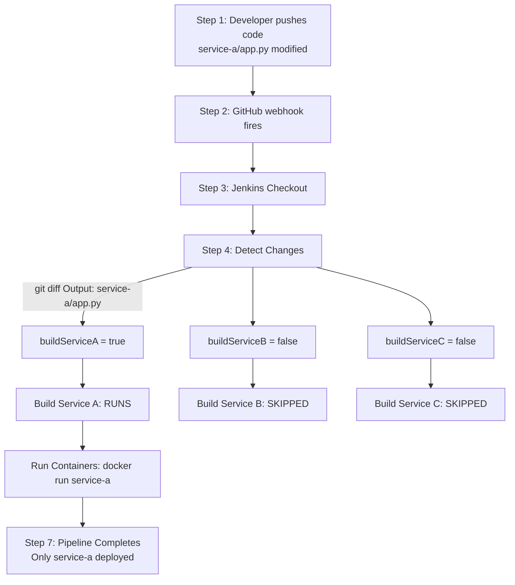

# ⚡ Week 09 — Project: Branch-Aware CI/CD Pipeline for Monorepo Microservices

> **Project Type:** Real-World CI/CD Optimization Project
> **Stack:** Jenkins · Docker · Git · Groovy · Bash
> **Status:** Completed
> **Difficulty:** Advanced

---

## ✦ 1. Project Overview

### ✦ What Problem Does This Project Solve?

Imagine a repository with 5 microservices — `service-a`, `service-b`, `service-c`, `service-d`, `service-e`. A developer fixes a bug in `service-a` and pushes. A naive pipeline would:

1. Build `service-a` ✅ (correct)
2. Build `service-b` ❌ (nothing changed — waste of time)
3. Build `service-c` ❌ (nothing changed — waste of time)
4. Build `service-d` ❌ (nothing changed — waste of time)
5. Build `service-e` ❌ (nothing changed — waste of time)

This wastes CI/CD time, compute resources, and slows down every developer on the team.

**This project solves that.** It detects **exactly which services changed** in a push and builds **only those** — nothing more.

---

### ✦ Why Is Monorepo CI/CD Challenging?

A **monorepo** is a single Git repository that contains multiple services/projects:

```
my-monorepo/
├── service-a/        ← Microservice 1
│   ├── app.py
│   └── Dockerfile
├── service-b/        ← Microservice 2
│   ├── app.js
│   └── Dockerfile
├── service-c/        ← Microservice 3
│   ├── main.go
│   └── Dockerfile
└── Jenkinsfile       ← One pipeline for all
```

**The challenge:** There is only ONE pipeline, but you don't want it to rebuild everything every time.

| Challenge | Why It's Hard |
|---|---|
| Single pipeline, multiple services | Pipeline must be smart enough to know what changed |
| One `git push` can change 1 or all 5 services | Detection logic must be precise |
| `git diff` needs two commit points | If there's no previous build, comparison fails |
| Jenkins `changeSets` is unreliable | It doesn't always populate, especially on first runs |
| Parallel builds need isolation | One failing service shouldn't block others |

---

### ✦ Why Optimization Matters

In real companies with large teams:

- A monorepo with 20 services, each taking 3 minutes to build = **60 minutes per push** if everything builds
- With delta builds (only changed services) = **3 minutes per push**
- That's a **20x improvement** in pipeline speed
- Faster feedback → developers push more confidently → faster product delivery

> 💡 This is exactly why companies like Google, Meta, and Netflix invest heavily in monorepo CI/CD tooling (Bazel, Nx, Turborepo). This project implements the same concept manually using Jenkins + Git.

---

## ✦ 2. Architecture Breakdown

### ✦ Full System Flow



---

### ✦ Each Component Explained

#### GitHub (Source of Truth)
- Stores all microservices in one repo
- Each service has its own folder and `Dockerfile`
- A **webhook** is configured to notify Jenkins on every `push` event
- Jenkins reads `GIT_PREVIOUS_SUCCESSFUL_COMMIT` from GitHub's commit history

#### Jenkins (The Brain)
- Receives the webhook trigger
- Runs the Jenkinsfile from the repo root
- Uses `git diff` to compare current commit vs previous successful commit
- Decides which services to build
- Runs builds in **parallel** for speed
- Deploys containers after build

#### Docker (The Builder + Runner)
- Each microservice has its own `Dockerfile`
- Jenkins runs `docker build` per changed service
- Jenkins runs `docker run` to deploy each service as a container
- Old containers are removed before new ones start (idempotency)

#### Microservices (The Applications)
- Each lives in its own subfolder
- Each has its own `Dockerfile`
- Each runs on its own port
- Completely independent — one failing doesn't affect others

---

## ✦ 3. Pipeline Deep Dive

### ✦ The Full Working Jenkinsfile

```groovy
def buildServiceA = false
def buildServiceB = false
def buildServiceC = false

pipeline {
    agent any

    stages {

        stage('Checkout') {
            steps {
                checkout scm
            }
        }

        stage('Detect Changes') {
            steps {
                script {
                    def previousCommit = env.GIT_PREVIOUS_SUCCESSFUL_COMMIT
                    def currentCommit  = env.GIT_COMMIT

                    if (previousCommit) {
                        def changedFiles = sh(
                            script: "git diff --name-only ${previousCommit} ${currentCommit}",
                            returnStdout: true
                        ).trim()

                        echo "Changed files:\n${changedFiles}"

                        buildServiceA = changedFiles.contains('service-a/')
                        buildServiceB = changedFiles.contains('service-b/')
                        buildServiceC = changedFiles.contains('service-c/')

                    } else {
                        echo "No previous commit found. Building all services."
                        buildServiceA = true
                        buildServiceB = true
                        buildServiceC = true
                    }
                }
            }
        }

        stage('Build Services') {
            parallel {
                stage('Build Service A') {
                    when { expression { return buildServiceA } }
                    steps {
                        sh 'docker build -t service-a:latest ./service-a'
                    }
                }
                stage('Build Service B') {
                    when { expression { return buildServiceB } }
                    steps {
                        sh 'docker build -t service-b:latest ./service-b'
                    }
                }
                stage('Build Service C') {
                    when { expression { return buildServiceC } }
                    steps {
                        sh 'docker build -t service-c:latest ./service-c'
                    }
                }
            }
        }

        stage('Run Containers') {
            steps {
                script {
                    if (buildServiceA) {
                        sh 'docker rm -f service-a || true'
                        sh 'docker run -d --name service-a -p 5001:5000 service-a:latest'
                    }
                    if (buildServiceB) {
                        sh 'docker rm -f service-b || true'
                        sh 'docker run -d --name service-b -p 5002:5000 service-b:latest'
                    }
                    if (buildServiceC) {
                        sh 'docker rm -f service-c || true'
                        sh 'docker run -d --name service-c -p 5003:5000 service-c:latest'
                    }
                }
            }
        }
    }
}
```

---

### ✦ Line-by-Line Explanation

#### Global Variables

```groovy
def buildServiceA = false
def buildServiceB = false
def buildServiceC = false
```

**What:** Three boolean variables declared at the **top level** of the Jenkinsfile, outside the `pipeline {}` block.

**Why declared outside:**
In Jenkins Declarative pipelines, `env.VARIABLE = value` inside a `script {}` block cannot be reliably read by `when { expression { } }` blocks in **parallel** stages. This is a known Jenkins limitation.

By declaring them as **plain Groovy variables at script scope**, they are accessible from every stage including parallel `when` expressions.

**What breaks if removed:**
If you use `env.BUILD_A = "true"` instead of `def buildServiceA = false`, the `when { expression { return env.BUILD_A == 'true' } }` comparison can silently fail. String `"true"` and boolean `true` behave differently in Groovy, and `env` variables are always strings.

---

#### Agent

```groovy
agent any
```

**What:** Run this pipeline on any available Jenkins agent.

**Why `any`:** For this project, any machine with Docker installed works. In production, you would use `agent { label 'docker-agent' }` to ensure Docker is available on the specific agent.

---

#### Stage: Checkout

```groovy
stage('Checkout') {
    steps {
        checkout scm
    }
}
```

**What:** `checkout scm` tells Jenkins to clone the repository using the SCM (Source Control Management) configuration defined in the Jenkins job itself.

**Why explicit checkout:** In some pipeline configurations, Jenkins does an implicit checkout before stages begin. Making it explicit gives you full control and avoids conflicts with `skipDefaultCheckout`.

**What `scm` means:** It refers to the Git configuration set in the Jenkins job — repository URL, credentials, and branch. You don't hardcode these values in the Jenkinsfile.

---

#### Stage: Detect Changes

```groovy
def previousCommit = env.GIT_PREVIOUS_SUCCESSFUL_COMMIT
def currentCommit  = env.GIT_COMMIT
```

**`GIT_COMMIT`:** Jenkins automatically sets this to the SHA (hash) of the commit that triggered the current build. Example: `a3f9c12d...`

**`GIT_PREVIOUS_SUCCESSFUL_COMMIT`:** Jenkins sets this to the SHA of the last commit where the pipeline **succeeded**. This is the key variable — it lets you compare "what was the state last time everything worked" vs "what is the state now".

```
Build #10 (success) → commit abc123
Build #11 (success) → commit def456
Build #12 (FAILS)   → commit ghi789
Build #13 (runs)    → GIT_PREVIOUS_SUCCESSFUL_COMMIT = def456  ← skips the failed one
                       GIT_COMMIT = jkl012
```

This is smarter than just comparing to the previous commit — it compares to the last **working** state.

---

```groovy
if (previousCommit) {
    def changedFiles = sh(
        script: "git diff --name-only ${previousCommit} ${currentCommit}",
        returnStdout: true
    ).trim()
```

**`git diff --name-only`:** Shows only the **file names** that changed between two commits — not the actual code changes. This is exactly what you need.

Example output:
```
service-a/app.py
service-a/requirements.txt
README.md
```

**`returnStdout: true`:** Captures the shell output into the Groovy variable `changedFiles` instead of printing it to the console.

**`.trim()`:** Removes trailing newlines from the output so comparisons work correctly.

**Why the `if (previousCommit)` check:**
On the **very first build** of a new repo or branch, `GIT_PREVIOUS_SUCCESSFUL_COMMIT` is `null` — there is no previous build to compare to. Without this check, the `git diff` command would fail with an error. The `else` block handles this gracefully by building everything.

---

```groovy
buildServiceA = changedFiles.contains('service-a/')
buildServiceB = changedFiles.contains('service-b/')
buildServiceC = changedFiles.contains('service-c/')
```

**What:** Checks if the string `'service-a/'` appears anywhere in the list of changed files.

**Why folder prefix with `/`:** Using `'service-a/'` instead of just `'service-a'` prevents false matches. If you had a file called `service-a-readme.md` at the root, checking for `'service-a'` would match it incorrectly. The `/` ensures only files **inside the `service-a/` directory** match.

**Result:** Each variable becomes `true` or `false` depending on whether that service's files changed.

---

#### Stage: Build Services (Parallel)

```groovy
stage('Build Services') {
    parallel {
        stage('Build Service A') {
            when { expression { return buildServiceA } }
            steps {
                sh 'docker build -t service-a:latest ./service-a'
            }
        }
        ...
    }
}
```

**`parallel {}`:** Runs all inner stages **at the same time** instead of one after another.

Without parallel:
```
Build A → 2 min
Build B → 2 min  = 6 minutes total
Build C → 2 min
```

With parallel:
```
Build A ─┐
Build B ─┤ → all run at same time = 2 minutes total
Build C ─┘
```

**`when { expression { return buildServiceA } }`:**
This is the **gate** — the stage only runs if `buildServiceA` is `true`. If the variable is `false`, Jenkins skips this stage entirely and shows it as "skipped" in the UI.

**Why `return` is needed:**
The `expression {}` block expects a closure that **returns** a boolean. Without `return`, Groovy returns the last evaluated expression, which may not behave as expected.

**`docker build -t service-a:latest ./service-a`:**
- `-t service-a:latest` — tags the image as `service-a:latest`
- `./service-a` — the **build context** is the `service-a/` folder, which is where the `Dockerfile` lives

---

#### Stage: Run Containers

```groovy
if (buildServiceA) {
    sh 'docker rm -f service-a || true'
    sh 'docker run -d --name service-a -p 5001:5000 service-a:latest'
}
```

**`docker rm -f service-a || true`:**
- `docker rm -f` force-removes a running container by name
- `|| true` means: **even if the command fails (container doesn't exist), continue**
- Without `|| true`, if no container named `service-a` is running, the pipeline would **fail** at this line

This is the **idempotency pattern** — the pipeline can run safely even if no container was running before.

**`docker run -d --name service-a -p 5001:5000 service-a:latest`:**
- `-d` — run in background (detached)
- `--name service-a` — assign a fixed name so we can reference it later
- `-p 5001:5000` — map port 5001 on the host to port 5000 inside the container
- Each service gets its own unique host port (5001, 5002, 5003...)

---

## ✦ 4. Old Pipeline vs New Pipeline

This section is critical for interviews — it shows you understand not just what works but **why things fail**.

### ✦ The Old (Broken) Pipeline

```groovy
pipeline {
    agent any

    environment {
        BUILD_A = 'false'
        BUILD_B = 'false'
        BUILD_C = 'false'
    }

    stages {
        stage('Detect Changes') {
            steps {
                script {
                    def changedFiles = sh(
                        script: "git diff --name-only ${env.GIT_PREVIOUS_SUCCESSFUL_COMMIT} ${env.GIT_COMMIT}",
                        returnStdout: true
                    ).trim()

                    if (changedFiles.contains('service-a/')) {
                        env.BUILD_A = 'true'
                    }
                    if (changedFiles.contains('service-b/')) {
                        env.BUILD_B = 'true'
                    }
                }
            }
        }

        stage('Build Services') {
            parallel {
                stage('Build A') {
                    when {
                        expression { env.BUILD_A == 'true' }
                    }
                    steps {
                        sh 'docker build -t service-a:latest ./service-a'
                    }
                }
                stage('Build B') {
                    when {
                        expression { env.BUILD_B == 'true' }
                    }
                    steps {
                        sh 'docker build -t service-b:latest ./service-b'
                    }
                }
            }
        }
    }
}
```

---

### ✦ What Was Wrong — Problem by Problem

#### Problem 1: `env` Variable Mutation in Declarative Pipelines

```groovy
// In environment block:
environment {
    BUILD_A = 'false'
}

// Then later in script block:
env.BUILD_A = 'true'   // ← This looks like it should work
```

**What actually happens:**
In Jenkins **Declarative** pipelines, `environment {}` variables are evaluated once at pipeline startup. When you write `env.BUILD_A = 'true'` inside a `script {}` block, the change **does not always propagate** reliably to other stages, especially in `parallel {}` blocks.

This is because parallel stages may execute on different threads. The `env` object is shared, but in some Jenkins versions and configurations, the mutation is not visible across parallel contexts.

**Result:** Detection works perfectly. `env.BUILD_A` is set to `'true'`. But the `when` condition in the parallel stage reads it as `'false'` — so nothing builds. The pipeline succeeds but does **nothing**.

This is one of the most frustrating Jenkins bugs — no error, no failure, just silent skipping.

---

#### Problem 2: String Comparison Unreliability

```groovy
when {
    expression { env.BUILD_A == 'true' }
}
```

`env` variables in Jenkins are **always strings** — even if you set them to a boolean `true`, they become the string `"true"`.

The comparison `env.BUILD_A == 'true'` seems correct, but problems arise because:
- Whitespace: `'true '` vs `'true'` — a trailing space fails the comparison
- Null safety: if `BUILD_A` was never set, `env.BUILD_A` returns `null`, and `null == 'true'` throws an error or returns false silently
- Type confusion: mixing Groovy's `true` (boolean) with `'true'` (string) in different parts of the pipeline leads to unpredictable behavior

---

#### Problem 3: No `null` Safety for `GIT_PREVIOUS_SUCCESSFUL_COMMIT`

```groovy
// Old pipeline — no null check
def changedFiles = sh(
    script: "git diff --name-only ${env.GIT_PREVIOUS_SUCCESSFUL_COMMIT} ${env.GIT_COMMIT}",
    returnStdout: true
).trim()
```

On the **first build**, `GIT_PREVIOUS_SUCCESSFUL_COMMIT` is `null`. This renders the command as:

```bash
git diff --name-only null abc123
```

Git does not understand `null` as a commit reference — this **crashes the pipeline** on first run.

---

#### Problem 4: `changeSets` Unreliability (Alternative Approach That Was Tried)

Some Jenkins users try to use `currentBuild.changeSets` to detect changed files:

```groovy
// This was tried and abandoned
def changes = currentBuild.changeSets.collectMany { it.items }.collectMany { it.affectedFiles }
```

**Why it fails:**
- `changeSets` is only populated when Jenkins can connect to SCM and retrieve change information
- On the **first build** of a branch, `changeSets` is empty
- When a build is triggered manually, `changeSets` is empty
- When a branch is rebased, `changeSets` can be inaccurate
- It is simply not reliable enough for production use

**`git diff` is more reliable** because it directly queries Git history — it works regardless of how the build was triggered.

---

### ✦ How the New Pipeline Fixes Every Issue

| Old Problem | Old Code | New Solution | New Code |
|---|---|---|---|
| `env` mutation unreliable across parallel | `env.BUILD_A = 'true'` | Groovy script-scope boolean | `def buildServiceA = false` |
| String comparison fragile | `env.BUILD_A == 'true'` | Direct boolean check | `return buildServiceA` |
| First build crash | No null check | Null guard with fallback | `if (previousCommit) { ... } else { build all }` |
| `changeSets` unreliable | `currentBuild.changeSets` | Direct `git diff` | `git diff --name-only prev curr` |
| `when` reads stale env | `when { expression { env.BUILD_A... } }` | `when` reads Groovy variable directly | `when { expression { return buildServiceA } }` |

---

## ✦ 5. Key DevOps Concepts Learned

### ✦ Monorepo CI/CD Optimization

**What it is:** Instead of rebuilding everything on every push, the pipeline is intelligent enough to only rebuild what changed.

**The core idea:**
```
Changed files → Map to services → Build only those services
```

**Real-world equivalent:** This is similar to how `make` in C/C++ builds only files that changed. DevOps applies the same principle to microservices.

---

### ✦ Delta Builds

**Definition:** A build that processes only the **delta** (difference) between the current state and the last known good state.

**Key ingredient:** `GIT_PREVIOUS_SUCCESSFUL_COMMIT` — this is your "last known good state" marker.

```
Last successful build: commit abc123  ← baseline
Current push:          commit xyz789  ← new state
Delta:                 git diff abc123 xyz789  ← what changed
```

**Why "successful":** You don't compare to the last *commit* — you compare to the last *working build*. This handles failures gracefully — if build #5 fails, build #6 compares against build #4 (last success), so it catches everything that build #5 missed.

---

### ✦ Parallel Execution

**Why it matters:** Serial builds waste time. If 3 services all need to be built after a big commit, running them in parallel cuts build time by up to 3x.

**The `parallel {}` block in Jenkins** starts all inner stages simultaneously. Each stage runs in its own thread.

**Important:** Parallel stages must be **independent**. If `service-b` build depends on the output of `service-a`, they cannot run in parallel — there is a dependency that forces serial execution.

---

### ✦ Idempotency

**Definition:** An operation that produces the same result whether run once or many times.

```bash
docker rm -f service-a || true     # Idempotent — works even if container doesn't exist
docker run -d --name service-a ... # Creates a fresh container each time
```

**Why it matters in CI/CD:**
Pipelines must be safe to re-run. If a deploy fails halfway and you re-run it, it should not crash because "service-a container already exists." The `rm -f || true` pattern ensures the pipeline is always starting from a clean state.

---

### ✦ Pipeline Reliability

A reliable pipeline must handle:
- **First run** (no previous commits) → build everything
- **Failed previous build** → compare to last *success*, not last *commit*
- **Manual trigger** → behave predictably
- **Null/empty variables** → never crash, always have a fallback
- **Partial failures** → one service failing should not block others (parallel)

---

## ✦ 6. Real-World Industry Relevance

### ✦ Where This Approach Is Used

| Company | Their Tool | Concept |
|---|---|---|
| Google | Bazel | Build only changed targets in a massive monorepo |
| Meta (Facebook) | Buck | Delta builds across thousands of services |
| Netflix | Gradle + custom | Service-specific build detection |
| Uber | Pants | Monorepo build optimization |
| Any startup | Jenkins + git diff | This exact pattern — what you built this week |

---

### ✦ How Companies Optimize CI/CD Pipelines

1. **Delta builds** — only build what changed (this project)
2. **Build caching** — reuse Docker layers to speed up builds
3. **Parallel execution** — build multiple services simultaneously (this project)
4. **Artifact caching** — store compiled outputs so clean builds are faster
5. **Test splitting** — run tests in parallel across multiple agents
6. **Branch-based triggers** — only certain branches trigger certain actions (this project)

---

### ✦ Why This Matters for Scalability

| Team Size | Naive Pipeline | Optimized Pipeline |
|---|---|---|
| 2 developers, 3 services | 6 min/build | 2 min/build |
| 10 developers, 10 services | 30 min/build | 3 min/build |
| 50 developers, 50 services | 150 min/build | 5 min/build |

At scale, an unoptimized pipeline becomes a **bottleneck that slows the entire engineering team**. Developers wait for builds, lose focus, and context-switch. Optimized pipelines keep teams moving fast.

---

## ✦ 7. Challenges Faced

### ✦ Challenge 1: Jenkins `env` Variable Mutation Issue

**Problem:** Set `env.BUILD_A = 'true'` in detect stage. `when` condition in parallel build stage read it as `'false'`.

**Why it happened:** Jenkins Declarative pipeline evaluates `when` conditions in parallel threads. The `env` object mutation from the `script {}` block in an earlier stage was not reliably visible in the parallel `when` expressions.

**How it was solved:** Moved flags to **Groovy script-scope variables** (`def buildServiceA = false`) declared outside the `pipeline {}` block. These are true Groovy variables — not Jenkins environment variables — and are visible across all stages in the same Groovy script execution.

---

### ✦ Challenge 2: `changeSets` Unreliability

**Problem:** Tried `currentBuild.changeSets` to detect changed files. It was empty on manual triggers and first builds.

**Why it happened:** `changeSets` depends on Jenkins' SCM polling mechanism. It is not populated when builds are triggered manually or when Jenkins doesn't have a previous build to compare against.

**How it was solved:** Switched to `git diff --name-only ${previousCommit} ${currentCommit}` — a direct Git command that works regardless of how the build was triggered.

---

### ✦ Challenge 3: Docker BuildKit / buildx Issue

**Problem:** `docker build` failed with errors related to BuildKit or buildx not being available inside the Jenkins environment.

**Error seen:**
```
ERROR: failed to solve: failed to read dockerfile
```
or
```
docker: 'buildx' is not a docker command
```

**Why it happened:** Newer Docker versions use BuildKit by default. Inside Jenkins containers or restricted environments, BuildKit may not be configured or available.

**How it was solved:**
```bash
# Disable BuildKit explicitly
DOCKER_BUILDKIT=0 docker build -t service-a:latest ./service-a

# Or set in Jenkins environment block
environment {
    DOCKER_BUILDKIT = '0'
}
```

---

### ✦ Challenge 4: Debugging Pipeline Logic (When Nothing Fails But Nothing Builds)

**Problem:** Pipeline ran successfully, showed green, but no Docker images were built and no containers were running.

**Why it happened:** The `when` conditions were evaluating to `false` silently. No error — just skipped stages. This is the hardest type of bug because there is no error message to follow.

**Debugging approach:**
```groovy
// Add debug echoes everywhere
echo "buildServiceA = ${buildServiceA}"
echo "buildServiceB = ${buildServiceB}"
echo "Previous commit: ${env.GIT_PREVIOUS_SUCCESSFUL_COMMIT}"
echo "Current commit: ${env.GIT_COMMIT}"
echo "Changed files: ${changedFiles}"
```

**Lesson:** Always add debug `echo` statements during development. Remove them before final commit but keep them commented out for future debugging.

---

## ✦ 8. Final Working Flow (Summary)



---

## ✦ 9. Improvements & Next Steps

### ✦ Docker Image Tagging

Currently images are tagged as `service-a:latest`. This overwrites previous images and makes rollback impossible.

**Better approach:**
```groovy
def imageTag = "${env.BRANCH_NAME}-${env.GIT_COMMIT.take(7)}"
// Example: dev-a3f9c12
sh "docker build -t service-a:${imageTag} ./service-a"
```

This gives every build a unique, traceable tag.

---

### ✦ Push to DockerHub or AWS ECR

Currently images only exist locally on the Jenkins agent. For real deployments:

```groovy
sh "docker push yourrepo/service-a:${imageTag}"
```

Remote registries allow:
- Images to be deployed to any server, not just the Jenkins machine
- Version history of all built images
- Rollback to any previous version

---

### ✦ Kubernetes Deployment

After pushing to a registry, the next step is deploying to Kubernetes instead of bare `docker run`:

```groovy
sh "kubectl set image deployment/service-a service-a=yourrepo/service-a:${imageTag}"
```

Kubernetes gives you:
- Automatic scaling
- Rolling updates with zero downtime
- Self-healing (restarts crashed containers)

---

### ✦ Dynamic Service Detection

Currently, service names are hardcoded (`service-a`, `service-b`, `service-c`). A more advanced approach automatically discovers all services:

```groovy
// Automatically find all folders with a Dockerfile
def services = sh(
    script: "find . -name Dockerfile -exec dirname {} \\; | sed 's|./||'",
    returnStdout: true
).trim().split('\n')

// Build only changed ones dynamically
services.each { service ->
    if (changedFiles.contains("${service}/")) {
        sh "docker build -t ${service}:latest ./${service}"
    }
}
```

This scales to any number of services without modifying the Jenkinsfile.

---

## ✦ 💭 10. Personal Learning Reflection

This project felt different from everything before it. Earlier in the training, I was following steps — install this, run that, it works, move on. This week, I was actually **thinking**.

The most important shift was learning to ask **"why did it work?"** instead of just **"did it work?"**

When the pipeline ran successfully but nothing built, I had to go deeper. Not just read the error — there was no error. I had to understand how Jenkins evaluates `when` conditions, how Groovy variables work differently from `env` variables, why a boolean `true` is not the same as a string `"true"` in a comparison, and why parallel stages behave differently from sequential ones.

That debugging experience taught me more than any tutorial ever could. I was not following instructions — I was reasoning about a system.

The monorepo optimization concept also clicked something in my mind about how real companies work. A team of 50 engineers pushing to the same repo all day cannot afford a 30-minute build on every push. The pipeline itself has to be engineered, not just configured.

Before this week, I thought a pipeline was a sequence of commands. After this week, I understand a pipeline is a **system** — with state, logic, failure modes, and performance characteristics that need to be designed carefully.

The shift from "pipeline user" to "system thinker" is what this week gave me. And that, more than any specific command or syntax, is what a DevOps engineer actually needs to think like.

---

## ✦ 📝 Personal Notes

<!-- Add your own observations as you revisit this project -->

> 💬 *Come back here during interview prep — every section above is a potential interview question.*

---

## ✦ 🔗 Resources

| Resource | Link |
|---|---|
| Jenkins GIT_PREVIOUS_SUCCESSFUL_COMMIT docs | https://www.jenkins.io/doc/book/pipeline/multibranch |
| git diff documentation | https://git-scm.com/docs/git-diff |
| Jenkins parallel stages | https://www.jenkins.io/doc/book/pipeline/syntax/#parallel |
| Jenkins `when` expression | https://www.jenkins.io/doc/book/pipeline/syntax/#when |
| Docker BuildKit docs | https://docs.docker.com/build/buildkit |
| Monorepo CI/CD patterns | *[Search: monorepo CI/CD best practices]* |
