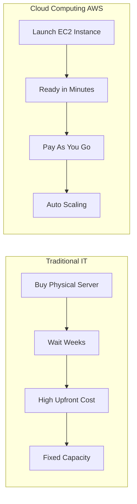
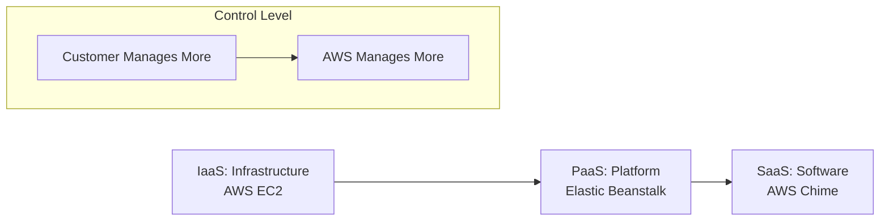
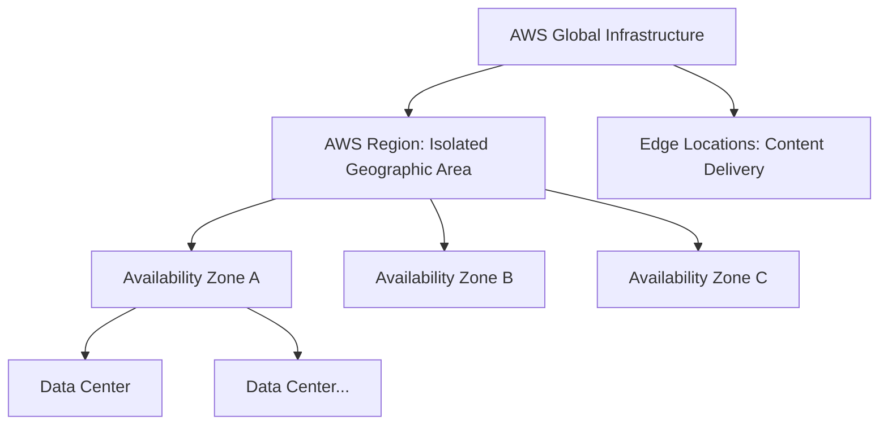
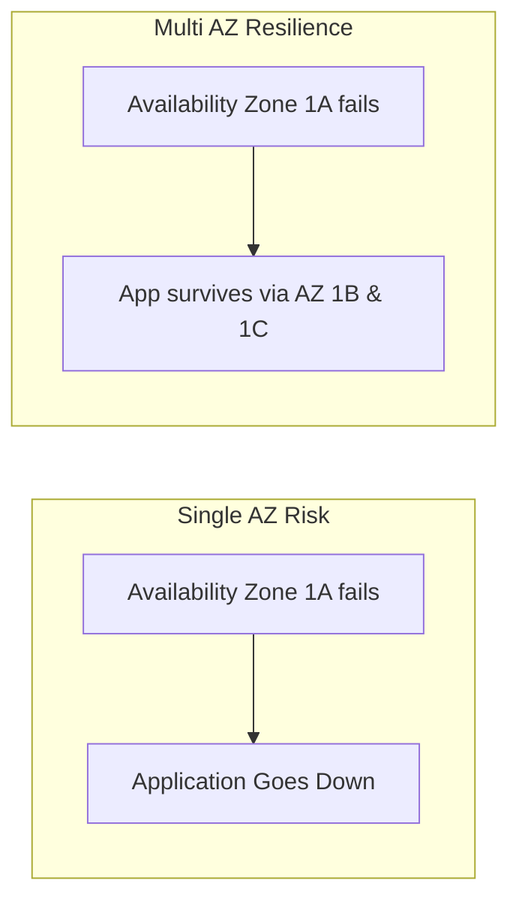
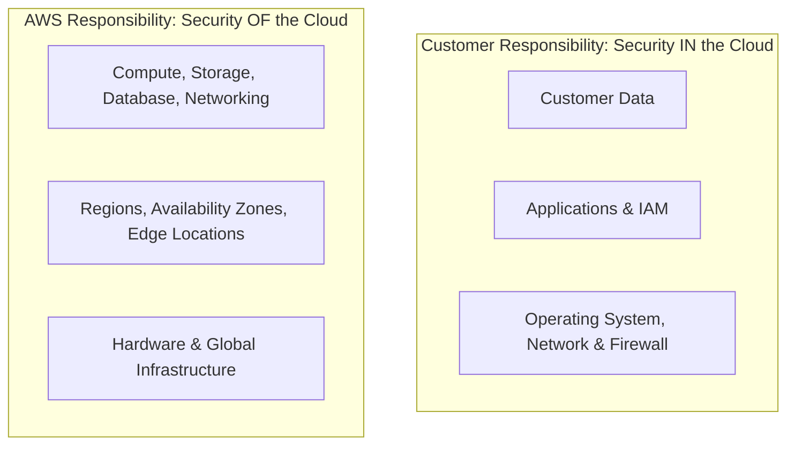

# Cloud Computing — Introduction

> **Week:** 10
> **Folder:** Cloud-Computing-Introduction
> **Goal:** Understand what cloud computing is, how AWS is structured globally, and how security responsibilities are divided.

---

## Why Cloud in DevOps?

Everything built so far — Jenkins, Docker, pipelines — needs somewhere to **run in production**. That place is the cloud.

```
Local Machine (Dev)  →  Docker / Jenkins (CI/CD)  →  AWS (Production)
     Your laptop            Your pipeline               The real world
```

AWS holds over 30% of the global cloud market. As a DevOps engineer, you will use it daily.

---

## 1. What Is Cloud Computing?

**Cloud computing** is the on-demand delivery of IT resources — servers, storage, databases, networking — over the internet with **pay-as-you-go pricing**.

### Before Cloud vs After Cloud



---

## 2. The Three Deployment Models

| Model | What It Means | Who Uses It |
|---|---|---|
| **Private Cloud** | Your own cloud, only for your org | Banks, Governments, Healthcare |
| **Public Cloud** | Shared cloud owned by a provider | Startups, most companies — this is AWS |
| **Hybrid Cloud** | Mix of private + public | Enterprises with compliance needs |

> 💡 For DevOps work, **Public Cloud (AWS)** is the most common setup.

---

## 3. Five Characteristics of Cloud Computing

These are the official NIST definitions — important for certifications:

| # | Characteristic | Real-World Meaning |
|---|---|---|
| 1 | **On-demand self-service** | Spin up a server at 2am without calling anyone |
| 2 | **Broad network access** | Access resources from anywhere via internet |
| 3 | **Resource pooling** | AWS hardware serves thousands of customers simultaneously |
| 4 | **Rapid elasticity** | Scale from 1 to 100 servers in minutes, back when done |
| 5 | **Measured service** | Every CPU hour and byte tracked — pay exactly for usage |

---

## 4. Six Advantages of Cloud Computing

| Advantage | Traditional IT Problem | Cloud Solution |
|---|---|---|
| Trade capital for operating expense | Buy servers upfront (huge cost) | Pay monthly, only for what you use |
| Economies of scale | You buy 1 server at retail price | AWS buys millions — passes savings to you |
| Stop guessing capacity | Buy too much = waste. Too little = downtime | Scale on demand |
| Increase speed and agility | New server takes weeks | New server takes 60 seconds |
| Stop spending on data centers | Pay rent, power, cooling, security | AWS handles all of that |
| Go global in minutes | New country = new data center | Deploy to any AWS Region in minutes |

---

## 5. Types of Cloud Computing — IaaS / PaaS / SaaS

Think of this as a spectrum of **how much you control vs how much AWS manages**:



| | **IaaS** | **PaaS** | **SaaS** |
|---|---|---|---|
| **What AWS provides** | VMs, storage, networking | Runtime, OS, middleware | Complete application |
| **What YOU manage** | OS, runtime, app, data | App code + data | Just use the software |
| **Control** | Maximum | Medium | Minimum |
| **AWS example** | EC2, EBS, VPC | Elastic Beanstalk, RDS | Chime, WorkMail |
| **Other examples** | Azure VMs, DigitalOcean | Heroku, Google App Engine | Gmail, Dropbox, Zoom |

### Restaurant Analogy

| Model | Analogy |
|---|---|
| On-premise | You buy land, build kitchen, buy equipment, hire chefs |
| IaaS | You rent a commercial kitchen — building provided, you cook |
| PaaS | You rent a kitchen with chefs — you just bring the recipe |
| SaaS | You go to a restaurant — someone else does everything |

> 💡 As a DevOps engineer, you will mostly work with **IaaS** — EC2, VPC, S3, EBS — because you need full control.

---

## 6. AWS Pricing Model

AWS pricing is based on three fundamentals — **pay only for what you use**:

| Pay For | Free |
|---|---|
| **Compute** — EC2 hours, Lambda invocations | Data transfer **IN** to AWS |
| **Storage** — S3 GB/month, EBS GB/month | — |
| **Data Transfer OUT** — data leaving AWS to internet | — |

> ⚠️ Data transfer **INTO** AWS is always **FREE**. You only pay for data going **OUT**.

---

## 7. AWS Global Infrastructure

### The Three Layers



| Infrastructure | Count | Purpose |
|---|---|---|
| Regions | 33+ | Deploy your applications |
| Availability Zones | 100+ | High availability within a Region |
| Edge Locations | 400+ | CloudFront CDN and DNS — faster content delivery |

---

### AWS Regions

- A Region is a **physical geographic area** — Mumbai, Virginia, Frankfurt
- Each Region is **completely independent** — failure in one does not affect others
- You choose which Region to deploy in

**How to Choose a Region — 4 Factors:**

| Factor | Question | Example |
|---|---|---|
| **Compliance** | Must data stay in a specific country? | Indian financial data → ap-south-1 (Mumbai) |
| **Latency** | Where are your users? | European users → eu-west-1 (Ireland) |
| **Service Availability** | Is the service available here? | Not all services launch everywhere simultaneously |
| **Pricing** | What is the cost difference? | us-east-1 (Virginia) is often cheapest |

---

### Availability Zones (AZs)

- One or more **physical data centers** within a Region
- Each has **independent power, cooling, and networking**
- Connected with **high-bandwidth, ultra-low latency** fiber
- Minimum **3 AZs per Region**

**Why AZs matter:**



---

### Edge Locations

- **400+ worldwide** — far more than Regions
- NOT for running your servers — for **delivering content faster**
- Used by: **CloudFront** (CDN), **Route 53** (DNS), **Global Accelerator**

```
Without Edge Location:
User in Mumbai → Server in US → back to Mumbai  (high latency)

With CloudFront + Edge Location:
User in Mumbai → Edge Location in Mumbai  (content already cached, low latency)
```

---

## 8. AWS Shared Responsibility Model

One of the **most common interview and certification questions**.

### The Core Idea

```
AWS = Security OF the Cloud   (the building, the hardware, the infrastructure)
You = Security IN the Cloud   (what you put inside, how you configure it)
```

**Apartment analogy:**
- **Landlord (AWS)** — building security, main door locks, structural safety
- **Tenant (You)** — locking your own door, what you store inside, who you give keys to

---

### AWS Is Responsible For

- Physical security of data centers
- Hardware maintenance and replacement
- Network infrastructure and DDoS protection
- Hypervisor security (virtualization layer)
- Managed service software (e.g., RDS database engine patches)

---

### You Are Responsible For

| Your Responsibility | Example |
|---|---|
| Data protection | Encrypt S3 buckets, encrypt RDS |
| IAM | Who has access to what |
| OS security on EC2 | Patch your operating system |
| Application security | Your app's code and authentication |
| Network configuration | Security group rules, VPC settings |
| Compliance | Implementing regulations with AWS tools |

---

### Responsibility Shifts by Service Type

| Service | Type | AWS Manages | You Manage |
|---|---|---|---|
| **EC2** | IaaS | Hardware, hypervisor, network | OS patches, app, firewall, data |
| **RDS** | PaaS | DB engine, OS patches, backups | DB access, encryption, IAM |
| **S3** | Managed | Storage durability, infrastructure | Bucket policies, permissions, encryption |
| **Lambda** | Serverless | Everything except your code | Your function code and data |

> 💡 Rule: The more AWS manages → the less you control → the less you need to secure yourself.

---

### Visual Stack



---

## Quick Summary — Interview Ready

| Concept | One-Line Answer |
|---|---|
| Cloud computing | On-demand IT resources over internet, pay-as-you-go |
| IaaS | Most control — you manage OS and above (EC2) |
| PaaS | You manage app code only (Elastic Beanstalk) |
| SaaS | Just use the software — AWS manages everything |
| AWS Region | Geographic area with multiple data centers |
| Availability Zone | Isolated data center(s) within a Region — for high availability |
| Edge Location | Content delivery point — CloudFront, Route 53 |
| Shared Responsibility | AWS secures infrastructure; you secure what you put in it |
| Data transfer pricing | Inbound = free. Outbound to internet = you pay |

---

## Practice Exercises

- [ ] Create a free AWS account and explore the console
- [ ] Open the AWS Global Infrastructure map: https://infrastructure.aws
- [ ] Identify your nearest Region and check which services are available
- [ ] Use the AWS Pricing Calculator: https://calculator.aws
- [ ] Read the Shared Responsibility Model page on AWS

---

## Personal Notes

<!-- Add your own observations and things that clicked -->

> 💬 *What confused you about cloud models? What analogy helped you understand AZs?*

---

## Resources

See [resources.md](./resources.md)
