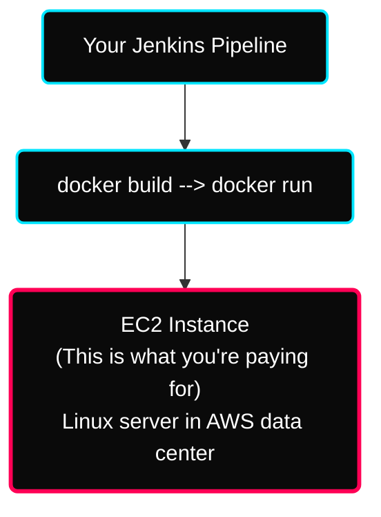
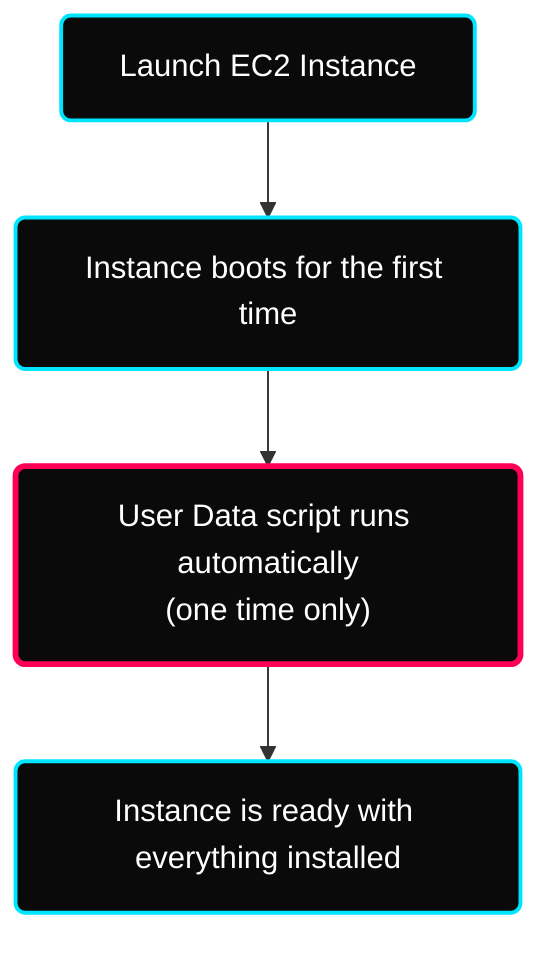
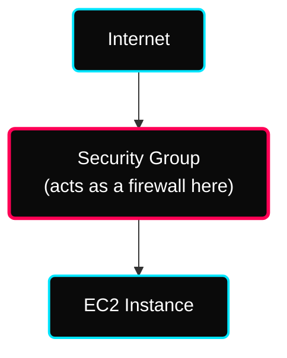

[](#) [](#)

---

# ⚡ EC2 — Elastic Compute Cloud

> **Week:** 10
> **Folder:** EC2
> **Topic:** Virtual servers in the cloud — the backbone of AWS infrastructure

---

## ✦ Why EC2 Matters for DevOps

EC2 is where your applications actually **run** in production. Everything you've done so far — Docker containers, Jenkins pipelines, shell scripts — ultimately deploys onto EC2 instances (or services built on top of EC2).



As a DevOps engineer, you will launch, configure, connect to, and manage EC2 instances almost every day.

---

## ✦ 1. What Is Amazon EC2?

**Amazon Elastic Compute Cloud (EC2)** is a service that lets you rent virtual servers (called **instances**) in the cloud.

- **Elastic** — you can scale up or down anytime
- **Compute** — CPU, RAM, processing power
- **Cloud** — runs in AWS data centers, not your machine

### ✦ What You Can Configure on an EC2 Instance

| Setting | What It Means | Example |
|---|---|---|
| **Operating System** | Which OS the server runs | Ubuntu 22.04, Amazon Linux 2, Windows Server |
| **Instance Type** | How much CPU and RAM | t2.micro (1 CPU, 1GB RAM) → m5.4xlarge (16 CPU, 64GB) |
| **Storage** | What disk to attach | EBS (persistent) or Instance Store (temporary) |
| **Networking** | Which VPC, subnet, IP | Public IP for web server, private IP for database |
| **Security Groups** | Firewall rules | Allow port 22 (SSH), port 80 (HTTP) |
| **User Data** | Startup script | Install Nginx when instance first boots |
| **IAM Role** | What AWS services this instance can access | Allow EC2 to read/write S3 |

---

## ✦ 2. EC2 User Data

**User Data** is a script that runs **automatically when an EC2 instance boots for the very first time**.

This is how you **automate server setup** — instead of manually SSH-ing in and installing things, you write a script and EC2 runs it on first start.



> [!WARNING]
> User Data runs **only once** — on the **first boot**. If you stop and restart the instance, the script does NOT run again.

### ✦ Example User Data Script

```bash
#!/bin/bash
# This script runs when the instance first starts

# Update all packages
yum update -y

# Install Apache web server
yum install -y httpd

# Start Apache and enable on reboot
systemctl start httpd
systemctl enable httpd

# Create a simple HTML page
echo "<h1>Hello from EC2 - launched by User Data!</h1>" > /var/www/html/index.html
```

### ✦ Common User Data Use Cases

| Use Case | Script Action |
|---|---|
| Web server setup | Install and start Nginx or Apache |
| Install Docker | `yum install docker -y && systemctl start docker` |
| Install Jenkins agent | Download and configure Jenkins agent JAR |
| Pull app from S3 | `aws s3 cp s3://my-bucket/app.jar /home/ec2-user/` |
| Set environment variables | Write to `/etc/environment` |

---

## ✦ 3. EC2 Instance Types

AWS offers many instance types — each designed for a different kind of workload. The naming convention tells you everything:

```text
m  5  .  xlarge
│  │       │
│  │       └── Size (nano, micro, small, medium, large, xlarge, 2xlarge...)
│  └────────── Generation (higher = newer, better performance per cost)
└───────────── Family (m=general, c=compute, r=memory, i=storage, p=GPU)
```

### ✦ Instance Families

#### 🟢 General Purpose — `t`, `m` families
**Balanced CPU + RAM + Network**

Best for: Web servers, small databases, dev/test environments, most standard workloads

| Instance | vCPUs | RAM | Network | Free Tier? |
|---|---|---|---|---|
| t2.micro | 1 | 1 GB | Low to Moderate | ✅ Yes (750 hrs/month) |
| t3.micro | 2 | 1 GB | Up to 5 Gbps | ✅ Yes |
| m5.large | 2 | 8 GB | Up to 10 Gbps | ❌ |
| m5.xlarge | 4 | 16 GB | Up to 10 Gbps | ❌ |

> [!TIP]
> **t2.micro is the Free Tier instance** — start all your practice with this.

#### 🔵 Compute Optimized — `c` family
**High CPU, less RAM per vCPU**

Best for: Batch processing, high-traffic web servers, machine learning inference, gaming

| Instance | vCPUs | RAM | Network |
|---|---|---|---|
| c5.large | 2 | 4 GB | Up to 10 Gbps |
| c5.xlarge | 4 | 8 GB | Up to 10 Gbps |
| c5.2xlarge | 8 | 16 GB | Up to 10 Gbps |

#### 🟣 Memory Optimized — `r`, `x` families
**Lots of RAM — for in-memory workloads**

Best for: Large databases (SAP HANA), in-memory caches (Redis, Memcached), real-time analytics

| Instance | vCPUs | RAM | Network |
|---|---|---|---|
| r5.large | 2 | 16 GB | Up to 10 Gbps |
| r5.xlarge | 4 | 32 GB | Up to 10 Gbps |
| r5.4xlarge | 16 | 128 GB | Up to 10 Gbps |

#### 🟠 Storage Optimized — `i`, `d` families
**High-speed local NVMe storage**

Best for: NoSQL databases (Cassandra), data warehousing, Hadoop, high-frequency trading

| Instance | vCPUs | RAM | Local Storage |
|---|---|---|---|
| i3.large | 2 | 15 GB | 475 GB NVMe SSD |
| i3.xlarge | 4 | 30 GB | 950 GB NVMe SSD |
| i3.2xlarge | 8 | 61 GB | 1.9 TB NVMe SSD |

### ✦ Quick Selection Guide

```text
Need a server for most things?           → General Purpose  (t3, m5)
CPU-heavy workload?                      → Compute Optimized (c5)
Lots of data in RAM? (Redis, big DB?)    → Memory Optimized  (r5)
Very fast disk I/O? (NoSQL, warehouse?)  → Storage Optimized (i3)
Machine learning / GPU?                  → Accelerated (p3, g4)
```

---

## ✦ 4. Security Groups

### ✦ What Is a Security Group?

A **Security Group** is a **virtual firewall** that controls what traffic can reach your EC2 instance.



Think of it as a bouncer at the door — it checks every incoming and outgoing connection against a list of rules. If the connection matches a rule → allowed. If not → blocked silently.

### ✦ Key Rules to Know

| Default Behavior | Value |
|---|---|
| All **inbound** traffic | ❌ DENIED by default |
| All **outbound** traffic | ✅ ALLOWED by default |

You only need to add **inbound rules** — outbound is open by default (you can restrict if needed).

### ✦ Inbound vs Outbound Rules

**Inbound** = traffic coming INTO your instance (someone connecting to your server)
**Outbound** = traffic going OUT from your instance (your server connecting to the internet)

### ✦ Rule Components

Every rule has these fields:

| Field | What It Means | Example |
|---|---|---|
| **Type** | Protocol name | SSH, HTTP, HTTPS, Custom TCP |
| **Protocol** | TCP or UDP | TCP (most web traffic) |
| **Port Range** | Which port | 22, 80, 443, 8080 |
| **Source** (inbound) | Who can connect | `0.0.0.0/0` = anyone, `203.0.1.5/32` = one specific IP |

### ✦ Common Security Group Configurations

```text
Web Server:
  Inbound:  Port 80  (HTTP)   from 0.0.0.0/0     ← anyone can browse
  Inbound:  Port 443 (HTTPS)  from 0.0.0.0/0     ← anyone can browse securely
  Inbound:  Port 22  (SSH)    from YOUR_IP/32    ← only you can SSH in

Jenkins Server:
  Inbound:  Port 8080         from 0.0.0.0/0     ← Jenkins UI accessible
  Inbound:  Port 22  (SSH)    from YOUR_IP/32    ← SSH restricted to you
  Inbound:  Port 50000        from agent IPs     ← Jenkins agent port

Database Server:
  Inbound:  Port 3306 (MySQL) from App_Server_SG ← only app server can connect
  (NO public access at all)
```

### ✦ Security Groups — Good to Know

| Fact | Detail |
|---|---|
| One instance can have multiple security groups | All rules combine — if any rule allows, traffic is allowed |
| One security group can attach to multiple instances | Reuse the same SG across similar servers |
| Rules are stateful | If inbound is allowed, return traffic is automatically allowed |
| Changes apply immediately | No restart needed |
| Default security group | Created automatically with VPC — allows all inbound from same SG |

> [!WARNING]
> **Common mistake:** Leaving SSH (port 22) open to `0.0.0.0/0` (the entire internet). This exposes your server to brute-force attacks. Always restrict SSH to your own IP.

---

## ✦ 5. Classic Ports to Know

These ports come up constantly in Security Group configurations and DevOps work:

| Port | Protocol | Service | When You Use It |
|---|---|---|---|
| **22** | TCP | SSH | Connect to Linux server terminal |
| **80** | TCP | HTTP | Web traffic — browser to server |
| **443** | TCP | HTTPS | Secure web traffic |
| **3389** | TCP | RDP | Connect to Windows server desktop |
| **21** | TCP | FTP Control | File transfer sessions |
| **20** | TCP | FTP Data | Actual file transfer data |
| **3306** | TCP | MySQL | Database connections |
| **5432** | TCP | PostgreSQL | Database connections |
| **6379** | TCP | Redis | Cache connections |
| **8080** | TCP | HTTP Alt | Jenkins, Tomcat, dev servers |
| **2376** | TCP | Docker | Docker daemon |
| **2377** | TCP | Docker Swarm | Swarm manager |

---

## ✦ 6. EC2 Purchasing Options

This is one of the most tested topics in AWS certifications — and very relevant for cost optimization in DevOps.

### ✦ All 7 Options Explained

#### 🟢 On-Demand Instances
- Pay by the **second** (Linux/Windows) or **hour** (other OS)
- No upfront cost, no commitment
- Most expensive per hour
- **Use when:** Short-term, unpredictable workloads — dev/test, traffic spikes

#### 🔵 Reserved Instances
- Up to **72% discount** vs On-Demand
- Commit to **1 year or 3 years**
- Pay options: No Upfront / Partial Upfront / All Upfront (more upfront = bigger discount)
- **Regular Reserved:** Locked to specific instance type + Region
- **Convertible Reserved:** Can change instance type — up to 66% discount
- **Use when:** Steady, predictable workloads — production databases, always-on app servers

#### 🟡 Savings Plans
- Up to **72% discount** — same as Reserved
- Commit to a **dollar amount per hour** (e.g., $10/hour for 1 or 3 years)
- More flexible than Reserved — works across instance sizes, OS, tenancy
- **Use when:** You know you'll spend a certain amount but want flexibility on instance type

#### 🔴 Spot Instances
- Up to **90% discount** — cheapest option
- AWS can **terminate your instance** with 2 minutes notice if the spot price exceeds your bid
- **Use when:** Batch jobs, data analysis, image processing — workloads that can be interrupted and resumed

#### ⚫ Dedicated Hosts
- You get a **whole physical server** dedicated to you
- Most expensive option
- Required for: Compliance needs, BYOL (Bring Your Own License) software
- **Use when:** Financial/healthcare companies with strict regulations, software licensed per-core or per-socket

#### 🟤 Dedicated Instances
- Your instance runs on hardware dedicated to your account
- May share the physical machine with other instances **from the same account**
- Less control than Dedicated Hosts — can't choose exact server
- **Use when:** Hardware isolation needed but full server control not required

#### ⬜ Capacity Reservations
- Reserve capacity in a **specific AZ** for any duration
- No discount — charged at On-Demand rates whether you use it or not
- **Use when:** Critical workload launch where you MUST have capacity available in a specific AZ

---

### ✦ Purchasing Options Comparison Table

| Option | Discount | Commitment | Can Be Interrupted? | Best For |
|---|---|---|---|---|
| On-Demand | None | None | No | Dev/test, unpredictable workloads |
| Reserved | Up to 72% | 1 or 3 years | No | Always-on production (databases) |
| Savings Plans | Up to 72% | 1 or 3 years | No | Predictable spend, flexible instances |
| Spot | Up to 90% | None | ✅ Yes | Batch jobs, fault-tolerant workloads |
| Dedicated Host | None (most expensive) | Optional | No | Compliance, BYOL licensing |
| Dedicated Instance | Some | None | No | Hardware isolation without full host |
| Capacity Reservation | None | None | No | Guaranteed capacity in specific AZ |

---

### ✦ Hotel Analogy (Easy to Remember for Interviews)

| Option | Hotel Analogy |
|---|---|
| On-Demand | Walk-in guest — pay full price per night, leave anytime |
| Reserved | Book months ahead — big discount for committing |
| Savings Plans | Prepay a set amount per night — use any room type |
| Spot | Last-minute deal — cheap but hotel can kick you out anytime |
| Dedicated Host | Rent the entire hotel wing for yourself |
| Dedicated Instances | Private room — you don't share, but share the building amenities |
| Capacity Reservation | Reserve a room for a date — pay full price even if you don't show up |

---

### ✦ Price Comparison — m4.large in us-east-1

| Option | Hourly Price | Monthly (approx.) |
|---|---|---|
| On-Demand | $0.096 | $69 |
| Reserved (1yr) | $0.054 | $39 |
| Savings Plans (1yr) | $0.058 | $42 |
| Spot | ~$0.028 | ~$20 |
| Dedicated Host | $0.12/host | $86 |
| Dedicated Instance | $0.096 | $69 |
| Capacity Reservation | $0.096 | $69 |

---

## ✦ 7. Shared Responsibility Model for EC2

| AWS Is Responsible For | You Are Responsible For |
|---|---|
| Physical data center security | OS patches and updates |
| Hardware maintenance | Application security |
| Hypervisor security | Security group configuration |
| Network infrastructure | IAM roles and access management |
| DDoS protection at network level | Data encryption |
| Providing encryption options | Applying patches regularly |

> [!NOTE]
> Simply: AWS secures the physical machine. You secure everything running on it.

---

## ✦ 🧠 EC2 Summary — Interview Ready

| Concept | One-Line Answer |
|---|---|
| What is EC2? | Rented virtual server in AWS cloud |
| User Data | Script that runs once on first boot — used for automated setup |
| Instance Type | Defines CPU, RAM, network — choose based on workload type |
| t2.micro | Free tier instance — 1 vCPU, 1GB RAM, 750 hrs/month free |
| Security Group | Virtual firewall — inbound denied by default, outbound allowed |
| Port 22 | SSH — always restrict to your IP only |
| On-Demand | Pay per second, no commitment — most expensive |
| Reserved | 1-3 year commitment — up to 72% cheaper |
| Spot | Up to 90% cheaper — but can be terminated anytime |
| Dedicated Host | Entire physical server — for compliance and BYOL |
| User Data runs | Only once — on first boot |
| Security group default | All inbound DENIED, all outbound ALLOWED |

---

## ✦ 🏃 Practice Exercises

- [ ] Launch a `t2.micro` EC2 instance (free tier) with Amazon Linux 2
- [ ] Add a User Data script that installs and starts Nginx on first boot
- [ ] Create a Security Group allowing HTTP (80), HTTPS (443), and SSH (22) from your IP only
- [ ] SSH into your instance: `ssh -i key.pem ec2-user@<public-ip>`
- [ ] Create an IAM Role with S3 read access and attach it to your EC2 instance
- [ ] Access the instance metadata: `curl http://169.254.169.254/latest/meta-data/`
- [ ] Stop the instance → verify billing stops. Start again → verify it resumes
- [ ] Explore the pricing difference between On-Demand and Reserved for your instance type

---

## ✦ 🐛 Common EC2 Mistakes

| Mistake | Consequence | Fix |
|---|---|---|
| SSH open to `0.0.0.0/0` | Entire internet can attempt login | Restrict to your IP: `YOUR_IP/32` |
| Not stopping unused instances | Charges accumulate even when idle | Stop (not terminate) when not in use |
| Forgetting to attach IAM Role | App can't access AWS services — hardcodes credentials instead | Always attach Role instead of storing credentials |
| Using root user to SSH | Security risk — if key is compromised, full root access | Use a non-root user (ec2-user, ubuntu) |
| No User Data automation | Manual setup every time — slow and error-prone | Automate with User Data scripts |
| Single AZ deployment | One AZ failure = app goes down | Deploy across multiple AZs |

---

## ✦ Personal Notes

- **Launched a `t2.micro` instance** running Amazon Linux 2 directly from the CLI and attached a User Data script that successfully installed and booted an Nginx web server layout.
- **Security Group Strictness:** Made sure to absolutely restrict port `22` access to only my specific IP address to avoid SSH brute-forcing attempts. Left `80` and `443` open to the world.
- **Cost Awareness:** Noticed that terminating instances via the AWS console removes their attached standard EBS volumes by default, avoiding silent storage fees over time.
- **IAM Role Security:** Verified that instead of manually inserting AWS credentials inside the EC2 machine via `aws configure` (which poses serious vulnerabilities), attaching a direct IAM role for EC2 allowing S3 bucket access ensures completely transparent API requests.

> [!NOTE]
> *Executing `curl http://169.254.169.254/latest/meta-data/` provided extreme detail on the network interface layout dynamically.*

---

## ✦ 🔗 Resources

See [resources.md](./resources.md)
