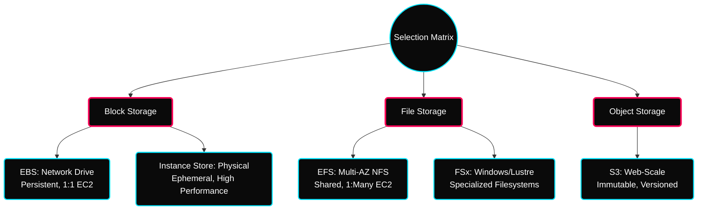

 

---

# 💾 AWS Storage Architecture — EBS, EFS & Instance Store

> **Focus:** Persistent block storage (EBS), Shared file systems (EFS), and Ephemeral performance (Instance Store).

---

## ✦ 1. Storage Divergence Taxonomy

In the AWS ecosystem, choosing the right storage "flavor" depends on your durability requirements and access patterns.

---

## ✦ 2. EBS (Elastic Block Store) Deep-Dive

Think of EBS as a **Networked USB Stick**. It is durable, can be detached/reattached, and persists even if the EC2 instance is terminated (if configured).

### ✦ Volume Types — Performance Selection

| Type | Name | Best For | Technical Insight |
|---|---|---|---|
| **gp3** | Gen-Purpose SSD | Standard Workloads | decoupled IOPS from Size. (Cheaper than gp2) |
| **gp2** | Gen-Purpose SSD | Small/Dev setups | IOPS tied to GiB size (3 IOPS per 1GB). |
| **io1/io2** | Provisioned IOPS | High-IQ Databases | Mission-critical apps needing >16k IOPS. |
| **st1** | Throughput HDD | Big Data / Logs | High MB/s, low IOPS. (Streaming focus). |
| **sc1** | Cold HDD | Archived data | Lowest cost, infrequently accessed. |

> [!TIP]
> **gp3 vs gp2**: Always use **gp3**. It allows you to increase IOPS and Throughput independently without increasing the drive size!

---

## ✦ 3. The Snapshot Lifecycle (Durability 101)

Snapshots are **incremental** backups stored in S3. 

1. **Snapshot 1**: Full copy of initial data.
2. **Snapshot 2**: Only the changed blocks (Delta).
3. **Snapshot 3**: Only the new changes.

> [!IMPORTANT]
> To move an EBS volume to a **different Availability Zone**, you must:
> 1. Take a Snapshot.
> 2. Create a new volume from that Snapshot in the target AZ.

---

## ✦ 4. EFS (Elastic File System) — Shared Logic

EFS solves the "Shared Web Folder" problem. While EBS is limited to a single AZ and (mostly) a single instance, EFS is accessible across your entire VPC.

- **NFS Protocol**: Linux only (POSIX compliant).
- **Scalability**: Grows and shrinks automatically (Serverless storage).
- **Cost-Optimization**: Use **EFS-IA** (Infrequent Access) to save 92% on files not used in 30 days.

---

## ✦ 5. Instance Store — The Speed Trap

The **Instance Store** is a physical drive on the host hardware. It is **Ephemeral**.

> [!CAUTION]
> If you **STOP** your EC2 instance, you will **LOSE** all data in the Instance Store. It only survives reboots. Only use for caches, buffers, or temporary scratch space!

---

## ✦ Practice Exercises
- [ ] Attach a 10GB `gp3` volume to a running EC2.
- [ ] SSH in and use `lsblk` to identify it, then `mkfs` to format it as XFS.
- [ ] Mount it to `/mnt/data` and verify with `df -h`.
- [ ] Take a snapshot and try to recreate a volume from it in `us-east-1b` (or a different AZ).
