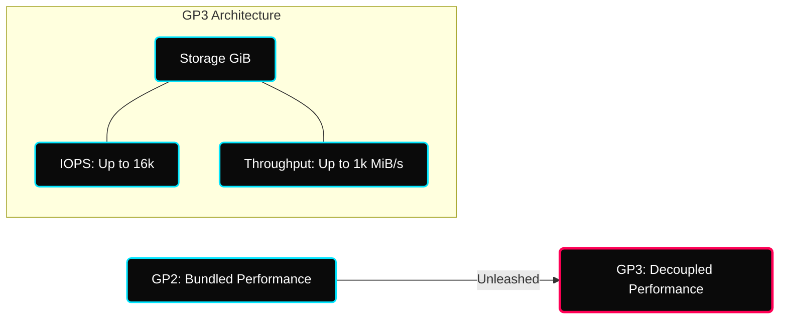

 

---

# 💾 Industrial AWS Storage — Multi-Tier Architectures

> **Architectural Goal:** Transition from "General Storage" to "Performance-Optimized & Cost-Efficient" block and file systems.

---

## ✦ 1. Block Storage Taxonomy (EBS)

### ✦ GP3: The Performance Decoupling Revolution

In legacy **GP2**, Performance (IOPS) was "bundled" with Capacity (Size). To get more speed, you had to buy more disk space. 

**GP3 (Current Gen)** decouples these two planes, allowing for:
- **Baseline Performance**: 3,000 IOPS and 125 MiB/s throughput (Guaranteed).
- **Independent Scaling**: Provision up to 16,000 IOPS and 1,000 MiB/s without increasing the storage size.
- **Cost Saving**: Typically **20% cheaper** than gp2 per GiB.

### ✦ Performance Tiering Matrix

| Volume Type | Max IOPS | Max Throughput | Deep-Dive Technical Use Case |
|---|---|---|---|
| **io2 Block Express** | 256,000 | 4,000 MiB/s | Sub-millisecond latency for mission-critical SAP HANA/Oracle clusters. |
| **io1/io2** | 64,000 | 1,000 MiB/s | Consistent performance for large-scale relational databases. |
| **st1 (HDD)** | 500 | 500 MiB/s | High-throughput sequential data — Log processing, ETL pipelines. |
| **sc1 (HDD)** | 250 | 250 MiB/s | Cold data — Infrequently accessed backups/archives. |

---

## ✦ 2. Elastic File System (EFS) — Scaling Logic

EFS provides a serverless, POSIX-compliant file system shareable across thousands of instances.

### ✦ Throughput & Performance Control

| Mode | Behavior | Best For |
|---|---|---|
| **Elastic Throughput** | Automatically scales with workload activity. | Spiky or unpredictable application traffic. |
| **Provisioned Throughput** | Guaranteed MB/s regardless of data size. | Consistent, high-performance batch processing. |
| **Bursting Throughput** | Driven by volume of data stored (Baseline + Credits). | General file shares where spikes are infrequent. |

> [!IMPORTANT]
> **Performance Modes**: Use **General Purpose** for latency-sensitive apps (Web Servers). Use **Max I/O** only for massive, highly parallelized Big Data workloads where IOPS are more important than individual file latency.

---

## ✦ 3. The "Shift-Left" Cost Optimization Cheat Sheet

Industrial DevOps requires financial awareness (FinOps). 

| Strategy | Action | Target Savings |
|---|---|---|
| **GP2 to GP3** | Migrate existing volumes via "Modify Volume" (No downtime). | **20%** directly on storage cost. |
| **EFS-IA Tiering** | Enable Lifecycle Management for files not used in 30 days. | **92%** on per-GB storage cost. |
| **Snapshot Archiving** | Move compliance-based "Cold" snapshots to Archive tier. | **75%** on snapshot costs. |
| **Wasted Resources** | Identity unattached EBS volumes via CLI/Automation. | **100%** on orphaned disk spend. |

---

## ✦ 4. Advanced Durability — Snapshots & AMIs

### ✦ Automated Lifecycle (DLM)
AWS **Data Lifecycle Manager (DLM)** automates the creation, retention, and deletion of EBS snapshots.
- **Cross-Region Copying**: Automates DR (Disaster Recovery) by cloning snapshots to another AWS region.
- **Fast Snapshot Restore (FSR)**: Pre-warms snapshots to eliminate the "first-touch" initialization delay.

> [!CAUTION]
> **Encryption Persistence**: If you take a snapshot of an unencrypted volume, the snapshot is unencrypted. You must **copy** the snapshot and select "Encrypt" to transform it before recreating a volume.

---

## ✦ Technical Deep-Dive Checklist
- [ ] Implement a **GP2 to GP3 migration** using `aws ec2 modify-volume`.
- [ ] Configure an **EFS Lifecycle Policy** to move data to Infrequent Access (IA).
- [ ] Create a **DLM Lifecycle Policy** for automated daily incremental backups.
- [ ] Validate **Multi-Attach** on `io1` volumes across a shared clustered filesystem.
