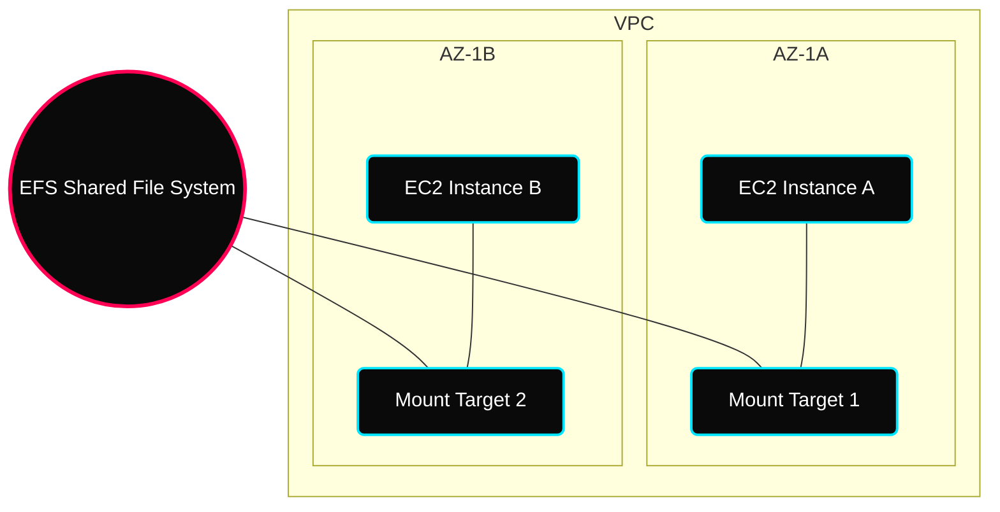

 

---

# 💾 Industrial AWS Storage — Multi-Tier Architectures

> **Architectural Goal:** Transition from "General Storage" to "Performance-Optimized & Cost-Efficient" block and file systems.

---

## ✦ 1. Elastic Block Store (EBS) Fundamentals

### ✦ EBS Performance Mastery (GP3)
In legacy **GP2**, Performance (IOPS) was "bundled" with Capacity (Size). 
**GP3 (Current Gen)** decouples these two planes, allowing for:
- **Baseline**: 3,000 IOPS and 125 MiB/s included (Guaranteed).
- **Independent Scaling**: Provision up to 16k IOPS and 1k MiB/s without increasing GiB.
- **Cost**: **20% cheaper** than gp2 per GiB.

### ✦ Advanced Snapshot Ecosystem
- **EBS Recycle Bin**: Retention rules for accidental deletions (1 day to 1 year).
- **Snapshot Archive**: Moves snapshots to a cold tier (Restore takes 24-72 hrs, 75% savings).
- **Fast Snapshot Restore (FSR)**: Pre-warms snapshots to eliminate initial latency (Pre-provisioned IOPS).

> [!TIP]
> **EBS Multi-Attach**: Attach a single `io1/io2` volume to multiple instances in the same AZ. Perfect for clustered filesystems on **AWS Nitro** systems.

---

## ✦ 2. Amazon EFS (Elastic File System) Deep-Dive

A shared, scalable, pay-as-you-go file system using the **NFSv4** protocol.

### ✦ Multi-AZ Mount Target Architecture
EFS replicates data across multiple AZs. Instances connect via a **Mount Target** endpoint in their specific subnet.

### ✦ Performance & Scaling Planes

| Mode | Behavior | Best For |
|---|---|---|
| **Elastic Throughput** | Automatically scales with activity. | Spiky/unpredictable traffic (Serverless). |
| **General Purpose** | Lowest per-operation latency. | Web Servers, CMS, Home directories. |
| **Max I/O** | Massive parallelization capability. | HPC, Big Data, Media transcoding. |

---

## ✦ 3. Industrial Decision Matrix: EBS vs. EFS

| Feature | EBS | EFS |
|---|---|---|
| **Mount Scope** | 1 instance at a time (per AZ) | 1000s of instances (multi-AZ) |
| **Protocol** | Block Storage (Network) | File Storage (NFSv4) |
| **Durability** | AZ-Locked (Data replicates in 1 AZ) | Regional (Data replicates across 3+ AZs) |
| **Price** | Base cost on provisioned storage | Base cost on amount used (Pay-as-you-go) |

---

## ✦ 4. AMI (Amazon Machine Image) Process

An **AMI** is a pre-packaged customization of an EC2 instance.

- **Fast Boot**: Dramatic reduction in boot time since software is pre-loaded.
- **Lifecycle**: Stop Instance -> Create Image (Snapshots) -> Launch from AMI.
- **AMI Sources**: Public (AWS), Personal, or AWS Marketplace.

---

## ✦ Technical Deep-Dive Checklist
- [ ] Migrate a **GP2 (bundled)** instance to **GP3 (decoupled)** using CLI.
- [ ] Configure **EFS-IA (Infrequent Access)** to save 92% on cold files.
- [ ] Implement an **Encryption Swap** (Snapshot -> Encrypt Snapshot -> Vol).
- [ ] Mount an **EFS share** across two instances in different subnets.
