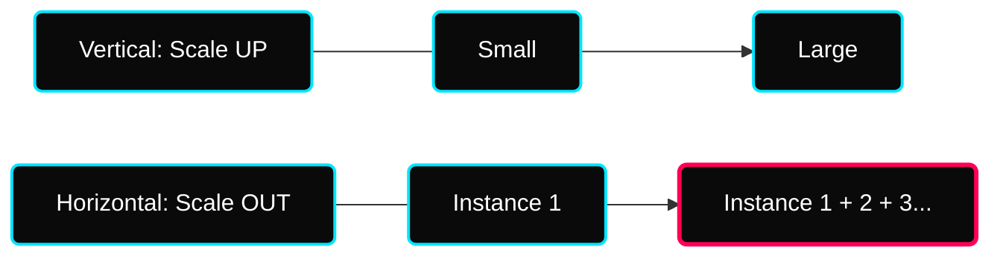

 

---

# ⚖️ Industrial AWS Traffic Management — Load Balancing & HA

> **Architectural Goal:** Transition from "Single-Instance Bottlenecks" to "Scalable, High-Availability" multi-zonal distribution.

---

## ✦ 1. Scalability vs Elasticity

Scalability is the ability to handle greater loads by adapting resources. In DevOps, we categorize this into two distinct models.

### ✦ Vertical Scalability (Scale UP/DOWN)
- **Action**: Enhance or reduce the size of a single instance (Upgrade CPU/RAM).
- **Limit**: Strictly bound by the hardware ceiling of the host (e.g., `t2.medium` -> `r5.2xlarge`).
- **Use Case**: Simple, non-distributed applications or relational databases.

### ✦ Horizontal Scalability (Scale OUT/IN)
- **Action**: Add or remove instances to match application demand.
- **Limit**: No practical limits; you can add thousands of smaller instances.
- **Use Case**: Web apps, microservices, and modern containerized loads.

---

## ✦ 2. High Availability (HA) & Fault Tolerance

**High Availability** means running your application in at least **2 Availability Zones (AZs)** at all times.

- **Objective**: Survive a complete Data Center (AZ) failure without downtime.
- **Core Components**: Load Balancer + Auto Scaling Group (ASG) + Multi-AZ instances.
- **Logic**: If `us-east-1a` goes down, `us-east-1b` continues serving traffic seamlessly.

---

## ✦ 3. Elastic Load Balancing (ELB) Architecture

A **Load Balancer** is a managed service that distributes network traffic among multiple servers (Target Groups).

### ✦ Why Use ELB?
- **SPOF Mitigation**: Distribute single points of failure to replicas.
- **Zero-Downtime**: Seamlessly updates backend instances without impacting end-users.
- **Continuous Delivery**: Health-check automation ensures only verified instances receive traffic.
- **Operational Savings**: Highly available and managed; no manual on-call staff for balancing maintenance.

### ✦ Health Checks Logic
- **Action**: Continuously send requests to backend instances.
- **Failstate**: If an instance fails a consecutive number of checks, it is marked **Unhealthy**.
- **Self-Healing**: The LB stops routing traffic to unhealthy instances and reroutes to healthy ones.

---

## ✦ 4. Load Balancer Taxonomy

| Type | Generation | Protocols | Best For |
|---|---|---|---|
| **ALB (Application)** | v2 (Current) | HTTP, HTTPS, WebSockets | Layer-7 Routing (Path, Hostname, Query Strings). |
| **NLB (Network)** | v2 (Current) | TCP, TLS, UDP, SSL | Millions of req/sec, ultra-low latency, static IPs. |
| **CLB (Classic)** | v1 (Legacy) | TCP, SSL, HTTP, HTTPS | Legacy apps (Not recommended for new projects). |

### ✦ Advanced Routing: Sticky Sessions
- **Affinity**: Sends a user to the same instance for the entire session.
- **Mechanism**: Load Balancer sets a special cookie (`AWSELB`).
- **Stickiness Duration**: Configurable timeline to prevent session loss for stateful apps.

### ✦ Cross-Zone Load Balancing
- **ALB**: Disabled by default at Target Group level (but no data charge for inter-AZ transfer).
- **NLB / GWLB**: Disabled by default; no extra charge for data transfer.
- **CLB**: Enabled by default; no charge.

---

## ✦ 5. SSL / TLS Security

An **SSL Certificate** encrypts traffic between the client and the load balancer (HTTPS).

- **Basics**: SSL (Legacy) vs TLS (Modern Version). Certificates are issued by Certificate Authorities (CA).
- **Management**: Integrated via **AWS Certificate Manager (ACM)**.
- **SNI (Server Name Indication)**: Solve the "Multiple Websites on One IP" problem.
  - **Logic**: The client indicates the hostname at the start of the TLS handshake.
  - **Availability**: Only available for **ALBs** and **NLBs**.

---

## ✦ Technical Deep-Dive Checklist
- [ ] Implement a **Cross-Zone** balancing test using two AZs.
- [ ] Configure **Sticky Sessions** and verify the `AWSELB` cookie in browser tools.
- [ ] Deploy an **SSL Listener (443)** using an ACM certificate.
- [ ] Compare performance latency between an **ALB** and an **NLB** for a high-traffic app.
