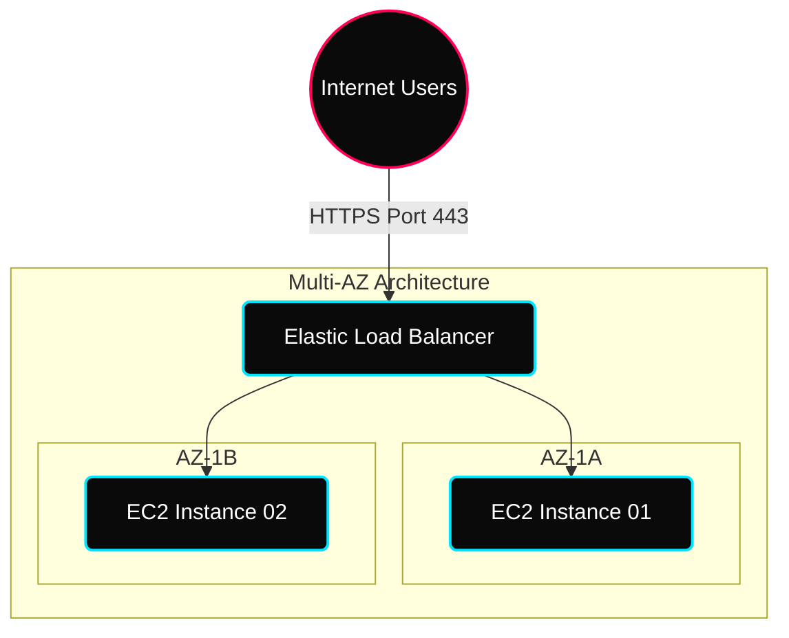

 

---

# ⚖️ Elastic Load Balancing & High Availability

> **Focus:** Horizontal Scaling, SSL Termination, and Session Stickiness architectures.

---

## ✦ 1. Traffic Distribution Topology

A Load Balancer acts as the single point of contact for clients, distributing incoming application traffic across multiple targets, such as EC2 instances.

---

## ✦ 2. ELB Family — Layer-7 vs Layer-4

Choosing the right Load Balancer depends on which OSI layer you need to inspect.

| Feature | ALB (Application) | NLB (Network) |
|---|---|---|
| **OSI Layer** | Layer 7 (HTTP/S) | Layer 4 (TCP/UDP) |
| **Logic** | Path-based / Host-based routing | IP / Port-based routing |
| **Performance** | High (millisecond latency) | Ultra-High (microsecond latency) |
| **Use Case** | Microservices, Web Apps | Gaming, Static IPs, Gaming, VoIP |

---

## ✦ 3. Content-Based Routing (ALB)

ALB can "look inside" the HTTP header and decide where to send the request based on the URL path.

- **URL Path**: `myapp.com/api` -> API Cluster. `myapp.com/img` -> Image Servers.
- **Hostname**: `api.myapp.com` -> API Cluster. `web.myapp.com` -> Web Cluster.

> [!TIP]
> **SSL Termination**: The Load Balancer can handle the SSL handshake. This offloads the heavy CPU work of decryption from your EC2 instances to the AWS managed infrastructure!

---

## ✦ 4. Session Preservation (Stickiness)

By default, an ELB routes each request independently. If your application stores session data locally on an instance, you must enable **Sticky Sessions**.

- **Cookie-Based**: The LB sets a cookie in the user's browser.
- **Duration**: You can define how long a user stays "stuck" to a specific instance.

---

## ✦ Practice Exercises
- [ ] Deploy two EC2 instances with Nginx and different `index.html` files.
- [ ] Create an ALB and verify it alternates traffic between them (Round Robin).
- [ ] Enable **Sticky Sessions** and verify you stay on the same instance upon refresh.
- [ ] Configure a Health Check that fails if a specific file (e.g., `health.html`) is missing.
