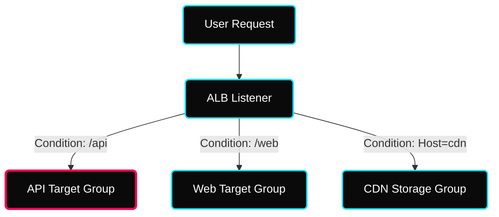

 

---

# ⚖️ Industrial AWS Traffic Management — Elastic Load Balancing (ELB)

> **Architectural Goal:** Transition from "Basic Traffic Splitting" to "Advanced Content-Aware Routing" and "High-Performance TCP/UDP" distribution.

---

## ✦ 1. Application Load Balancer (ALB) — Layer 7 Advanced Logic

ALB is the brain of the modern microservices stack. It doesn't just "split" traffic; it "thinks" before routing.

### ✦ The ALB Multi-Condition Matrix

Instead of simple path-based routing, industrial ALB configurations use complex logic to decide the destination.

| Condition Type | Value / Pattern | Real-World Use Case |
|---|---|---|
| **Host Header** | `api.myapp.com` | Hosting multiple subdomains/microservices on a single ALB. |
| **Path Pattern** | `/v2/users/*` | Version-based routing for API updates (A/B Testing). |
| **HTTP Header** | `User-Agent: Mobile` | Routing specialized traffic to mobile-optimized backend clusters. |
| **Query String** | `?debug=true` | Routing developers to internal logs or staging targets. |
| **Source IP** | `10.0.0.0/24` | Whitelisting internal office IPs for admin panel access. |
| **HTTP Method** | `POST` / `DELETE` | Segmenting "Write" traffic to a higher-capacity database group. |

---

## ✦ 2. Network Load Balancer (NLB) — Layer 4 High Performance

When performance is measured in **microseconds** (gaming, IoT, trading), NLB is the choice.

- **Static IPs**: Unlike ALB, NLB provides **one static IP per AZ**. This allows firewall whitelisting. Use **Elastic IPs** for permanent endpoints.
- **Ultra-Low Latency**: Handles millions of connections per second by bypassing the expensive HTTP inspection logic of the ALB.
- **Protocol Depth**: Perfect for non-HTTP protocols like TCP, UDP, and TLS.

---

## ✦ 3. Secure Encryption Architectures (SSL/TLS)

### ✦ SNI (Server Name Indication) — The Multi-Site Solution
Industrial deployments often host multiple domains (e.g., `shop.com`, `blog.com`) on a **single ALB**.
- **The Problem**: Traditionally, one listener = one SSL cert.
- **The Solution**: SNI allows the ALB to look at the hostname during the SSL handshake and Pick the Correct Certificate.
- **Scale**: Up to 25+ certificates per ALB listener.

### ✦ SSL Termination vs. End-to-End
- **SSL Termination**: ALB decrypts HTTPS and sends plain HTTP to backend EC2s (inside the private VPC). Faster and cheaper.
- **End-to-End**: ALB decrypts traffic, re-encrypts it, and sends HTTPS to backend EC2s. Used for high-security compliance (e.g., PCI-DSS / HIPAA).

---

## ✦ 4. Advanced Maintenance — Draining & Health Checks

### ✦ Deregistration Delay (Connection Draining)
When an instance is removed (e.g., during scale-in), ALB keeps the connection open for a **cooldown period** (default: 300s) to let active users finish their requests.
- **Goal**: Zero errors for users during auto-scaling events.

### ✦ Custom Health Checks
- **Industrial Path**: Always use a dedicated route like `/health` or `/status` instead of `/` (the homepage).
- **Thresholds**: Healthy (e.g., 5 successful pings) vs Unhealthy (e.g., 2 failed pings).
- **Interval**: How often the LB checks (e.g., every 30 seconds).

---

## ✦ Technical Deep-Dive Checklist
- [ ] Configure an **ALB Listener Rule** with multiple conditions (Host + Path).
- [ ] Enable **Cross-Zone Load Balancing** and verify distribution efficiency.
- [ ] Implement **SSL Termination** using a free certificate from **AWS ACM (Certificate Manager)**.
- [ ] Adjust **Deregistration Delay** to 60 seconds for faster scale-in during testing.
- [ ] Set up an **NLB with a Static Elastic IP** and verify connectivity via TCP.
