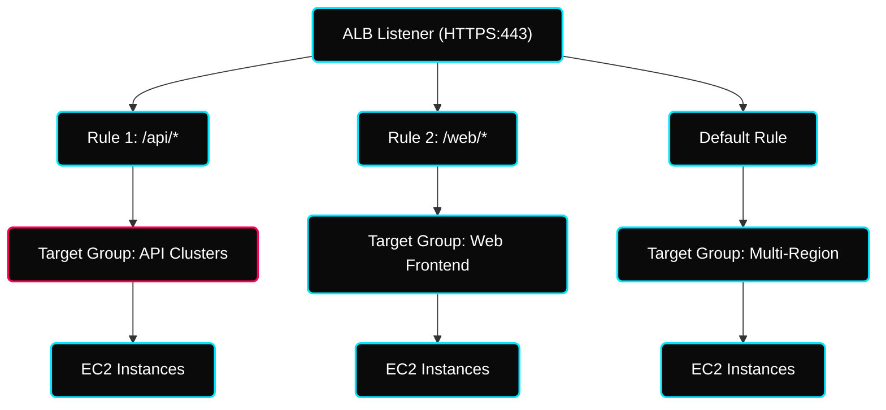
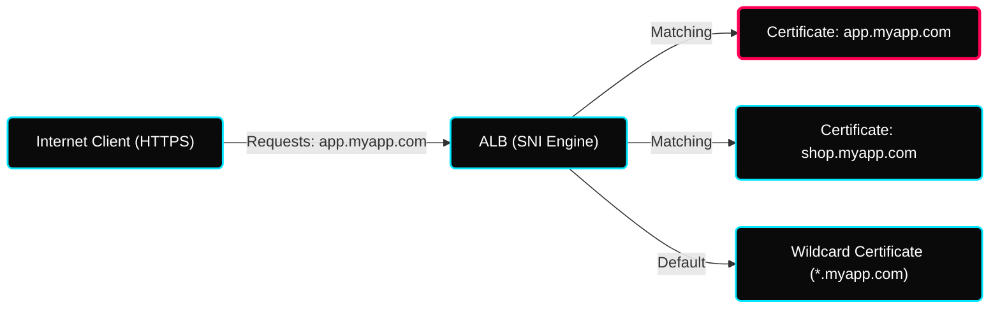
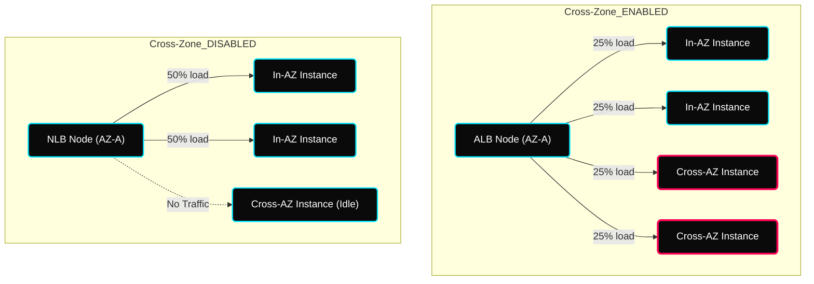

 

---

# ⚖️ Industrial AWS Traffic Management — Load Balancing & HA

> **Architectural Goal:** Transition from "Single-Instance Bottlenecks" to "Scalable, High-Availability" multi-zonal distribution.

---

## ✦ 1. Scalability vs Elasticity (The DevOps Core)

**Scalability** is the ability to handle greater loads by adapting resources. 

- **Vertical Scalability (Scale UP)**: Increase or decrease the size of a single instance (t2.medium -> r5.2xlarge).
- **Horizontal Scalability (Elasticity)**: Add or remove instances to match application demand.
- **High Availability (HA)**: Running your application across at least **2 Availability Zones (AZs)** at all times.

---

## ✦ 2. Application Load Balancer (ALB) — Layer 7 Advanced Logic

ALB is the brain of the modern microservices stack. It doesn't just "split" traffic; it "thinks" before routing.

### ✦ The ALB Multi-Condition Matrix
ALB can route to different target groups based on complex logic.

| Condition Type | Value / Pattern | Real-World Use Case |
|---|---|---|
| **Host Header** | `api.myapp.com` | Hosting multiple subdomains/microservices on a single ALB. |
| **Path Pattern** | `/v2/users/*` | Version-based routing for API updates (A/B Testing). |
| **HTTP Header** | `User-Agent: Mobile` | Routing specialized traffic to mobile backend clusters. |
| **Query String** | `?debug=true` | Routing developers to internal logs or staging targets. |
| **Source IP** | `10.0.0.0/24` | Whitelisting internal office IPs for admin panel access. |

---

## ✦ 3. Network Load Balancer (NLB) & SNI Security

### ✦ NLB: High-Performance Distribution (Layer 4)
- **Static IPs**: Unlike ALB, NLB provides **one static IP per AZ** using **Elastic IPs**.
- **Ultra-Low Latency**: Handles millions of connections per second for TCP/UDP Gaming/IoT.

### ✦ SNI (Server Name Indication) — The Multi-Site Solution
- **The Problem**: Traditionally, one listener = one SSL cert.
- **The Solution**: SNI allows the ALB to look at the hostname during the SSL handshake and **Pick the Correct Certificate**.
- **Availability**: Available for **ALB** and **NLB** (Not Legacy CLB).

---

## ✦ 4. Traffic Resilience & Cost

### ✦ Cross-Zone Load Balancing (Industrial Deep-Dive)
When you have instances spread across AZs, cross-zone load balancing controls whether traffic is balanced across ALL instances or only within each AZ.

| LB Type | Behavior | Inter-AZ Data Cost |
|---|---|---|
| **ALB** | Enabled by default | **Free** |
| **NLB** | Disabled by default | You pay if enabled |
| **CLB** | Enabled by default | **Free** |

### ✦ Connection Draining (Deregistration Delay)
When an instance is removed (e.g., during scale-in), the Load Balancer keeps the connection open for a **cooldown period** (default: 300s) to let active users finish their requests.

---

## ✦ Technical Deep-Dive Checklist
- [ ] Configure an **ALB Listener Rule** with multiple conditions (Host + Path).
- [ ] Enable **Cross-Zone Load Balancing** and verify distribution efficiency.
- [ ] Implement **SSL Termination** using a free certificate from **AWS ACM (Certificate Manager)**.
- [ ] Adjust **Deregistration Delay** to 60 seconds for faster scale-in during testing.
- [ ] Set up an **NLB with a Static Elastic IP**.
