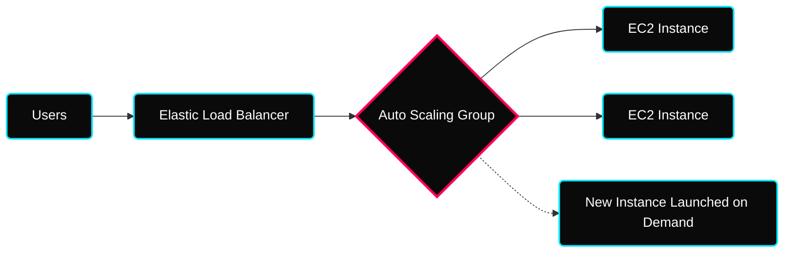
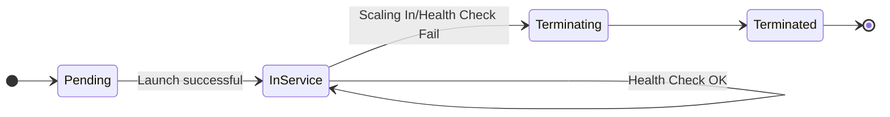

 

---

# ⚡ Auto Scaling Groups (ASG)

> **Week:** 12
> **Folder:** Auto-Scaling-Groups
> **Topic:** Automated Horizontal Scaling & High Availability

---

## ✦ Why ASG in DevOps?

In a dynamic production environment, traffic is never constant. Manually launching or terminating EC2 instances in response to load is inefficient and error-prone. **Auto Scaling Groups (ASG)** automate this process, ensuring your application always has the right number of instances to handle the current load while minimizing costs.

---

## ✦ 1. ASG Core Components

To set up an ASG, you need two fundamental pieces of configuration:

### ⚡ Launch Template (The "What")
A **Launch Template** defines the blueprints of the instances the ASG will launch.
- **AMI ID:** The OS and software configuration.
- **Instance Type:** CPU/RAM allocation.
- **Key Pair & Security Groups:** Access control.
- **User Data:** Startup scripts for automation.

> [!TIP]
> **Launch Templates** are the modern standard, replacing legacy **Launch Configurations**. They support versioning and allow you to mix On-Demand and Spot instances in a single ASG.

### ⚡ ASG Settings (The "Where" & "How Many")
- **VPC & Subnets:** Which Availability Zones the instances will reside in.
- **Min Size:** The absolute minimum number of instances (e.g., for HA).
- **Max Size:** The cap on how many instances can be launched (cost control).
- **Desired Capacity:** The target number of instances AWS will try to maintain.

---

## ✦ 2. The ASG Lifecycle

Every instance managed by an ASG goes through a specific set of states.

### ⚡ Self-Healing Mechanics
If an instance fails an **EC2 Status Check** or an **ELB Health Check**, the ASG will:
1.  **Terminate** the unhealthy instance.
2.  **Launch** a new one to maintain the **Desired Capacity**.

---

## ✦ 3. Scaling Strategies

| Strategy | How it Works | Best For |
|---|---|---|
| **Target Tracking** | Scales based on a metric (e.g., "Keep average CPU at 50%"). | Most standard workloads. |
| **Step Scaling** | Scales in steps based on CloudWatch Alarms (e.g., "+2 if CPU > 80%"). | Workloads with sharp traffic spikes. |
| **Scheduled** | Scales based on known time patterns (e.g., "Increase to 10 on Friday 5 PM"). | E-commerce sales, batch processing. |
| **Predictive** | Uses ML to forecast traffic and scale *before* it happens. | High-scale, predictable traffic. |

---

## ✦ 4. Operational Considerations

### ⚡ Cooldown Period
The **Cooldown Period** (Default: 300s) ensures the ASG doesn't launch or terminate additional instances before the previous scaling action has taken effect and the metrics have stabilized.

### ⚡ Termination Policies
By default, ASG will try to maintain balance across Availability Zones:
1.  Identify AZ with most instances.
2.  Identify instance with **oldest** Launch Template/Configuration.
3.  Terminate the instance.

---

## ✦ 🧠 Summary — Interview Ready

| Concept | The "Elevator Pitch" |
|---|---|
| **Horizontal Scaling** | Adding more instances (Scaling Out) or removing instances (Scaling In). |
| **Desired Capacity** | The "Sweet Spot" number of instances you want running. |
| **Launch Template** | The reusable blueprint for instance configuration. |
| **Health Check** | ASG uses EC2 (default) or ELB checks to identify failed nodes. |

---

## ✦ 🏃 Practice Exercises

- [ ] Create a **Launch Template** with a simple Nginx User Data script.
- [ ] Deploy an **ASG** with Min: 1, Desired: 2, Max: 4.
- [ ] **Simulate a Failure:** Manually terminate one instance and watch ASG launch a replacement.
- [ ] **Test Scaling:** Stress the CPU of an instance and watch it Trigger a "Scale Out" event.
- [ ] Configure a **Scheduled Scaling** event to increase capacity by 1 for the next hour.

---

## ✦ Personal Notes

- **The Spot Strategy:** Using a mix of On-Demand and Spot instances in an ASG can reduce costs by up to 90% without sacrificing availability if configured correctly.
- **Subnet Diversity:** Always deploy ASG across at least 2 or 3 AZs. If one AZ goes down, ASG will automatically re-balance the capacity in the healthy AZs.

---

## ✦ 🔗 Resources

See [resources.md](./resources.md)
