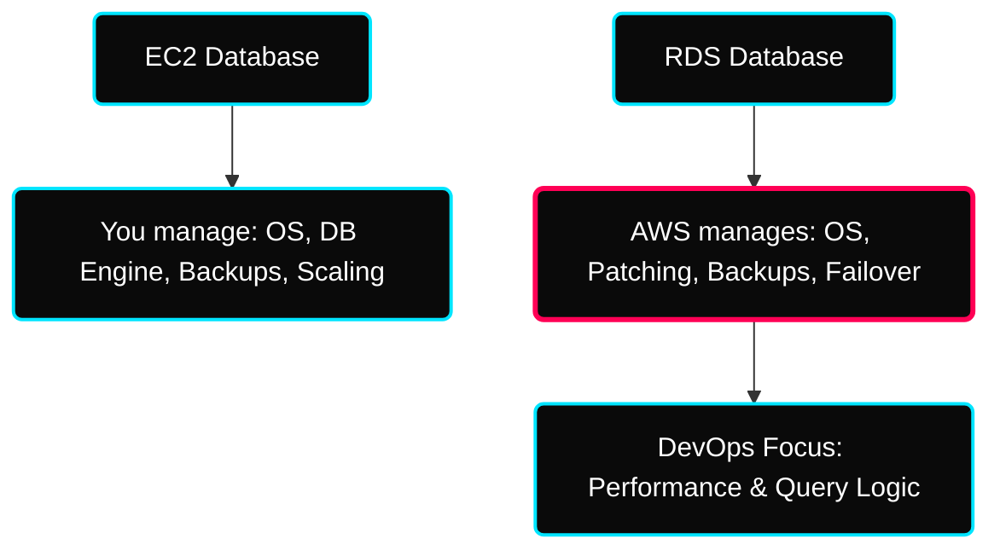
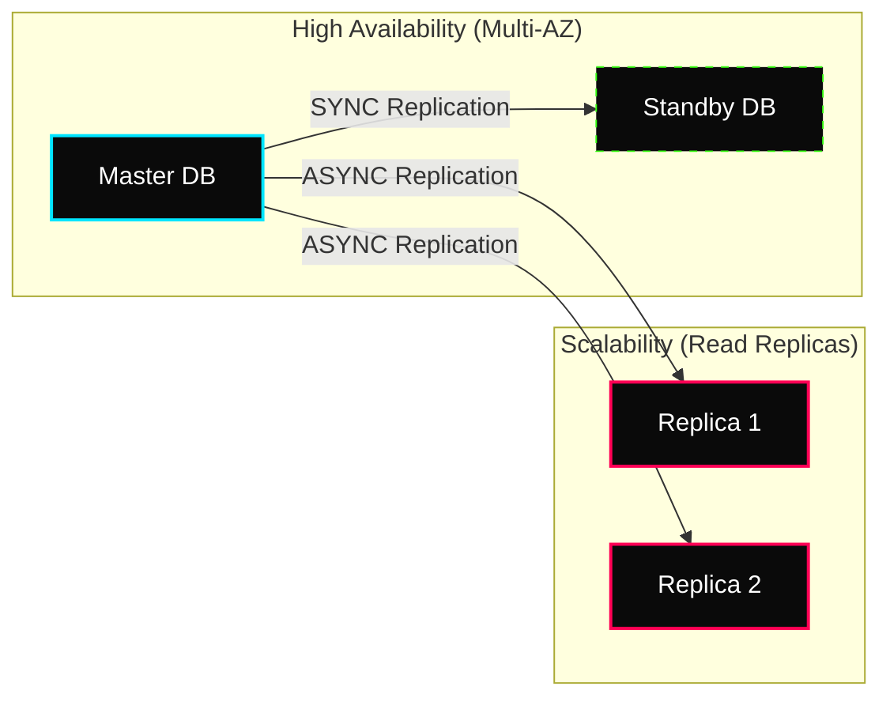
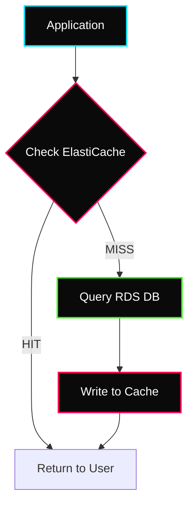

[](#) [](#)

---

# ⚡ RDS, Aurora & ElastiCache

> **Week:** 12
> **Folder:** RDS-Aurora-ElastiCache
> **Topic:** Managed Relational & In-Memory Data Systems

---

## ✦ Why Managed Databases in DevOps?

Running a database on EC2 (IaaS) puts the "Admin Burden" on you. **Amazon RDS (PaaS)** shifts the responsibility of maintenance, patching, and backups to AWS.



---

## ✦ 1. RDS Architectures: DR vs. Scaling

The most critical distinction for a DevOps engineer is understanding **Multi-AZ** vs. **Read Replicas**.



### ⚡ Technical Comparison Matrix

| Property | Multi-AZ (Disaster Recovery) | Read Replicas (Scaling) |
|---|---|---|
| **Replication Type** | Synchronous (Zero Data Loss) | Asynchronous (Eventually Consistent) |
| **Primary Use** | High Availability / Failover | Read Performance Scaling |
| **Readable?** | ❌ No (Passive standby) | ✅ Yes (Offload SELECT queries) |
| **Automatic Failover** | ✅ Built-in by AWS | ❌ Manual (Requires app logic) |
| **Failover Range** | Only within its Region | Same Region or Cross-Region |

---

## ✦ 2. Amazon Aurora: Cloud-Native SQL

Aurora is not just "RDS with a different name." It is a ground-up redesign of the database engine using a **log-structured distributed storage system**.

### ✦ Aurora Storage Engine
- **Data Copies:** 6 copies of data across 3 Availability Zones.
- **Self-Healing:** Continuously scans data segments and repairs them from peers.
- **Failover:** Typically **< 30 seconds**, making it significantly faster than standard RDS.

### ✦ Aurora Serverless
Best for **unpredictable** workloads.
- **Scaling:** Automatically adjusts CPU/RAM based on query pressure.
- **Cost:** Scales to **ZERO** when not in use (massive cost saver for dev environments).

---

## ✦ 3. ElastiCache: The Speed Layer

In-memory caching is the standard for high-performance distributed systems.

### ⚡ The Caching Flow (Lazy Loading)


### ⚡ Redis vs. Memcached

| Feature | Redis (Standard Choice) | Memcached (Simple Caching) |
|---|---|---|
| **Persistence** | ✅ Supported (disk snapshots) | ❌ Volatile (RAM only) |
| **Data Types** | Lists, Sets, Hashes, Geospatial | Simple Keys/Strings |
| **Multi-AZ** | ✅ Supported with Failover | ❌ Not available |
| **Pub/Sub** | ✅ Built-in messaging | ❌ Not available |
| **Multi-threaded** | ❌ Single-threaded | ✅ Yes |
| **Use for** | Complex data, HA, persistence | Simple cache, large scale sharding |

> 💡 **Choose Redis for almost everything** — unless you specifically need multi-threaded sharding at extreme scale.

### Redis Use Case — Gaming Leaderboard

Gaming leaderboards are computationally complex — millions of users, constantly changing scores, need real-time ranking.

**Redis Sorted Sets** solve this perfectly:
- Every element is unique (one entry per player)
- Elements are automatically ordered by score
- Each time a new score is added, it's ranked in real time and inserted in correct order

```
Player scores a point → Redis ZADD leaderboard <score> <player_id>
                       → Redis automatically re-ranks all players
                       → App reads top 10: ZREVRANGE leaderboard 0 9 WITHSCORES
```
