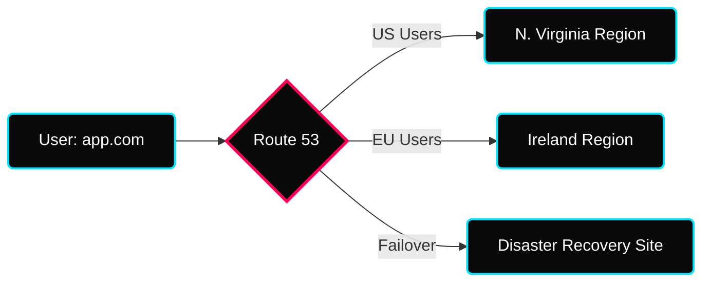
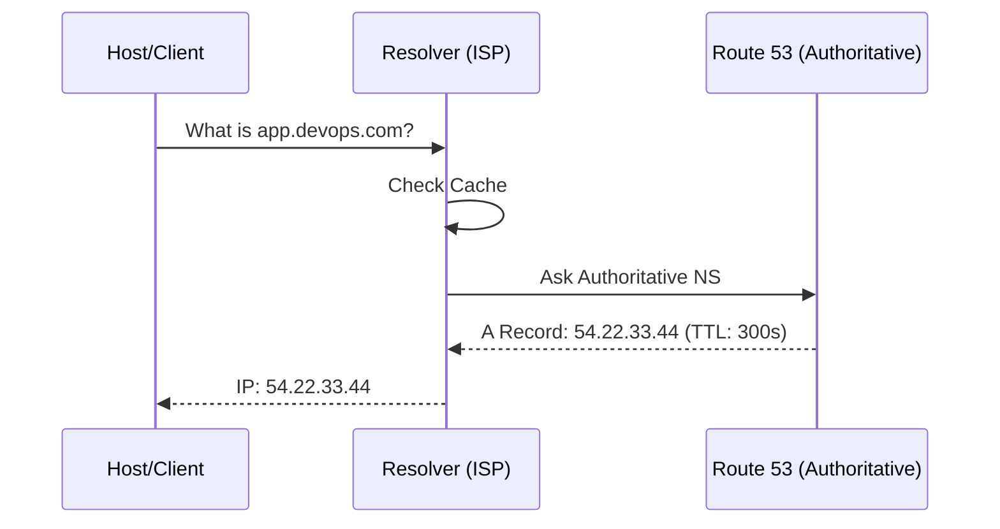
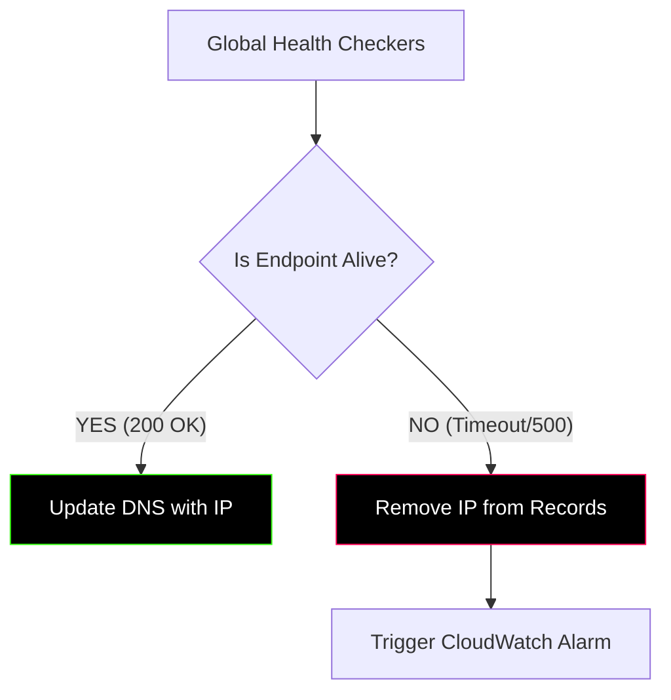

 

---

# ⚡ Amazon Route 53

> **Week:** 12
> **Folder:** Route-53
> **Topic:** Managed DNS, Traffic Flow & 100% Availability Engineering

---

## ✦ Why Route 53 in DevOps?

IP addresses are for machines; domain names are for humans. Route 53 is the globally distributed service that bridges this gap while providing advanced routing logic for high availability.

---

## ✦ 1. DNS Resolution Architecture

Understanding how a query is resolved globally is essential for troubleshooting latency.

---

## ✦ 2. Critical Record Types

| Record | Function | DevOps Use Case |
|---|---|---|
| **A** | Hostname -> IPv4 | Standard server mapping. |
| **AAAA** | Hostname -> IPv6 | Future-proofing & mobile network compatibility. |
| **CNAME** | Hostname -> Hostname | Mapping subdomains (e.g., `www`) to base domains. |
| **Alias** | Hostname -> AWS Resource | **Free** mapping for ELBs, S3, and CloudFront at the Root/Apex level. |

---

## ✦ 3. Advanced Routing Policies

Route 53 allows you to define complex traffic steering logic.

### ⚡ Policy Comparison Matrix

| Policy | Logic | Best For |
|---|---|---|
| **Simple** | 1:1 or 1:Many random | Basic single-server setups. |
| **Weighted** | Split traffic by % | **Canary Deployments** & A/B testing. |
| **Latency** | Closest region by speed | Global apps requiring high performance. |
| **Failover** | Health-check based | **Disaster Recovery** (Active-Passive). |
| **Geolocation** | Based on user's country | Licensing restrictions & local content. |
| **Multivalue** | Multiple healthy IPs | Client-side load balancing. |

---

## ✦ 4. Health Checks & Failover

Route 53 doesn't just route traffic; it monitors endpoints to ensure they are alive before sending users there.

---

## ✦ 🧠 Summary — Interview Ready

| Concept | The "Elevator Pitch" |
|---|---|
| **SLA** | Route 53 is the only AWS service with a **100% Availability SLA**. |
| **Alias vs CNAME** | Alias is AWS-native, works on root domains (`@`), and queries are **free**. |
| **Hosted Zone** | A container for records of a single domain. $0.50/mo. |
| **TTL** | Time-To-Live. Lower TTL (60s) is better for migrations; Higher (24h) is cheaper. |

---

## ✦ 🏃 Practice Exercises

- [ ] Create a **Public Hosted Zone** for a sandbox domain.
- [ ] Map an **Alias Record** to an existing Application Load Balancer.
- [ ] Configure **Weighted Routing** (90/10) between two EC2 web servers.
- [ ] Setup a **CloudWatch Alarm-based Health Check** that monitors disk space.
- [ ] Use `dig` or `nslookup` to verify the TTL and resolution path from your terminal.

---

## ✦ Personal Notes

- **The Zone Apex Rule:** You can NEVER use a CNAME for the root domain (e.g., `google.com`). You MUST use an Alias or an A record. This is a common exam/interview question.
- **Propagation:** While AWS updates records in seconds, global ISP caches might take minutes/hours to reflect changes depending on the TTL.

---

## ✦ 🔗 Resources

See [resources.md](./resources.md)
 check on your EC2 instance
- [ ] Configure a Failover routing policy between two instances
- [ ] Test Weighted routing — 80% to EC2-A, 20% to EC2-B

---

## 📝 Personal Notes

<!-- Add your Route 53 observations here -->

---

## 🔗 Resources

| Resource | Link |
|---|---|
| Route 53 Documentation | https://docs.aws.amazon.com/route53/latest/developerguide/Welcome.html |
| Routing Policies | https://docs.aws.amazon.com/Route53/latest/DeveloperGuide/routing-policy.html |
| Route 53 Pricing | https://aws.amazon.com/route53/pricing |
| AWS CLI Route 53 | https://docs.aws.amazon.com/cli/latest/reference/route53 |
