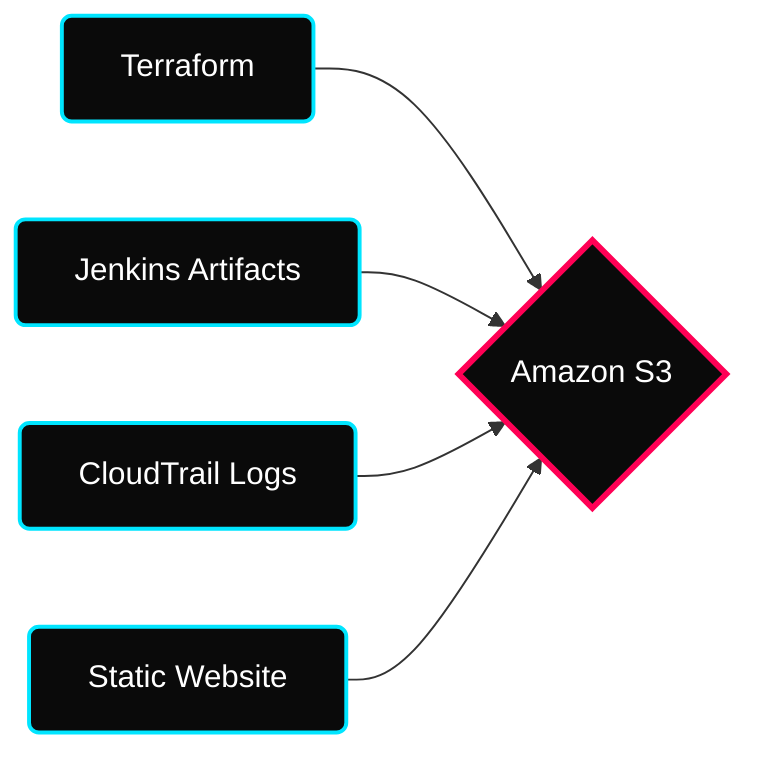
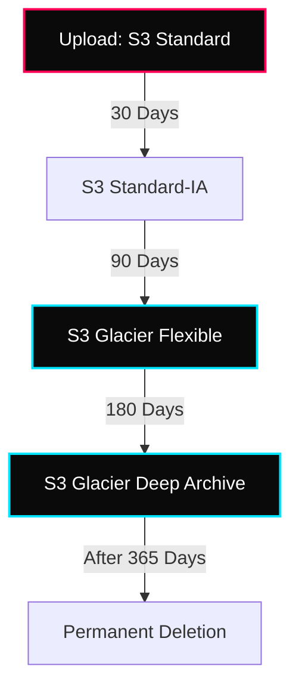

 

---

# ⚡ Amazon S3 — Simple Storage Service

> **Week:** 12
> **Folder:** S3
> **Topic:** Object-Based Cloud Storage & Data Life Cycle

---

## ✦ Why S3 in DevOps?

S3 is the universal storage layer for AWS. As a DevOps engineer, you'll use it for storing Terraform state, deployment artifacts, centralized logs, and static web assets.

---

## ✦ 1. Core Concepts: Buckets & Objects

### ⚡ The Bucket
- **Global Namespace:** Names must be unique across all AWS accounts globally.
- **Regional Content:** Data is physically stored in the region you select.
- **Flat Structure:** S3 is not a file system. Folders are just "prefixes" in an object's key.

### ⚡ The Object
- **Key:** The full "path" (e.g., `uploads/2024/image.png`).
- **Value:** The actual data (up to 5TB).
- **Metadata:** System metadata (Content-Type) or custom tags.
- **Tags:** Unicode key-value pairs (up to 10) for security/lifecycle.
- **Large Files:** Must use **Multi-part Upload** for files > 5GB (Max size 5TB).

---

## ✦ 2. S3 Lifecycle Management

Automation of data transitions is a key pillar of cost optimization.

### ⚡ Storage Class Comparison

| Class | Availability | Durability | Use Case |
|---|---|---|---|
| **Standard** | 99.99% | 11 9's | Frequently accessed data. |
| **Intelligent-Tiering** | 99.9% | 11 9's | Unknown or changing patterns. |
| **Standard-IA** | 99.9% | 11 9's | Backups, retrieved monthly. |
| **One Zone-IA** | 99.5% | 11 9's | Non-critical/recreatable data. |
| **Glacier Deep Archive** | 99.9% | 11 9's | Long-term compliance (7-10 years). |

---

## ✦ 3. Security & Access Control

S3 is private by default. Access is managed through layers of defense.

| Layer | Method | Scope |
|---|---|---|
| **IAM Policy** | JSON attached to user | Controls "Who" can access "What". |
| **Bucket Policy** | JSON attached to bucket | Controls "Public" or "Cross-Account" access. |
| **Block Public Access** | AWS Console Toggle | Hard override to prevent data exposure. |
| **Object ACLs** | XML-based (Legacy) | Fine-grained access for individual objects. |
| **SSE-S3** | Encryption | Managed by AWS (Default). |
| **SSE-KMS** | Encryption | Managed by KMS Service (Audit Trail). |
| **SSE-C** | Encryption | Customer-provided keys (Advanced). |
| **CORS** | Browser Mechanism | Allows requests to other domains/origins. |

---

## ✦ 🧠 Summary — Interview Ready

| Concept | The "Elevator Pitch" |
|---|---|
| **Versioning** | Protects against accidental deletes by keeping a history of objects. |
| **Replication** | CRR (Cross-Region) used for DR; SRR (Same-Region) for log aggregation. |
| **Pre-signed URLs** | Temporary access for non-IAM users (e.g., private video link). |
| **Vault Lock** | WORM model (Write Once Read Many) for compliance; impossible to delete. |
| **Object Lambda** | Transform data on-the-fly (e.g., resizing images during GET). |
| **Access Points** | Dedicated hostnames for bucket access within a VPC. |

---

## ✦ 🏃 Practice Exercises

- [ ] Create a bucket with **Block Public Access** turned OFF.
- [ ] Upload an `index.html` and configure **Static Website Hosting**.
- [ ] Apply a **Bucket Policy** to allow public `s3:GetObject` access.
- [ ] Enable **Object Versioning** and upload two different versions of a file.
- [ ] Create a **Lifecycle Rule** to move objects to Glacier after 30 days of inactivity.

---

## ✦ Personal Notes

- **S3 vs. EBS:** Remember that S3 is an **Object Store** (HTTP-based access), while EBS is a **Block Store** (used as a hard drive for EC2).
- **Cost Warning:** While S3 storage is cheap, **Data Transfer Out** and **API requests (PUT/GET)** can add up in high-traffic apps.

---

## ✦ 🔗 Resources

See [resources.md](./resources.md)
