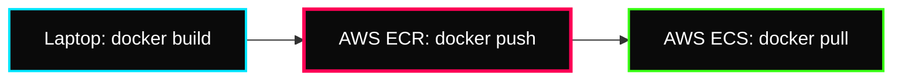
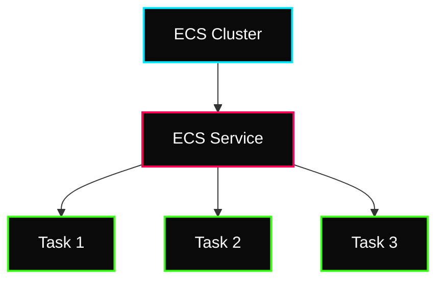

 

---

# 🐳 Containers on AWS (ECS & ECR)

> **Week:** 13
> **Folder:** Containers-ECS-ECR
> **Topic:** Elastic Container Service & Registry

---

## ✦ Introduction to AWS Containers

While running Docker on EC2 is possible, it's not "Cloud Native." **Amazon ECS** provides a managed control plane to orchestrate your containers at scale.

---

## ✦ 1. Amazon ECR: Elastic Container Registry

ECR is your private Docker Hub. It stores, manages, and deploys Docker images.

### ⚡ The Container Workflow

---

## ✦ 2. Amazon ECS: Elastic Container Service

ECS consists of three main components: **Task Definitions**, **Tasks**, and **Services**.

### ⚡ Key Components
- **Task Definition:** A JSON file (blueprint) that describes one or more containers (CPU, RAM, Port mappings, Image URL).
- **Task:** A running instance of a Task Definition (the "Container instance").
- **Service:** Ensures that the specified number of Tasks are running and balanced across the cluster.

### ⚡ The ECS Hierarchy

---

## ✦ 3. Fargate vs. EC2 Launch Types

The most critical decision when using ECS is choosing how to "Host" your containers.

| Feature | ECS on EC2 | **AWS Fargate** (Serverless) |
|---|---|---|
| **Management** | You manage EC2 instances | AWS manages the infrastructure |
| **Scaling** | You scale the Cluster + Auto Scaling | You only scale the Tasks |
| **Control** | Full SSH access to OS | No OS access (Task only) |
| **Cost** | You pay for the EC2 runtime | You pay for vCPU/RAM per Task |
| **Use Case** | Large persistent workloads | Microservices, Batch jobs, "Serverless first" |

---

## ✦ 🐳 Personal Notes & Interview Tips

- **Task Roles vs Execution Roles:**
    - **Execution Role:** Allows ECS to PULL the image from ECR and send logs to CloudWatch.
    - **Task Role:** Allows the actual APPLICATION inside the container to talk to S3, DynamoDB, etc.
- **Dynamic Port Mapping:** When using an ALB with ECS, you don't need to specify a host port. ECS/ALB will automatically assign a random port to your container, allowing multiple copies of the same container to run on one EC2 host.
- **Service Discovery:** Use AWS Cloud Map (Service Discovery) to allow your ECS services to talk to each other via internal DNS (e.g., `db.local`).
