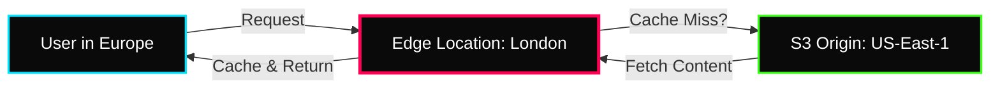

 

---

# 🌐 Global Content Delivery

> **Week:** 13
> **Folder:** Global-Content-Delivery
> **Topic:** CloudFront, Edge Caching, and Global Acceleration

---

## ✦ Why Global Content Delivery?

In modern DevOps, "Latency is the Enemy." If your origin server is in Virginia but your user is in Mumbai, the round-trip time (RTT) will be high. **Content Delivery Networks (CDNs)** solve this by caching content as close to the user as possible (the "Edge").

---

## ✦ 1. Amazon CloudFront (CDN)

CloudFront is a fast content delivery network service that securely delivers data, videos, applications, and APIs to customers globally with low latency.

### ⚡ Key Concepts
- **Edge Location:** Small points of presence globally where content is cached.
- **Origin:** The source of your content (S3 bucket, EC2, ALB, or Custom HTTP server).
- **Distribution:** A "Link" between Edge locations and your Origin.

### ⚡ Architecture: S3 as an Origin

### ⚡ Cache Invalidations
If you update an image on S3, users might still see the old version because it's cached.
- **CloudFront Invalidation:** Forcefully clearing the cache for a specific path (e.g., `/*` or `/images/*`).

---

## ✦ 2. AWS Global Accelerator

Global Accelerator uses the **AWS Global Network** to route traffic to yours applications, improving availability and performance.

### ⚡ Anycast IP
Unlike CloudFront (which uses DNS to point to Edge locations), Global Accelerator provides **2 Static Anycast IPs**. These IPs point to the nearest AWS Edge location, which then tunnels the traffic through the AWS internal private network to your application.

### ⚡ Use Cases
- **Non-HTTP Use Cases:** Gaming (UDP), VoIP, IoT (MQTT).
- **Deterministic Routing:** When you need static IPs that don't change.

---

## ✦ 🌐 Technical Comparison

| Property | Amazon CloudFront | AWS Global Accelerator |
|---|---|---|
| **Layer** | Layer 7 (HTTP/HTTPS) | Layer 3/4 (TCP/UDP) |
| **Primary Goal** | Caching content (Images, Video) | Improving Network Performance / Stability |
| **IP Address** | Dynamic (DNS based) | **Static Anycast IPs** |
| **Caching?** | ✅ Yes | ❌ No |
| **Edge Use** | Serves content from Edge | Entry point to AWS Private Network |

---

## ✦ 🌐 Personal Notes

- **CloudFront Geo-Restriction:** Use this to Allow/Block specific countries from accessing your content (useful for licensing/compliance).
- **OAC (Origin Access Control):** Always use OAC to ensure users can ONLY access your S3 content via CloudFront, preventing them from bypassing your CDN security.
