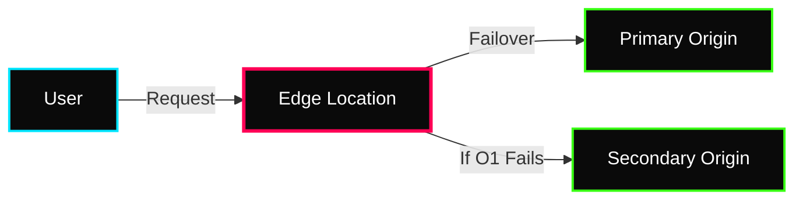

 

---

# 🌐 Global Content Delivery

> **Week:** 13
> **Folder:** Global-Content-Delivery
> **Topic:** CloudFront, Edge Caching, and Global Acceleration

---

## ✦ Why Global Content Delivery?

In modern DevOps, "Latency is the Enemy." If your origin server is in Virginia but your user is in Mumbai, the round-trip time (RTT) will be high. **Content Delivery Networks (CDNs)** solve this by caching content as close to the user as possible (the "Edge") and optimizing the route to the origin.

---

## ✦ 1. Amazon CloudFront (CDN)

CloudFront is a fast content delivery network service that securely delivers data, videos, applications, and APIs to customers globally.

### ⚡ Advanced Caching Logic
- **Cache Behaviors:** Allow you to configure different settings for different URL patterns (e.g., `/api/*` goes to ALB with no caching, while `/images/*` goes to S3 with 1-year caching).
- **TTL (Time To Live):** 
    - **Min/Max/Default TTL:** Controlled by CloudFront settings or `Cache-Control` headers from the origin.
- **Cache Keys:** Determine what makes a request "unique" in the cache (e.g., URL + Query Strings + Specific Headers).

### ⚡ Origin Resilience
- **Origin Groups:** Define a Primary and a Secondary origin. If the Primary returns a specific error code (e.g., 504), CloudFront automatically fails over to the Secondary.
- **OAC (Origin Access Control):** The modern way to secure S3 origins. It ensures S3 buckets are private and only accessible via CloudFront.

---

## ✦ 2. AWS Global Accelerator

Improves availability and performance of your local or global applications by using the **AWS Global Network**.

### ⚡ Technical Mechanics
- **Unicast IP:** A specific server has a specific IP. Traffic is routed via the public internet.
- **Anycast IP:** Multiple servers (at the Edge) share the same IP. Traffic is routed to the nearest Edge location and then via the private AWS network.
- **Static IPs:** Global Accelerator provides 2 static Anycast IPs that never change, shielding your application from DNS propagation delays.

### ⚡ Performance Benefits
- **TCP Termination:** Handshake happens at the Edge location closest to the user, reducing the time to establish a connection.
- **Congestion Avoidance:** Uses AWS's dedicated fiber optic network instead of the crowded public internet.

---

## ✦ 🌐 Technical Comparison

| Property | Amazon CloudFront | AWS Global Accelerator |
|---|---|---|
| **Layer** | Layer 7 (HTTP/HTTPS) | Layer 3/4 (TCP/UDP) |
| **Primary Goal** | Caching content & reducing load | Improving Network Path & Stability |
| **IP Address** | Dynamic (DNS based) | **Static Anycast IPs** |
| **Caching?** | ✅ Yes | ❌ No |
| **Encryption** | SSL/TLS at Edge | Pass-through to Origin |

---

## ✦ 🌐 Personal Notes & Interview Tips

- **CloudFront Functions vs. Lambda@Edge:**
    - **CloudFront Functions:** Ultra-fast, lightweight JS for header manipulation/URL rewrites. Scale to millions of requests.
    - **Lambda@Edge:** Full Node.js/Python power. Use for complex logic like image resizing or A/B testing.
- **Field Level Encryption:** Use this when you need to encrypt specific sensitive data fields (like Credit Card numbers) at the Edge before they even reach your origin.
- **Custom Error Pages:** Always configure these to provide a branded 404/500 experience instead of a raw AWS error.
- **Shield & WAF:** CloudFront is the first line of defense. Always integrate with **AWS WAF** (Layer 7) and **AWS Shield** (DDoS) for industrial security.

