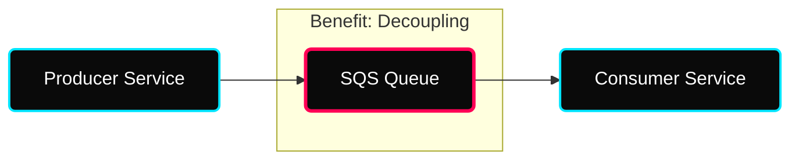
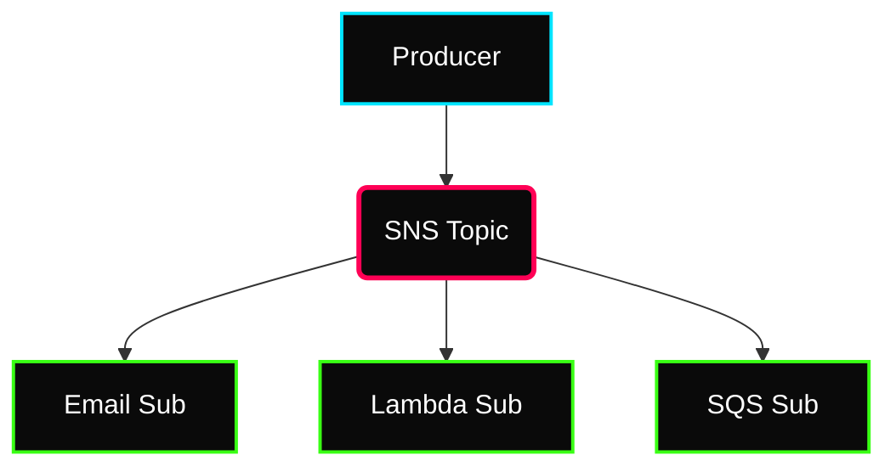

 

---

# 🛸 AWS Messaging & Streaming

> **Week:** 13
> **Folder:** Messaging-SQS-SNS-Kinesis
> **Topic:** Decoupling & Real-time Data Pipelines

---

## ✦ Why Messaging in DevOps?

Decoupling is the heart of resilient architecture. Instead of services talking directly (and failing together), we use **Queues** and **Topics** to create "buffer zones."

---

## ✦ 1. Amazon SQS: Simple Queue Service

SQS is a fully managed message queuing service that enables you to decouple and scale microservices, distributed systems, and serverless applications.

### ⚡ Standard vs. FIFO Queues

| Feature | Standard Queue | FIFO Queue |
|---|---|---|
| **Throughput** | Unlimited | High (300-3000 msgs/sec) |
| **Delivery** | At-least-once | **Exactly-once** |
| **Ordering** | Best-effort (No guarantee) | **First-In-First-Out** |
| **Use Case** | High scale, order not critical | Banking, sequential processing |

### ⚡ Key Attributes
- **Retention:** Default 4 days, Max 14 days.
- **Message Size:** Up to 256 KB (can use S3 for larger).
- **Visibility Timeout:** Time the message is invisible to other consumers while being processed.

---

## ✦ 2. Amazon SNS: Simple Notification Service

SNS is a managed service that provides message delivery from publishers to subscribers (Pub/Sub).

### ⚡ The Pub/Sub Model
SNS works on a **Topic** basis. Producers "Publish" to a topic, and all "Subscribers" receive a copy.

### ⚡ SNS + SQS: Fan-Out Architecture
The most common pattern: SNS publishes to multiple SQS queues. This ensures each consumer handles the message at its own pace without data loss.

---

## ✦ 3. Amazon Kinesis: Real-Time Streaming

Kinesis is designed for **big data** and **real-time** streaming.

### ⚡ Kinesis Data Streams (KDS)
- **Retention:** 24 hours to 365 days.
- **Reprocess:** Ability to "replay" data (unlike SQS where data is deleted after processing).
- **Ordering:** Guaranteed ordering per Partition ID.

---

## ✦ 🛸 Personal Notes & Interview Tips

- **SQS vs Kinesis?** Use **SQS** for task decoupling (1-to-1). Use **Kinesis** for data streaming/analytics (1-to-many, replayable).
- **Dead Letter Queue (DLQ):** Always configure a DLQ for SQS to capture failed messages for later debugging.
- **Visibility Timeout:** If your consumer crashes, the message stays "in-flight" until the visibility timeout expires, then it reappears in the queue.
