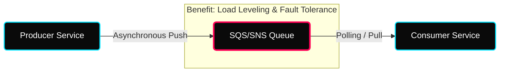
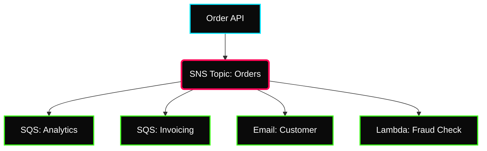

 

---

# 🛸 AWS Messaging & Streaming

> **Week:** 13
> **Folder:** Messaging-SQS-SNS-Kinesis
> **Topic:** Decoupling & Real-time Data Pipelines

---

## ✦ Why Messaging in DevOps?

In a distributed microservices architecture, direct synchronous communication leads to "Chain Failures." If one service goes down, the entire request fails. **Messaging services** act as a buffer, decoupling producers from consumers and enabling asynchronous processing.

---

## ✦ 1. Amazon SQS: Simple Queue Service

SQS is a fully managed message queuing service that enables you to decouple and scale microservices, distributed systems, and serverless applications.

### ⚡ Standard vs. FIFO Queues

| Feature | Standard Queue | FIFO Queue |
|---|---|---|
| **Throughput** | Unlimited | High (3,000 msgs/s with batching) |
| **Delivery** | At-least-once | **Exactly-once** |
| **Ordering** | Best-effort (No guarantee) | **First-In-First-Out (Strict)** |
| **Use Case** | Video encoding, image processing | Financial transactions, order processing |

### ⚡ Critical Parameters for the Architect
- **Visibility Timeout:** (Default: 30s) The period during which SQS prevents other consumers from receiving and processing a message. If the consumer fails to delete the message within this window, it becomes visible again.
- **Short Polling vs. Long Polling:**
    - **Short Polling:** Returns immediately even if the queue is empty. (Higher API costs)
    - **Long Polling:** (WaitTimeSeconds > 0) Waits up to 20s for a message to arrive before returning empty. (Reduces cost and latency).
- **Dead Letter Queue (DLQ):** A secondary queue where messages are moved after failing to be processed $X$ times (Redrive Policy).

---

## ✦ 2. Amazon SNS: Simple Notification Service

SNS follows the **Pub/Sub** (Publisher/Subscriber) pattern. It allows you to "fan-out" messages to multiple subscribers simultaneously.

### ⚡ The Fan-Out Architecture
This is the most powerful DevOps pattern. A single event (e.g., "S3 Upload") can trigger multiple independent workflows.

### ⚡ Key Capabilities
- **Message Filtering:** Subscribers can define filtering policies so they only receive messages that match specific attributes (e.g., "Only receive Orders where `status` is `fraud`").
- **FIFO Topics:** Introduced to support strict ordering and deduplication when used with FIFO SQS queues.

---

## ✦ 3. Amazon Kinesis: Real-Time Streaming

Kinesis is designed for high-scale, real-time data ingestion and processing.

### ⚡ The Kinesis Ecosystem
- **Kinesis Data Streams (KDS):** Low-latency data ingestion. Data is stored in "Shards."
    - **Retention:** 24h to 365 days.
    - **Replayability:** Unlike SQS, multiple consumers can read from the same stream at different points (offsets).
- **Kinesis Data Firehose:** Managed service to load streaming data into S3, Redshift, Elasticsearch, or Splunk. (Zero code, near real-time).
- **Kinesis Data Analytics:** Run SQL queries on streaming data to get real-time insights (e.g., detecting anomalies).

---

## ✦ 🛸 Personal Notes & Interview Tips

- **SQS vs. SNS?** SNS is **Push** (many subscribers). SQS is **Pull/Polling** (1-to-1 processing).
- **SQS vs. Kinesis?**
    - **SQS:** Use for individual tasks that need to be processed once. (Decoupling)
    - **Kinesis:** Use for large-scale data ingestion and analytics where data needs to be "replayed."
- **How to handle large messages (>256KB)?** Use the **SQS Extended Client Library** which stores the payload in S3 and sends a pointer (reference) in the SQS message.
- **Delay Queues:** Useful if you need to postpone message delivery for up to 15 minutes (e.g., waiting for a backend sync to complete).

