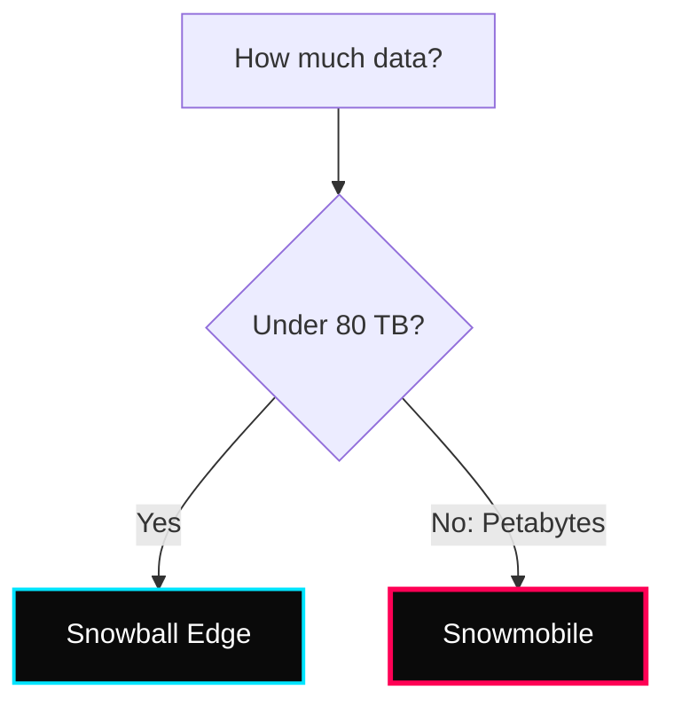

 

---

# 📦 Storage, Hybrid & Migration

> **Week:** 13
> **Folder:** Storage-and-Migration
> **Topic:** AWS Snow Family, FSx, and Hybrid Storage

---

## ✦ Why Specialized Storage?

Not all data fits in S3. Legacy apps need Windows shares (SMB), sub-millisecond latency (Lustre), or a way to move Petabytes of data physically because internet bandwidth is too slow.

---

## ✦ 1. AWS Snow Family

The Snow family consists of physical hardware devices used for data migration and edge computing.

### ⚡ Migration Decision Matrix

- **Snowcone:** Tiny, portable, 8TB.
- **Snowball Edge:** 80TB capacity, including compute (EC2-compatible).
- **Snowmobile:** A literal truck capacity for Exabyte-scale migrations.

---

## ✦ 2. Amazon FSx: Managed File Systems

FSx provides fully managed, high-performance file systems for specific protocols.

### ⚡ Technical Variants
- **FSx for Windows File Server:** Native Windows SMB support, Active Directory integration.
- **FSx for Lustre:** High-performance computing (HPC), machine learning.
- **FSx for NetApp ONTAP:** Easy migration from on-prem NetApp arrays.
- **FSx for OpenZFS:** High throughput, low latency ZFS.

---

## ✦ 3. AWS Storage Gateway (Hybrid)

Bridge between your on-premises data and AWS cloud storage.

- **File Gateway:** SMB/NFS access to S3.
- **Volume Gateway:** iSCSI blocks backed by S3 (Cached or Stored).
- **Tape Gateway:** "Virtual Tape Library" to replace physical tape backups.

---

## ✦ 📦 Master Storage Comparison

| Storage Type | AWS Service | Access Protocol | Multiple Instances? |
|---|---|---|---|
| **Object** | **S3** | HTTP API | ✅ Worldwide |
| **Archival** | **S3 Glacier**| HTTP API | ✅ Worldwide |
| **Block** | **EBS** | iSCSI / Network | ❌ One instance (mostly) |
| **File (Linux)** | **EFS** | NFS | ✅ Multiple (Region) |
| **File (Win)** | **FSx Win** | SMB | ✅ Multiple (Region) |
| **High Speed** | **FSx Lustre**| Lustre | ✅ Multiple (Region) |

---

## ✦ 📦 Personal Notes

- **Snowball Ingestion:** Remember that Snowball cannot import to Glacier directly. You must import to **S3 first**, then use a lifecycle policy to move to Glacier.
- **EFS vs EBS:** EBS is a "stick" (one instance), EFS is a "server" (many instances).
- **Storage Gateway:** Always use "Cached Volumes" if you want to store almost all data in S3 but keep a small, frequently accessed part on-site.
