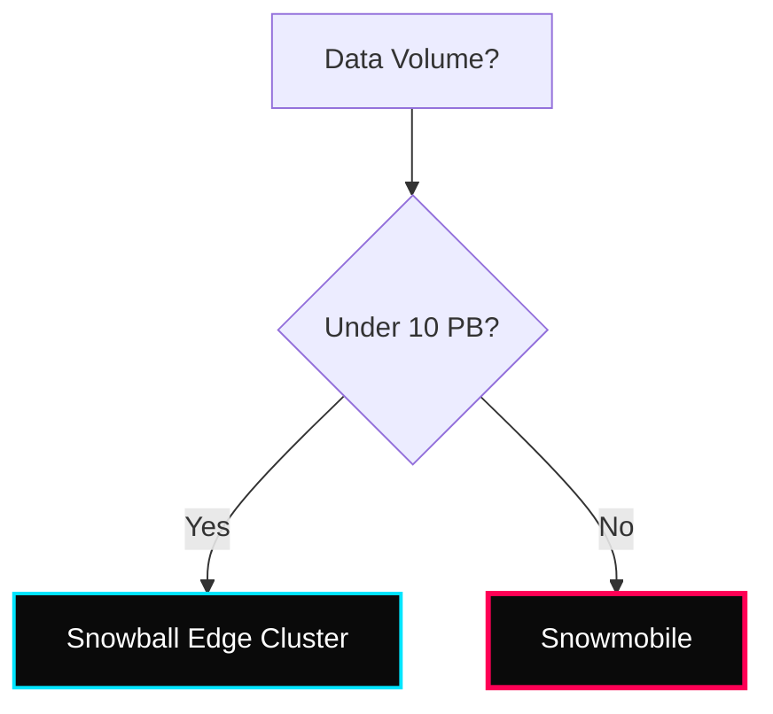

 

---

# 📦 Storage, Hybrid & Migration

> **Week:** 13
> **Folder:** Storage-and-Migration
> **Topic:** AWS Snow Family, FSx, and Hybrid Storage

---

## ✦ Why Specialized Storage?

Not all data fits in S3. Legacy apps need Windows shares (SMB), sub-millisecond latency (Lustre), or a way to move Petabytes of data physically because internet bandwidth is too slow. AWS provides specialized services for **Hybrid Cloud** and **Mass Migration**.

---

## ✦ 1. AWS Snow Family

The Snow family consists of physical hardware devices used for data migration and edge computing in remote environments.

### ⚡ Technical Capabilities
- **Snowcone:** 8 TB of usable storage. Can be powered by battery. Supports AWS IoT Greengrass.
- **Snowball Edge:** 
    - **Storage Optimized:** 80 TB HDD or 210 TB NVMe for data-heavy migrations.
    - **Compute Optimized:** 104 vCPUs, 416 GB RAM, and optional GPU for real-time Edge AI/ML.
- **Snowmobile:** A 45-foot long ruggedized shipping container. 100 PB capacity. Ideal for moving entire data centers.

---

## ✦ 2. Amazon FSx: Managed File Systems

FSx provides fully managed, high-performance file systems for specific industry-standard protocols.

| Variant | Best For | Protocol | Key Feature |
|---|---|---|---|
| **FSx for Windows** | Enterprise Apps | SMB | Active Directory Integration |
| **FSx for Lustre** | HPC, ML, Video | Lustre | Sub-millisecond latency |
| **FSx for ONTAP** | NetApp Migration | NFS/SMB/iSCSI | Multi-protocol, SnapMirror support |
| **FSx for OpenZFS** | Specialized ZFS | NFS | High throughput, ZFS features |

---

## ✦ 3. AWS Storage Gateway (Hybrid)

Bridge between your on-premises data and AWS cloud storage.

- **S3 File Gateway:** Maps S3 buckets to an NFS or SMB share. Good for backups or "cloud tiering."
- **FSx File Gateway:** Low-latency access to FSx for Windows File Server from on-prem.
- **Volume Gateway:** iSCSI block storage.
    - **Cached Volumes:** Frequently accessed data is kept locally, all data is in S3.
    - **Stored Volumes:** All data is kept locally, backed up to S3 as EBS snapshots.
- **Tape Gateway:** Virtual Tape Library (VTL). Replaces physical tapes with S3/Glacier.

---

## ✦ Migration & Transfer Masters

- **AWS DataSync:** Optimized network transfer. 10x faster than open-source tools. Syncs data from on-prem (NFS/SMB/HDFS) to S3, EFS, or FSx.
- **AWS Transfer Family:** Managed **SFTP, FTPS, and FTP** directly into S3 or EFS. Eliminates the need to manage FTP servers.

---

## ✦ 📦 Personal Notes & Interview Tips

- **Snowball Ingestion:** Since Snowball cannot import to Glacier directly, you must import to **S3 Standard first**, then use a lifecycle policy to transition to Glacier.
- **EFS vs. EBS vs. Instance Store:**
    - **EFS:** Networked, multi-instance, Region-wide.
    - **EBS:** Networked, single-instance (mostly), AZ-specific.
    - **Instance Store:** Physical, ephemeral (loss on stop), ultra-high IOPS.
- **Storage Gateway vs. DataSync:**
    - **Storage Gateway:** Persistent "bridge" for ongoing hybrid access.
    - **DataSync:** One-time or scheduled "migration" tool for large datasets.

