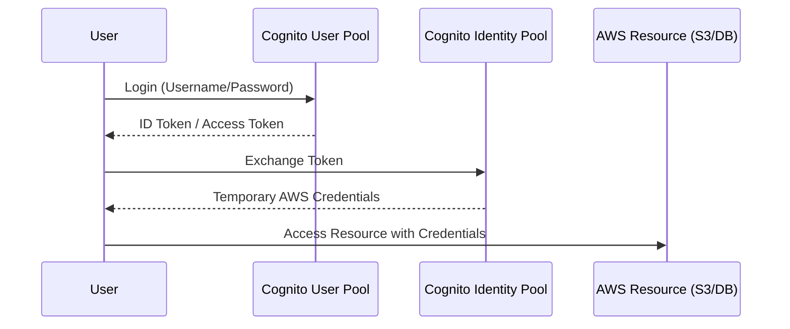

 

---

# ⚡ AWS API Gateway & Cognito

> **Week:** 14
> **Folder:** API-Gateway-and-Cognito
> **Topic:** Entry Points & Identity Management

---

## ✦ 1. What is AWS API Gateway?

A fully managed service that makes it easy for developers to create, publish, maintain, monitor, and secure APIs at any scale. It acts as the "front door" for your applications to access data, business logic, or functionality from your backend services.

### ⚡ Key Features
- **API Types:** REST (stateless), HTTP (low latency), and WebSocket (real-time).
- **Versioning:** Easily manage `v1`, `v2`, etc.
- **Environments:** Use Stages (e.g., `dev`, `prod`) to manage deployment lifecycle.
- **Security:** Integrated with IAM, Cognito, and API Keys for throttling.

---

## ✦ 2. API Gateway Endpoint Types

How your API is deployed and accessed globally:

1.  **Edge-Optimized (Default):** For global clients. Requests are routed through CloudFront Edge locations to reduce latency.
2.  **Regional:** For clients within the same region. No CloudFront integration by default.
3.  **Private:** Can only be accessed from your VPC using an Interface VPC Endpoint (ENI).

---

## ✦ 3. Amazon Cognito: Identity Management

Cognito provides authentication, authorization, and user management for your web and mobile apps.

### ⚡ User Pools (Authentication)
- Think of it as your **Database of Users**.
- Handles login, sign-up, password reset, and MFA.
- Provides a JWT (JSON Web Token) upon successful login.

### ⚡ Identity Pools (Authorization)
- Think of it as **Access to AWS Resources**.
- Exchanges tokens from User Pools (or other providers) for temporary AWS credentials.
- Allows users to access S3 buckets, DynamoDB tables, etc., directly.

---

## ✦ 🍟 Personal Notes & Interview Tips

- **API Mapping:** You can transform and validate requests and responses at the API Gateway level using VTL (Velocity Template Language), reducing the weight of your Lambda code.
- **Throttling:** API Gateway handles throttling at two levels: per-account and per-stage/method. Use this to protect your backend from spikes.
- **Caching:** You can cache API responses for a specific TTL to reduce the number of calls made to your Lambda, saving costs and latency.
- **Cognito vs IAM:** Use Cognito for "millions of web/mobile users." Use IAM for "internal users/employees/administrative access."
