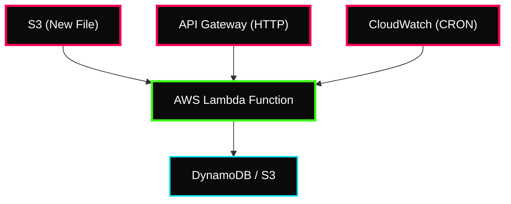

 

---

# ⚡ AWS Lambda Fundamentals

> **Week:** 14
> **Folder:** Lambda-Fundamentals
> **Topic:** Function-as-a-Service (FaaS) Architecture

---

## ✦ 1. What is Serverless?

Serverless is a cloud execution model where the provider manages the allocation of machine resources. Developers can focus on code without worrying about infrastructure management, patching, or scaling.

### ⚡ Key Characteristics
- **No Servers to Manage:** Provisioning and maintenance are automated.
- **Pay-per-use:** Costs are based on execution time and the number of requests.
- **Automatic Scaling:** Scales horizontally based on incoming triggers.

---

## ✦ 2. AWS Lambda Execution Model

Lambda is the core of AWS Serverless. It executes your code in response to events.

### ⚡ Event Sources (Triggers)
- **Synchronous:** API Gateway, ALB, Cognito.
- **Asynchronous:** S3, SNS, CloudWatch Events.
- **Event Source Mapping:** SQS, Kinesis, DynamoDB Streams.

---

## ✦ 3. Performance & Scaling

### ⚡ Cold Starts
When a function is invoked for the first time or after being idle, AWS must initialize a new execution environment. This delay is known as a **Cold Start**.
- **Causes:** Large code size, complex dependencies, VPC initialization.
- **Mitigation:** Use **Provisioned Concurrency** to keep a specified number of environments warm and ready.

### ⚡ Concurrency & Throttling
- **Account Limit:** Default is 1,000 concurrent executions per region.
- **Reserved Concurrency:** Guarantees a set number of units for a specific function.
- **Throttling:** If the limit is reached, synchronous calls return a 429 error, while asynchronous calls retry.

---

## ✦ 4. Lambda in VPC

By default, Lambda runs in a secure, AWS-managed VPC with internet access but no access to your private resources (like RDS).

### ⚡ Connecting to Private Resources
To access resources in your own VPC:
- Define the **VPC ID**, **Subnets**, and **Security Groups**.
- Lambda creates an **ENI (Elastic Network Interface)** in your subnets.
- **RDS Proxy:** Recommended for Lambda connecting to RDS to manage connection pooling and prevent hitting DB connection limits.

---

## ✦ 🍟 Personal Notes & Interview Tips

- **Memory vs CPU:** In Lambda, CPU power is allocated proportionally to the memory you select (128MB to 10GB). Increasing RAM also improves CPU and Network performance.
- **The `/tmp` Directory:** Each execution environment provides 512MB to 10GB of temporary space. Use this for ephemeral files or large libraries that don't fit in the deployment package.
- **Timeout Limit:** The maximum execution time is **15 minutes (900 seconds)**. For longer tasks, use Batch or Step Functions.
- **Environment Variables:** Used for configuration without code changes. Limit is 4KB.
