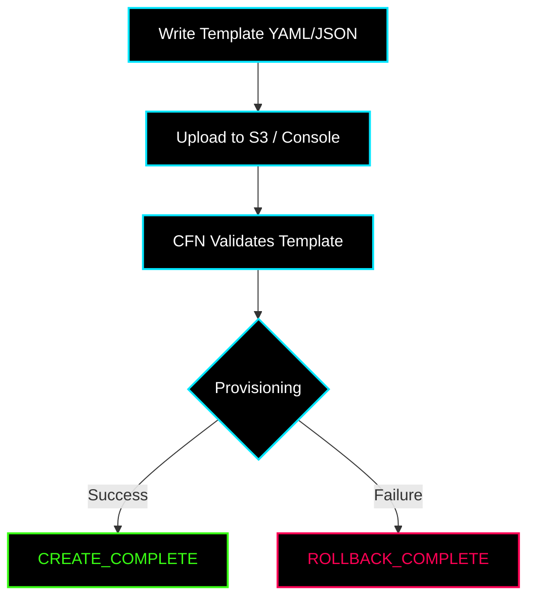

# ✦ Module: CloudFormation Basics

> **Infrastructure as Code (IaC) with AWS CloudFormation.** Model, provision, and manage AWS resources using YAML/JSON templates.

---

## ✦ Core Concepts

- **Template:** A YAML/JSON file describing the desired AWS resources.
- **Stack:** A single unit of AWS resources created from a template. You manage the lifecycle of the stack as a whole.
- **Resources:** The actual AWS infrastructure (EC2, S3, IAM, etc.) defined in the template.
- **Parameters:** Custom inputs provided at deployment time.
- **Outputs:** Values exported after stack creation (e.g., Load Balancer DNS, Public IPs).
- **Mappings:** Static key-value lookups inside a template.
- **Conditions:** Boolean logic for conditionally creating resources.

---

## ✦ Template Anatomy

```yaml
AWSTemplateFormatVersion: "2010-09-09"

Description: >
  Standard AWS CloudFormation template structure.

Parameters:
  InstanceType:
    Type: String
    Default: t2.micro

Resources:
  MyWebServer:
    Type: AWS::EC2::Instance
    Properties:
      InstanceType: !Ref InstanceType
      ImageId: ami-0c55b159cbfafe1f0
      Tags:
        - Key: Name
          Value: WebServer

Outputs:
  PublicIP:
    Value: !GetAtt MyWebServer.PublicIp
```

---

## ✦ Intrinsic Functions

CloudFormation provides built-in functions to make templates highly dynamic:

| Function | Purpose | Example |
|---|---|---|
| `!Ref` | Reference a parameter or resource | `!Ref InstanceType` |
| `!GetAtt` | Get a specific attribute of a resource | `!GetAtt MyBucket.Arn` |
| `!Sub` | String substitution with variables | `!Sub "arn:aws:s3:::${BucketName}/*"` |
| `!Join` | Join strings with a delimiter | `!Join [",", [a, b, c]]` |
| `!Select` | Select item from a list by index | `!Select [0, !GetAZs ""]` |
| `!If` | Conditional value selection | `!If [IsProd, t3.large, t3.micro]` |
| `!ImportValue` | Import an output from another stack | `!ImportValue VpcId` |

---

## ✦ Stack Lifecycle & Updates



> [!WARNING]
> **Stack Update Behaviors:** Depending on what property you change, a resource update might be handled in-place, with a brief interruption, or by completely **replacing** the resource (destroying the old one and creating a new one). Always review CloudFormation documentation for a resource before modifying immutable properties.

---

## ✦ Why Use CloudFormation?

1. **Version Control:** Manage your infrastructure exactly like your application code.
2. **Consistency:** Eliminate configuration drift across dev, staging, and production environments.
3. **Rollback Safety:** Automatically rolls back to the last known good state if a deployment fails.
4. **Documentation:** The template itself serves as the living documentation of your architecture.
