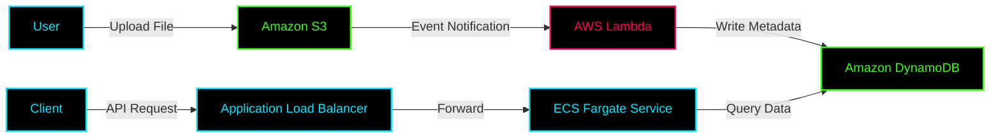

# ✦ Project: Event-Driven File Processing

> **An automated, event-driven cloud architecture built on AWS that leverages serverless and containerized services to process and serve file metadata with a secure, private networking design.**

---

## ✦ Overview

Traditional file uploads often require polling or manual backend tracking, leading to high latency and scaling bottlenecks. This architecture utilizes an **Event-Driven Pattern** where storage directly triggers compute.

- **Trigger:** S3 `ObjectCreated` event.
- **Compute:** AWS Lambda extracts metadata.
- **State:** DynamoDB persists the metadata.
- **Serving:** ECS Fargate (Node.js/Express) serves the data through an ALB.

### Impact
- ~100% automated processing.
- Massive latency reduction vs. polling.
- Decoupled, horizontally scalable services.

---

## ✦ Architecture Flow

---

## ✦ Key Learnings

1. **Event Persistence:** Handling asynchronous S3 events and ensuring idempotent writes to DynamoDB.
2. **Private Connectivity:** Interfacing ECS Tasks in private subnets with DynamoDB and S3 using VPC Gateway Endpoints to avoid NAT Gateway data costs.
3. **IAM Granularity:** Separating ECS Task Roles (for querying DynamoDB) from Execution Roles (for pulling ECR images).

> [!NOTE]
> Check the GitHub repository for source code, deployment instructions, and visual evidence (logs, VPC maps, and database items).
