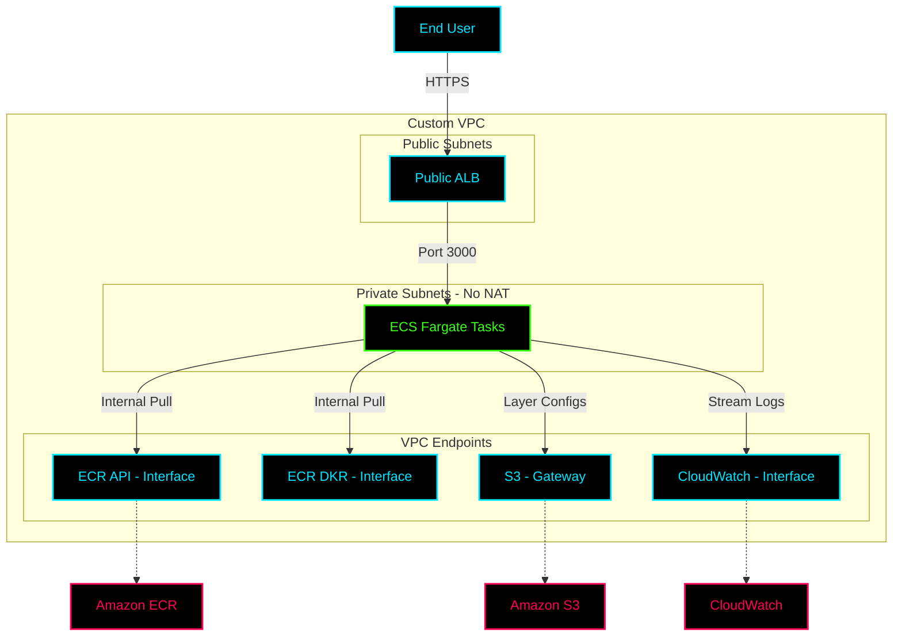

# ✦ Project: Secure ECS Fargate Deployment

> **A production-grade deployment strategy for containerized Node.js applications on AWS ECS Fargate, featuring a custom VPC architecture, private subnets, and VPC Endpoints for enhanced security and cost efficiency.**

---

## ✦ Overview

Deploying containers in public subnets exposes them to the internet, while relying on NAT Gateways for private subnet outbound traffic incurs heavy data transfer costs. This project implements a **Fully Private Architecture** using **VPC Endpoints** (PrivateLink).

- **Compute:** ECS Fargate tasks run in completely isolated Private Subnets.
- **Ingress:** A public Application Load Balancer (ALB) handles incoming traffic.
- **Internal AWS Comms:** ECR, S3, and CloudWatch Logs are accessed internally via VPC Interface and Gateway Endpoints.

---

## ✦ Secure Architecture

---

## ✦ Troubleshooting & Resolutions

During deployment, several architectural challenges were resolved:

1. **ECS Tasks Stuck in Pending:**
   - *Cause:* Private subnets lacked internet access to reach the ECR public registry.
   - *Fix:* Implemented VPC Endpoints for ECR API, ECR DKR, and S3.

2. **Missing CloudWatch Logs:**
   - *Cause:* The Fargate task could not reach the CloudWatch API.
   - *Fix:* Provisioned the `logs` VPC Endpoint and attached `logs:CreateLogStream` to the ECS Task Execution IAM Role.

3. **ALB Timeouts:**
   - *Cause:* ALB was inadvertently deployed in private subnets without an Internet Gateway route.
   - *Fix:* Relocated ALB to public subnets and verified IGW routing.

> [!IMPORTANT]
> **Cost Optimization:** By eliminating the NAT Gateway ($0.045/hr + data transfer) and using VPC Endpoints, the baseline infrastructure cost is significantly reduced while maintaining a Zero-Trust internal network.
