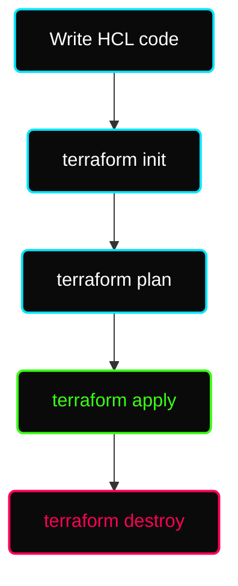

# ✦ Module: Terraform Basics

> **Infrastructure as Code (IaC) with Terraform.** Define, provision, and manage infrastructure across any cloud provider using HashiCorp Configuration Language (HCL).

---

## ✦ What is Terraform?

Terraform is an open-source Infrastructure as Code (IaC) tool by HashiCorp that lets you define, provision, and manage infrastructure across any cloud provider using a declarative configuration language (HCL — HashiCorp Configuration Language).

**Key principles:**
- **Declarative:** You describe *what* you want. Terraform figures out *how* to create it.
- **Idempotent:** Running the same config multiple times produces the same result.
- **Cloud-agnostic:** One tool, one workflow — works with AWS, Azure, GCP, Kubernetes, and 1,000+ providers.

---

## ✦ How Terraform Works



Under the hood, Terraform:
1. Reads your `.tf` configuration files
2. Compares them against the current **state file** (`terraform.tfstate`)
3. Calls the relevant **provider's API** to reconcile the difference

---

## ✦ Terraform Architecture

### 1. The Core (Engine)
The `terraform` binary you run locally. It reads your config, loads the state, and computes the diff (what needs to be added, changed, or deleted).

### 2. Providers
Plugins that translate Terraform HCL into real API calls for a specific platform.

| Provider | Platform |
|---|---|
| `hashicorp/aws` | Amazon Web Services |
| `hashicorp/azurerm` | Microsoft Azure |
| `hashicorp/google` | Google Cloud Platform |
| `hashicorp/kubernetes` | Kubernetes clusters |
| `hashicorp/helm` | Helm charts |

Providers are declared in your config and downloaded during `terraform init`:

```hcl
terraform {
  required_providers {
    aws = {
      source  = "hashicorp/aws"
      version = "~> 5.0"
    }
  }
}

provider "aws" {
  region = "us-east-1"
}
```

### 3. State File (`terraform.tfstate`)
The **source of truth** that maps your HCL code to real-world resources.

- Stores resource IDs, attributes, and metadata
- Used by Terraform to detect what has changed
- If you delete a resource from code, Terraform reads the state to find the real resource ID and delete it from the cloud

#### Local State (default)
```
terraform.tfstate       ← created automatically in your working directory
```
Simple but risky for teams — no locking, easy to lose.

#### Remote State (recommended for teams)
Store state in a shared backend with locking:

```hcl
terraform {
  backend "s3" {
    bucket         = "my-terraform-state"
    key            = "prod/terraform.tfstate"
    region         = "us-east-1"
    dynamodb_table = "terraform-locks"   # Prevents concurrent updates
    encrypt        = true
  }
}
```

| Backend | Locking | Notes |
|---|---|---|
| AWS S3 + DynamoDB | ✅ | Most common for AWS teams |
| Terraform Cloud | ✅ | Hosted, full UI + CI/CD |
| Azure Blob Storage | ✅ | For Azure teams |
| Google Cloud Storage | ✅ | For GCP teams |
| Local file | ❌ | Dev/learning only |

---

## ✦ Core Language Elements

### Resources
The fundamental building block — a piece of infrastructure to create.

```hcl
# Syntax: resource "<TYPE>" "<LOCAL_NAME>" { ... }

resource "aws_instance" "web_server" {
  ami           = "ami-0c55b159cbfafe1f0"
  instance_type = "t2.micro"

  tags = {
    Name = "DevOps-Server"
    Env  = "production"
  }
}
```

### Data Sources
Read-only — fetch existing infrastructure info without creating anything.

```hcl
data "aws_ami" "ubuntu" {
  most_recent = true
  owners      = ["099720109477"] # Canonical

  filter {
    name   = "name"
    values = ["ubuntu/images/hvm-ssd/ubuntu-*-22.04-amd64-server-*"]
  }
}

resource "aws_instance" "web" {
  ami           = data.aws_ami.ubuntu.id
  instance_type = "t2.micro"
}
```

### Outputs
Export values after a stack is applied — useful for referencing across modules or displaying key info.

```hcl
output "instance_public_ip" {
  description = "Public IP of the web server"
  value       = aws_instance.web_server.public_ip
}
```

### Locals
Internal computed values — not exposed to users, not passed in as inputs.

```hcl
locals {
  environment = "production"
  name_prefix = "myapp-${local.environment}"
}

resource "aws_s3_bucket" "data" {
  bucket = "${local.name_prefix}-data"
}
```

---

## ✦ Modules

A **module** is a reusable package of Terraform code — like a function in programming.

**Using a module:**
```hcl
module "web_server" {
  source        = "./modules/web-server"
  instance_type = "t2.micro"
  environment   = "prod"
}
```

---

## ✦ Immutable Infrastructure

Terraform's default approach is to **replace** resources rather than patch them in place.

> [!TIP]
> **Immutable Benefits:** No configuration drift (servers don't become unique snowflakes), consistent, predictable deployments, and easy rollbacks.
