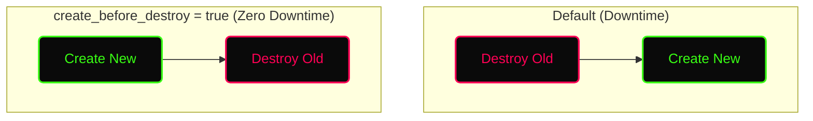

# ✦ Module: Terraform Meta-Arguments & Lifecycle

> **Control Resource Behavior.** Meta-arguments are special constructs provided by Terraform to alter how resources are provisioned, counted, and managed.

---

## ✦ What are Meta-Arguments?

Meta-arguments are built into Terraform itself, not specific to any provider (like AWS or Azure). They can be used with *any* `resource` or `module` block to change its behavior.

**The primary Meta-Arguments are:**
1. `depends_on`
2. `count`
3. `for_each`
4. `provider`
5. `lifecycle`

---

## ✦ 1. `depends_on`

Terraform usually automatically infers dependencies between resources. However, sometimes a resource depends on another in a way Terraform cannot see (e.g., application-level dependencies). `depends_on` forces an explicit dependency.

```hcl
resource "aws_iam_role_policy" "example" {
  name   = "example_policy"
  role   = aws_iam_role.example.id
  policy = jsonencode(...)
}

resource "aws_instance" "example" {
  ami           = "ami-a1b2c3d4"
  instance_type = "t2.micro"

  # Wait for IAM policy to be fully attached before booting instance
  depends_on = [
    aws_iam_role_policy.example
  ]
}
```

---

## ✦ 2. `count`

Creates multiple identical instances of a resource based on a number.

```hcl
resource "aws_instance" "web" {
  count         = 3
  ami           = "ami-a1b2c3d4"
  instance_type = "t2.micro"

  tags = {
    # count.index starts at 0
    Name = "WebServer-${count.index + 1}"
  }
}
```

> [!WARNING]
> If you remove an item from the middle of a list used with `count`, Terraform will destroy and recreate resources to shift the indexes down. Use `for_each` instead if the order of items might change.

---

## ✦ 3. `for_each`

Creates multiple instances of a resource based on a `map` or `set of strings`. This is much safer than `count` because it uses keys instead of integer indexes.

```hcl
resource "aws_iam_user" "accounts" {
  for_each = toset(["alice", "bob", "charlie"])
  name     = each.key
}

# Creates:
# aws_iam_user.accounts["alice"]
# aws_iam_user.accounts["bob"]
# aws_iam_user.accounts["charlie"]
```

Using a map with `for_each`:

```hcl
variable "vpcs" {
  type = map(string)
  default = {
    "dev"  = "10.0.0.0/16"
    "prod" = "10.1.0.0/16"
  }
}

resource "aws_vpc" "main" {
  for_each   = var.vpcs
  cidr_block = each.value

  tags = {
    Name = "VPC-${each.key}"
  }
}
```

---

## ✦ 4. `provider`

Allows you to specify a non-default provider configuration for a specific resource (e.g., deploying to a different AWS region).

```hcl
provider "aws" {
  region = "us-east-1"
}

provider "aws" {
  alias  = "west"
  region = "us-west-2"
}

resource "aws_instance" "east_server" {
  # Uses default provider (us-east-1)
  ami           = "ami-123"
  instance_type = "t2.micro"
}

resource "aws_instance" "west_server" {
  provider      = aws.west # Uses aliased provider
  ami           = "ami-456"
  instance_type = "t2.micro"
}
```

---

## ✦ 5. `lifecycle` Rules

The `lifecycle` block allows you to customize the creation and destruction behavior of a resource.

### `create_before_destroy`
By default, Terraform destroys a resource before creating its replacement. Setting this to `true` reverses the order (creates the new one, then destroys the old one) to ensure zero downtime.



```hcl
resource "aws_launch_configuration" "example" {
  image_id      = "ami-123"
  instance_type = "t2.micro"

  lifecycle {
    create_before_destroy = true
  }
}
```

### `prevent_destroy`
A safety mechanism that causes Terraform to reject with an error any plan that would destroy the infrastructure object associated with the resource.

```hcl
resource "aws_db_instance" "production_db" {
  # ... 
  lifecycle {
    prevent_destroy = true
  }
}
```

### `ignore_changes`
Tells Terraform to ignore changes to specific resource attributes. Useful when attributes are managed outside of Terraform (e.g., Auto Scaling Group desired capacity).

```hcl
resource "aws_autoscaling_group" "example" {
  desired_capacity = 2
  max_size         = 5
  min_size         = 1

  lifecycle {
    ignore_changes = [
      desired_capacity,
    ]
  }
}
```
