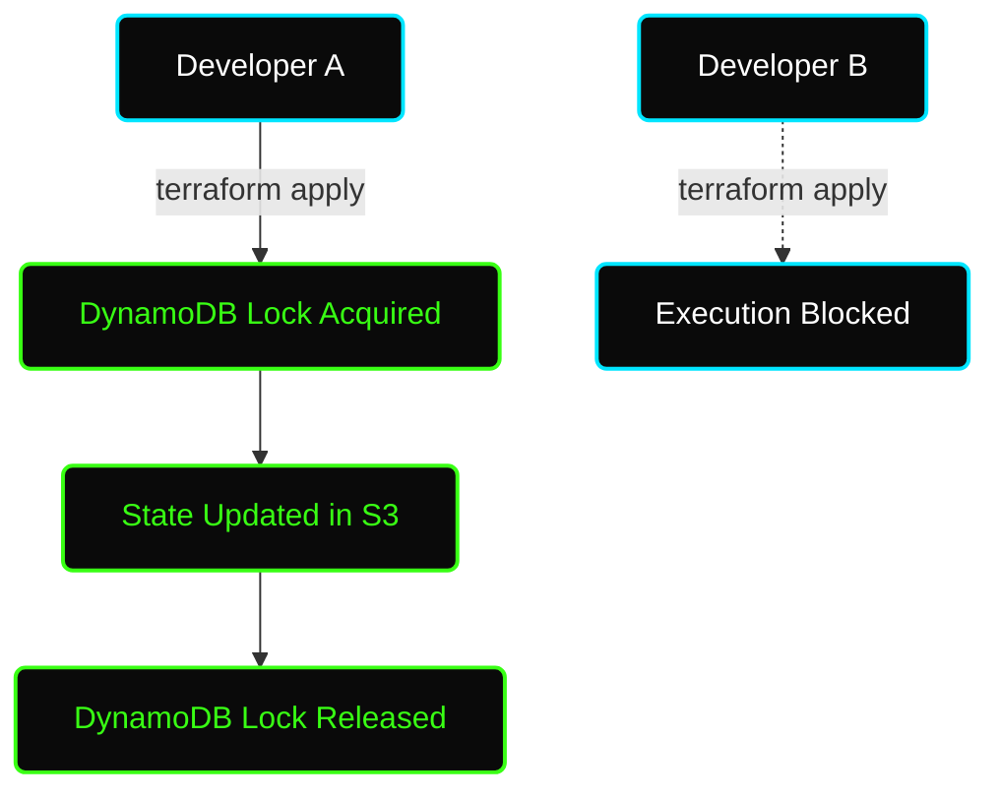

# ✦ Module: Terraform State Management

> **The Source of Truth.** Terraform must store state about your managed infrastructure and configuration. This state is used by Terraform to map real-world resources to your configuration.

---

## ✦ What is Terraform State?

By default, Terraform stores state locally in a file named `terraform.tfstate`. 
When you run `terraform apply`, Terraform records the IDs and properties of the resources it created in this JSON file.

### Why does Terraform need State?
1. **Mapping:** It needs to know that the `aws_instance.web` in your code corresponds to `i-0abcd1234efgh5678` in AWS.
2. **Metadata:** It tracks resource dependencies and ordering.
3. **Performance:** It caches the state of your infrastructure so it doesn't have to query the entire cloud provider API every time you run `terraform plan`.
4. **Syncing:** It detects if someone manually changed a resource in the AWS Console (configuration drift).

---

## ✦ Remote State (The Industry Standard)

Storing state locally works for a solo developer, but it is **catastrophic** for a team.
- **Problem 1:** If two developers run `terraform apply` at the same time, they will corrupt the infrastructure.
- **Problem 2:** The state file can contain sensitive data (passwords, private keys) in plain text. You should **never** commit `terraform.tfstate` to Git.

**The Solution:** Remote Backends.

A Remote Backend stores the state file in a centralized, secure location (like AWS S3) and uses a locking mechanism (like AWS DynamoDB) to prevent concurrent executions.

### Configuring an AWS S3 Backend

To use an S3 backend, you must first manually create (or use CloudFormation/a separate Terraform script to create):
1. An S3 bucket (with versioning enabled!).
2. A DynamoDB table (with a primary key named `LockID`).

```hcl
terraform {
  backend "s3" {
    bucket         = "my-company-terraform-state-bucket"
    key            = "production/networking/terraform.tfstate" # The path inside the bucket
    region         = "us-east-1"
    dynamodb_table = "terraform-state-locks"
    encrypt        = true
  }
}
```



---

## ✦ State Security & Versioning

> [!WARNING]
> **State files contain plain-text secrets.** If you pass a database password as a variable, or if a provider returns a private key, it is stored in the state file unencrypted.

**Security Best Practices:**
1. **Encryption at Rest:** Always set `encrypt = true` in your S3 backend block, and ensure the S3 bucket has default KMS encryption enabled.
2. **IAM Restrictions:** Only the CI/CD pipeline role (e.g., Jenkins) or lead DevOps engineers should have `s3:GetObject` access to the state bucket.
3. **Versioning:** ALWAYS enable S3 bucket versioning. If the state file gets corrupted, you can easily roll back to the previous version of the `terraform.tfstate` object.

---

## ✦ State Manipulation 

Sometimes the state file falls out of sync with reality, or you need to refactor your code without destroying the infrastructure. You can use the `terraform state` command to manually manipulate the state file.

### 1. Moving Resources (`state mv`)
If you rename a resource in your `.tf` file:
```hcl
# Old
resource "aws_instance" "web" {}
# New
resource "aws_instance" "frontend" {}
```
Terraform will want to destroy `web` and create `frontend`. To prevent this, move the state:
`terraform state mv aws_instance.web aws_instance.frontend`

### 2. Removing Resources (`state rm`)
If you want Terraform to "forget" about a resource (so you can manage it manually, or delete it from the code without destroying the actual AWS resource):
`terraform state rm aws_instance.web`

### 3. Importing Resources (`import`)
If you manually created an S3 bucket in the AWS Console, and now want Terraform to manage it:
1. Write the code for it in `main.tf`: `resource "aws_s3_bucket" "manual" {}`
2. Run the import command: `terraform import aws_s3_bucket.manual my-manual-bucket-name`
3. Run `terraform plan` and update your `.tf` code until the plan shows `0 to add, 0 to change, 0 to destroy`.
